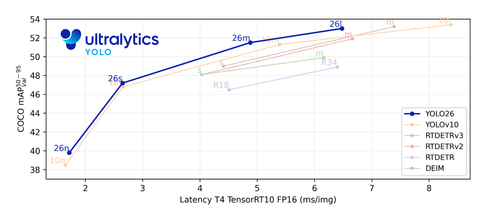
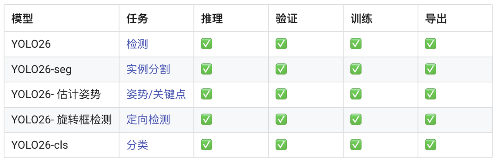

### YOLO26：魔改终结者

```markdown
🚧 YOLO26 型号仍在开发中，尚未发布。此处显示的性能数据仅为预览。
最终下载和发布将在不久之后进行，请随时通过YOLO Vision 2025 进行更新。
```

**简介：**

Ultralytics YOLO26 是YOLO 系列实时物体检测器的最新产品，专为边缘和低功耗设备而设计。它采用精简设计，消除了不必要的复杂性，
同时集成了有针对性的创新技术，以提供更快、更轻和更方便的部署。


**YOLO26 的架构遵循三个核心原则：**

- 简单：YOLO26 是一个原生的端到端模型，无需非最大抑制（NMS）即可直接生成预测结果。由于省去了这一后处理步骤，推理变得更快、更轻便，也更容易部署到现实世界的系统中。这一突破性方法由清华大学的王敖在YOLOv10中首创，并在 YOLO26 中得到进一步发展。
- 部署效率：端到端设计省去了管道的整个阶段，大大简化了集成、减少了延迟，并使不同环境下的部署更加稳健。
- 培训创新：YOLO26 引入了MuSGD 优化器，它是SGD和Muon的混合体，灵感来自 Moonshot AI 在 LLM 训练中取得的Kimi K2突破。该优化器具有更高的稳定性和更快的收敛速度，将语言模型中的优化技术应用到了计算机视觉领域。

这些创新结合在一起，使模型系列在小型物体上实现了更高的精度，提供了无缝部署，在 CPU 上的运行速度提高了 43%，从而使 YOLO26 成为迄今为止在资源有限的环境中最实用、最易部署的YOLO 模型之一。



主要功能
- DFL 移除
分布焦距损耗 (DFL) 模块虽然有效，但往往使导出复杂化，并限制了硬件兼容性。YOLO26 完全取消了 DFL，简化了推理，扩大了对边缘和低功耗设备的支持。
- 端到端无 NMS 推断
与依赖 NMS 作为单独后处理步骤的传统检测器不同，YOLO26本身就是端到端的。预测结果直接生成，减少了延迟，使集成到生产系统的速度更快、更轻便、更可靠。
- ProgLoss + STAL
改进的损失函数提高了检测精度，在小目标识别方面有显著改进，这是物联网、机器人、航空图像和其他边缘应用的关键要求。
- MuSGD 优化器
一种结合了SGD和Muon 的新型混合优化器。受到 Moonshot AI 的Kimi K2 的启发，MuSGD 将 LLM 训练中的先进优化方法引入计算机视觉，使训练更加稳定，收敛速度更快。
- CPU 推理速度提高 43
YOLO26 专门针对边缘计算进行了优化，大大加快了CPU 推理速度，确保在没有 GPU 的设备上实现实时性能。
支持的任务和模式
YOLO26 被设计为多任务模型系列，将YOLO 的多功能性扩展到各种计算机视觉挑战中：



这一统一的框架确保 YOLO26 适用于实时检测、分割、分类、姿势估计 和面向对象检测，所有这些都支持训练、验证、推理和输出。