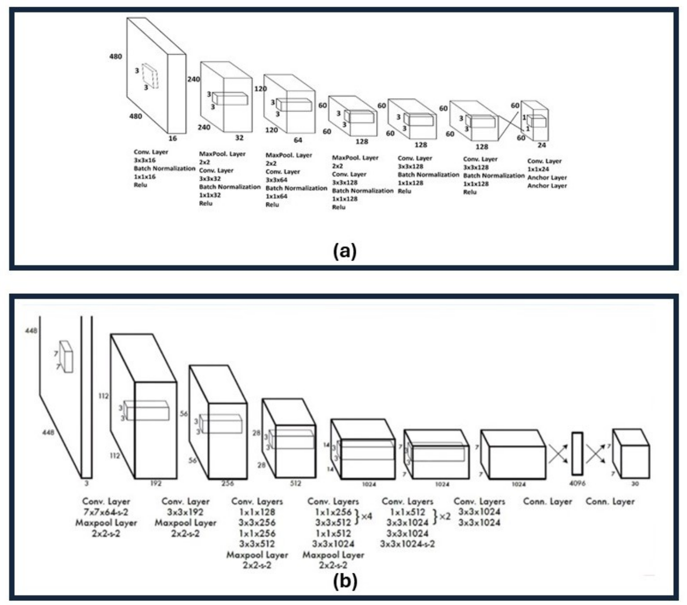

### YOLOv1 和 YOLOv2

**论文：**
- [《You Only Look Once: Unified, Real-Time Object Detection》](https://arxiv.org/pdf/1506.02640)
- [《YOLO9000: Better, Faster, Stronger》](https://arxiv.org/pdf/1612.08242)
- [Project Code](http://pjreddie.com/yolo/)

**简介：**
- **YOLOv1** 由 Joseph Redmon 于 2015 年首次发布，它的单次机制彻底改变了目标检测，该机制利用更简单的 Darknet19 架构在一次网络传递中预测边界框和类概率。
这种初始方法显著加速检测过程，建立了基础技术，并将在 YOLO 系列的后续版本中进行完善。

- **YOLOv2** 于 2016 年发布，引入了一种新的 30 层架构，带有来自 Faster R-CNN 的锚框和批量归一化，以加速收敛并增强模型性能。

**YOLOv1 和 YOLOv2 架构的比较**。 (a) YOLOv1 架构，显示了用于目标检测的卷积层、最大池层和全连接层的序列。该模型在一个统一的步骤中执行特征提取和预测，旨在实现实时性能。
(b) YOLOv2 架构，展示了诸如使用批量归一化、更高分辨率的输入和锚框等改进
