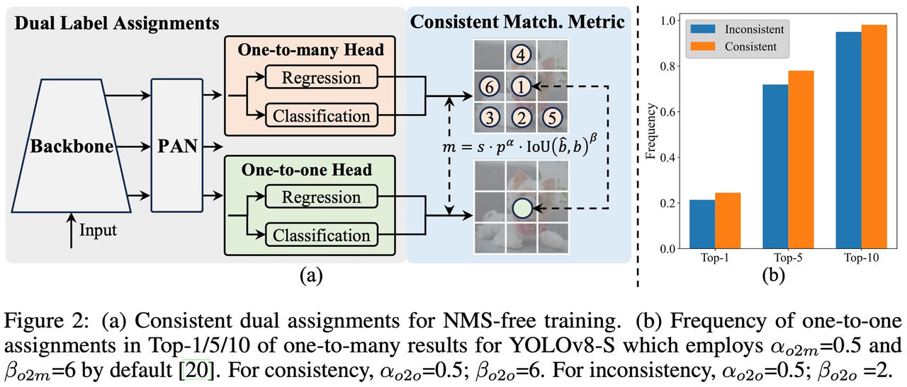

### YOLOv10

- 论文标题：[《YOLOv10: Real-Time End-to-End Object Detection》](https://arxiv.org/pdf/2405.14458)
- GitHub：https://github.com/THU-MIG/yolov10

**简介：**

由清华大学的研究人员基于 Ultralytics Python 包构建，它引入了一种新的实时对象检测方法，解决了之前 YOLO 版本中存在的后处理和模型架构缺陷。
通过消除非极大值抑制 (NMS) 并优化各种模型组件，YOLOv10 以显著降低的计算开销实现了最先进的性能。大量实验表明，它在多个模型规模上都具有卓越的精度-延迟权衡。

**该模型架构包括以下组件：**

  - Backbone：YOLOv10 中的 Backbone 负责特征提取，它使用了 CSPNet（Cross Stage Partial Network）的增强版本，以改善梯度流并减少计算冗余。
  - Neck：Neck 的设计目的是聚合来自不同尺度的特征，并将它们传递到 Head。它包括 PAN（路径聚合网络）层，用于有效的多尺度特征融合。
  - One-to-Many Head：在训练期间为每个对象生成多个预测，以提供丰富的监督信号并提高学习准确性。
  - One-to-One Head：在推理期间为每个对象生成单个最佳预测，从而无需 NMS，从而减少延迟并提高效率。

**无NMS训练**: 采用一致的对偶分配来消除对NMS的需求，从而减少推理延迟。

**整体模型设计**：从效率和准确性的角度对各种组件进行全面优化，包括轻量级分类 Head、空间通道解耦下采样和秩引导块设计。

**增强的模型功能**: 结合了大内核卷积和部分自注意力模块，以提高性能，而无需显著的计算成本。
