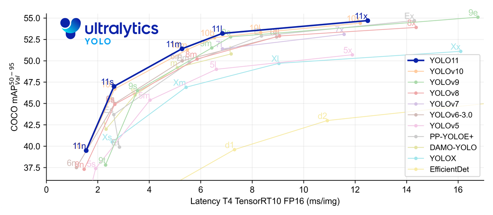

### YOLOv11

- GitHub：https://github.com/ultralytics/ultralytics

**简介：**

YOLO11 是 Ultralytics YOLO 系列实时目标检测器的迭代版本，它以前沿的精度、速度和效率重新定义了可能性。YOLO11 在之前 YOLO 版本的显著进步基础上，
在架构和训练方法上进行了重大改进，使其成为各种计算机视觉任务的多功能选择。

- **增强的特征提取**：YOLO11 采用改进的 backbone 和 neck 架构，从而增强了特征提取能力，以实现更精确的目标检测和复杂的任务性能。
- **优化效率和速度**： YOLO11 引入了改进的架构设计和优化的训练流程，从而提供更快的处理速度，并在精度和性能之间保持最佳平衡。
- **以更少的参数实现更高的精度**： 凭借模型设计的进步，YOLO11m 在 COCO 数据集上实现了更高的 平均精度均值 (mAP)，同时比 YOLOv8m 使用的参数减少了 22%，从而在不影响精度的情况下提高了计算效率。
- **跨环境的适应性**： YOLO11 可以无缝部署在各种环境中，包括边缘设备、云平台和支持 NVIDIA GPU 的系统，从而确保最大的灵活性。
- **广泛支持的任务范围**： 无论是目标检测、实例分割、图像分类、姿势估计还是旋转框检测 (OBB)，YOLO11 都旨在满足各种计算机视觉挑战。
