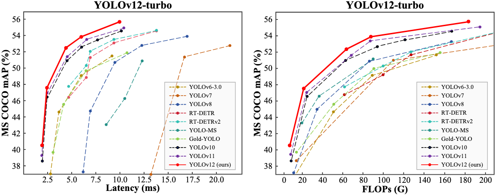
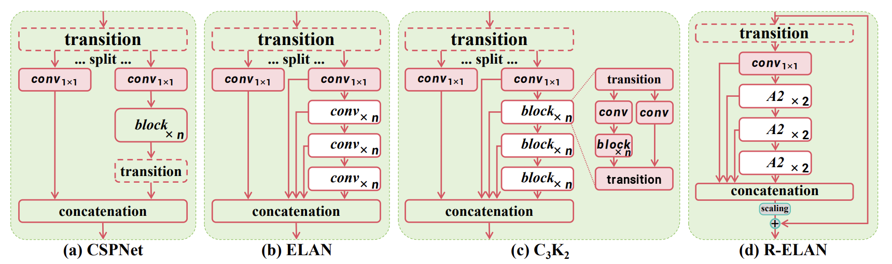
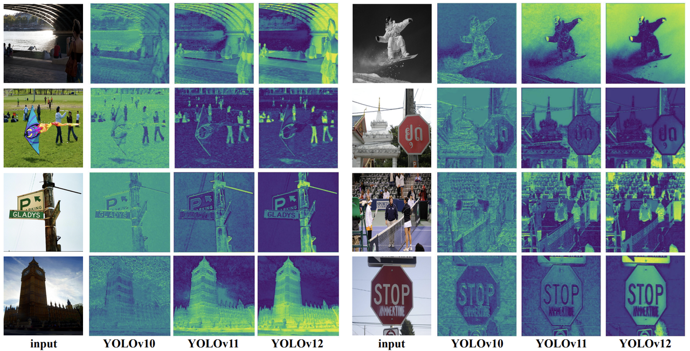

### YOLOv12

- **论文标题**：[《YOLOv12: Attention-Centric Real-Time Object Detectors》](https://arxiv.org/pdf/2502.12524)
- **GitHub**：https://github.com/sunsmarterjie/yolov12.git

**简介：**

YOLO12 引入了一种以注意力为中心的架构，它脱离了之前 YOLO 模型中使用的传统 CNN 方法，但保留了许多应用所必需的实时推理速度。
该模型通过在注意力机制和整体网络架构方面的创新方法，实现了先进的目标检测精度，同时保持了实时性能。

- 区域注意力机制: 一种新的自注意力方法，可以有效地处理大型感受野。它将特征图分成 l 个大小相等的区域（默认为 4 个），水平或垂直，避免复杂的运算并保持较大的有效感受野。与标准自注意力相比，这大大降低了计算成本。
- 残差高效层聚合网络（R-ELAN）：一种基于 ELAN 的改进的特征聚合模块，旨在解决优化挑战，尤其是在更大规模的以注意力为中心的模型中。R-ELAN 引入：
  - 具有缩放的块级残差连接（类似于层缩放）。
  - 一种重新设计的特征聚合方法，创建了一个类似瓶颈的结构。

与流行模块的架构比较，包括（a）：CSPNet（b）ELAN（c）C3K2（GELAN的一个例子）（d）R-ELAN（残差高效层聚合网络）

- 优化的注意力机制架构：YOLO12 精简了标准注意力机制，以提高效率并与 YOLO 框架兼容。这包括：
  - 使用 FlashAttention 来最大限度地减少内存访问开销。
  - 移除位置编码，以获得更简洁、更快速的模型。
  - 调整 MLP 比率（从典型的 4 调整到 1.2 或 2），以更好地平衡注意力和前馈层之间的计算。
  - 减少堆叠块的深度以改进优化。
  - 利用卷积运算（在适当的情况下）以提高其计算效率。
  - 在注意力机制中添加一个7x7可分离卷积（“位置感知器”），以隐式地编码位置信息。
- 全面的任务支持: YOLO12 支持一系列核心计算机视觉任务：目标检测、实例分割、图像分类、姿势估计和旋转框检测 (OBB)。
- 增强的效率: 与许多先前的模型相比，以更少的参数实现了更高的准确率，从而证明了速度和准确率之间更好的平衡。
- 灵活部署: 专为跨各种平台部署而设计，从边缘设备到云基础设施。

**YOLOv10、YOLOv11和拟议的YOLOv12之间的热图比较**。与先进的YOLOv10和YOLOv11相比，YOLOv12对图像中的物体有更清晰的感知。所有结果都是使用X尺度模型获得的