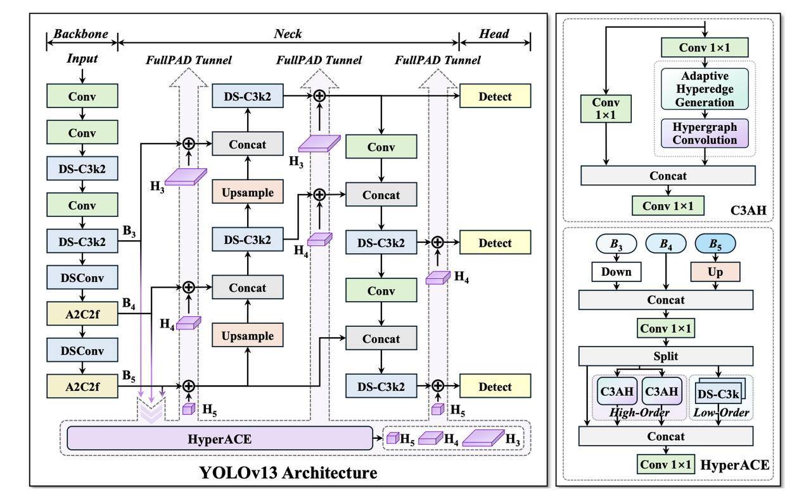

### YOLOv13

- **论文标题**：[《YOLOv13: Real-Time Object Detection with Hypergraph-Enhanced Adaptive Visual Perception》](https://arxiv.org/pdf/2506.17733)
- **GitHub**：https://github.com/iMoonLab/yolov13

**简介：**

YOLOv13 是 YOLO 系列的最新版本，于 2025 年 6 月正式推出。该模型由清华大学和 iMoonLab 研究人员开发，旨在提升目标检测的精度和效率。
YOLOv13 在 COCO 数据集上实现了更高的 mAP（平均精度），同时保持了较低的 FLOPs（计算量）和推理速度。该模型提供了多种尺寸版本，
包括 Nano、Small、Large 和 X-Large，以适应不同应用场景的需求。

**YOLOv13模型网络架构**。HyperACE以骨干网提取的多尺度特征为输入，自适应地探索高阶相关性，实现特征增强和融合。
然后，通过FullPAD隧道将相关增强特征分布到整个网络中，以实现复杂场景中的精确目标检测。HyperACE的详细结构如右图所示

YOLOv13 的核心技术创新包括 HyperACE（基于超图的自适应关联增强）和 FullPAD 机制，这些技术提升了多尺度特征融合与感知能力，提升了复杂场景下的检测性能。
- **HyperACE：基于超图的自适应相关增强**
  - 将多尺度特征图中的像素视为超图顶点。
  - 采用可学习的超边构建模块，以自适应地探索顶点之间的高阶相关性。
  - 利用具有线性复杂度的消息传递模块，在高级相关性的指导下有效聚合多尺度特征，以实现对复杂场景的有效视觉感知。

- **FullPAD：全流程聚合与分配范式**
  - 使用 HyperACE 聚合骨干网络的多尺度特征，并在超图空间中提取高阶相关性。
  - 利用三个独立的隧道，将这些相关性增强的特征分别传递到骨干网络与颈部连接处、颈部内部层以及颈部与头部连接处。通过这种方式，YOLOv13 在整个流程中实现了细粒度信息流和表征协同。
  - FullPAD 显著提高了梯度传播，并增强了检测性能。

- **基于 DS 模块的模型轻量化**
  - 基于深度可分离卷积（DSConv、DS-Bottleneck、DS-C3k、DS-C3k2）构建的模块替换大核卷积，在保留感受野的同时大幅减少参数和计算量。
  - 实现更快的推理速度而不牺牲精度。

**尽管 YOLOv13 在研究和性能上表现出色**，但其在实际部署中仍面临一些挑战，例如代码稳定性、社区支持不足以及与 Ultralytics 官方版本的集成问题。此外，YOLOv5 和 YOLOv8 由于其稳定性和成熟的工具链，仍然是工业落地的首选版本。