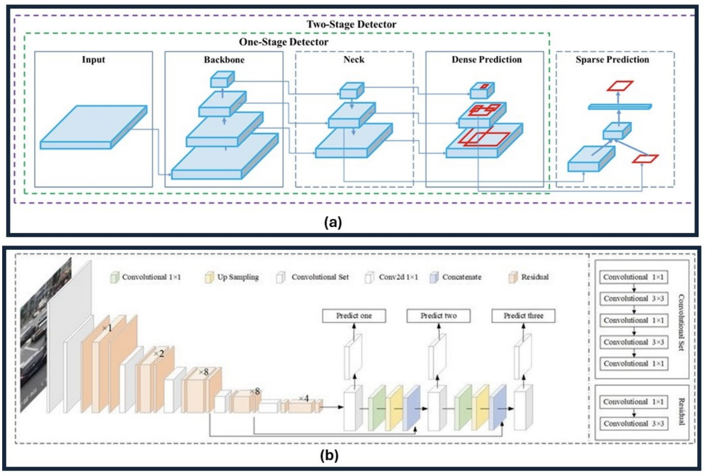

### YOLOv3 和 YOLOv4
论文标题：
- [《YOLOv3: An Incremental Improvement》](https://arxiv.org/pdf/1804.02767)
- https://github.com/pjreddie/darknet
- [《YOLOv4: Optimal Speed and Accuracy of Object Detection》](https://arxiv.org/pdf/2004.10934)
- https://github.com/kiyoshiiriemon/yolov4_darknet

简介：
- **YOLOv3**：这是 You Only Look Once (YOLO) 目标检测算法的第三个版本，引入了使用三种不同尺度进行检测的方法，利用了三种不同大小的检测核：13x13、26x26 和 52x52。这显著提高了对不同大小物体的检测精度。此外，YOLOv3 还增加了诸如每个边界框的多标签预测和一个更好的特征提取网络等功能。

- **YOLOv4**：代表 You Only Look Once version 4（第 4 版）。它是一种实时目标检测模型，旨在解决之前 YOLO 版本（如 YOLOv3）和其他目标检测模型的局限性。利用多种创新功能协同工作以优化其性能。这些功能包括加权残差连接 (WRC)、跨阶段局部连接 (CSP)、跨 mini-批归一化 (CmBN)、自对抗训练 (SAT)、Mish 激活、Mosaic 数据增强、DropBlock 正则化和 CIoU 损失。这些功能相结合，实现了当时最先进的结果。

**YOLOv4 和 YOLOv3 架构比较**。 (a) YOLOv4 架构显示了具有骨干、颈部、密集预测和稀疏预测模块的两级检测器。 
(b) YOLOv3 架构具有卷积层和上采样层，可实现多尺度预测。这凸显了两个版本之间在目标检测方面的结构进步