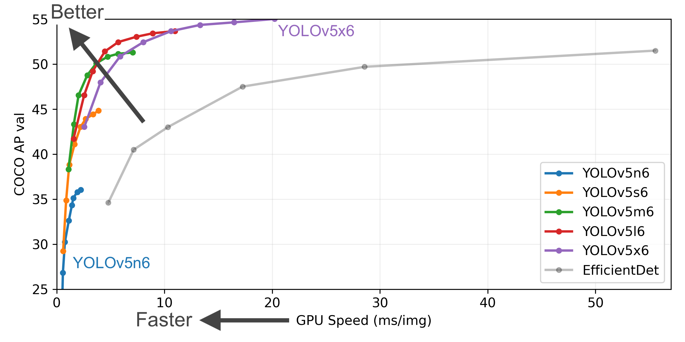

# YOLOv5
- GitHub：https://github.com/ultralytics/yolov5.git

**简介：**

标志着 YOLO 系列的重大演变，专注于为实际应用程序提供简化架构的生产部署。

该版本强调通过细化模型的层和组件来降低模型的复杂性，在不牺牲检测精度的情况下提高推理速度。
YOLOv5 的架构融合了一系列优化，包括改进的骨干、颈部和头部设计，共同增强了其检测能力。

**核心技术：**

- 引入了 CSP 网络，提高网络的效率并减少计算需求。通过多个空间金字塔池化（SPP）块进一步优化了CSPNet，允许在不同尺度上进行特征提取。

- Neck 特征采用路径聚合网络（PAN）模块，并增加了上采样层以改善特征图的分辨率。

- Head 是一系列卷积层，用于生成边界框和类别标签的预测。使用基于 Anchor 的预测，将每个边界框与一组特定形状和大小的预定义 Anchor 框相连接。

- 损失函数计算涉及两个主要部分：二进制交叉熵用于计算类别和目标性损失，而完整交并比（CIoU）用于衡量定位准确性。

