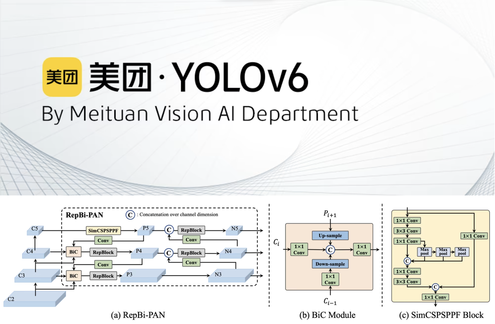

### YOLOv6

- 论文标题：[《YOLOv6 v3.0: A Full-Scale Reloading》](https://arxiv.org/pdf/2301.05586)
- GitHub：https://github.com/meituan/YOLOv6

**简介：**

该模型在其架构和训练方案中引入了多项显着增强功能，包括双向连接 (BiC) 模块的实现、锚点辅助训练 (AAT) 策略以及改进的 backbone 和 neck 设计，从而在 COCO dataset 上实现了最先进的精度。

**YOLOv6 模型架构图**，展示了经过重新设计的网络组件和训练策略，这些改进显著提升了性能。(a) YOLOv6 的 neck（显示了 N 和 S）。请注意，对于 M/L，RepBlocks 被替换为 CSPStackRep。(b) BiC 模块的结构。(c) SimCSPSPPF 块。

- **双向连接 (BiC) 模块**：YOLOv6 在检测器的 neck 中引入了 BiC 模块，增强了定位信号，并在速度几乎没有降低的情况下提供了性能提升。
- **Anchor-Aided Training (AAT) Strategy**：该模型提出了 AAT，以享受基于 anchor 和 无 anchor 范例的优势，而不会影响推理效率。
- **增强的骨干网络和 Neck 设计**：通过加深 YOLOv6 以在骨干网络和 Neck 中包含另一个阶段，该模型在高分辨率输入下实现了 COCO 数据集上的最先进性能。
- **自蒸馏策略**：采用一种新的自蒸馏策略来提升 YOLOv6 较小模型的性能，在训练期间增强辅助回归分支，并在推理时移除它，以避免显著的速度下降。