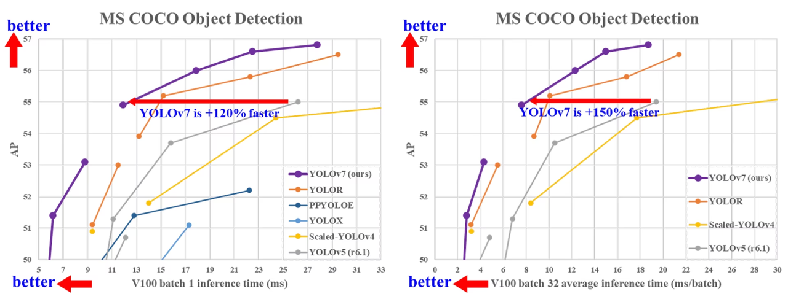

### YOLOv7

- 论文标题：[《YOLOv7: Trainable bag-of-freebies sets new state-of-the-art for real-time object detectors》](https://arxiv.org/pdf/2207.02696)
- GitHub：https://github.com/WongKinYiu/yolov7

**简介：**

在 5 FPS 到 160 FPS 的范围内，其速度和准确性均超过当时所有已知的对象检测器。在 GPU V100 上，它是所有当时已知实时对象检测器中准确性最高的（56.8% AP），
帧率达到 30 FPS 或更高。此外，YOLOv7 在速度和准确性方面均优于其他对象检测器，如 YOLOR、YOLOX、Scaled-YOLOv4、YOLOv5 等。
该模型从头开始在 MS COCO 数据集上进行训练，未使用任何其他数据集或预训练权重。

- **模型重参数化**: YOLOv7 提出了一种计划的重参数化模型，这是一种适用于具有梯度传播路径概念的不同网络中的层的策略。
- **动态标签分配**: 使用多个输出层训练模型会带来一个新问题：“如何为不同分支的输出分配动态目标？”为了解决这个问题，YOLOv7 引入了一种新的标签分配方法，称为由粗到细的引导式标签分配。
- **扩展和复合缩放**: YOLOv7 针对实时目标检测器提出了“扩展”和“复合缩放”方法，可以有效地利用参数和计算。
- **效率**: YOLOv7 提出的方法可以有效地减少约 40% 的参数和 50% 的最先进的实时目标检测器的计算量，并且具有更快的推理速度和更高的检测精度。