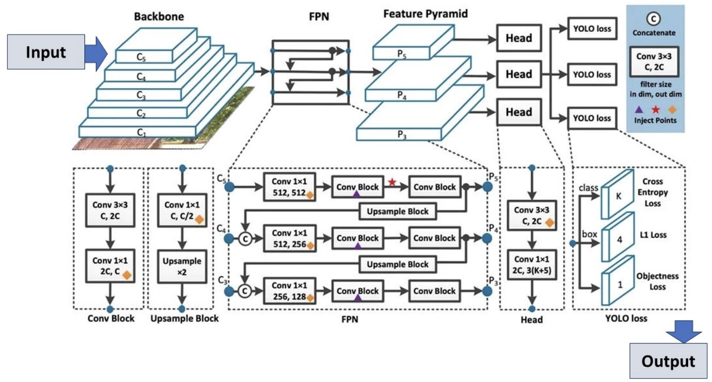

### YOLOv8

- **GitHub**：https://github.com/ultralytics/ultralytics

**简介：**

**由 Ultralytics 于 2023 年 1 月 10 日发布**，在准确性和速度方面提供了前沿的性能。YOLOv8 在之前 YOLO 版本的基础上进行了改进，引入了新的特性和优化，
使其成为各种应用中各种目标检测任务的理想选择。

**YOLOv8 架构：展示关键组件及其连接**。 主干网络通过多个卷积层（C1至C5）处理输入图像，提取层次特征。然后这些特征通过特征金字塔网络（FPN）创建特征金字塔（P3、P4、P5），
从而增强不同尺度的检测。网络头执行最终预测，结合卷积块和上采样块来细化特征。

- **高级骨干和颈部架构**： YOLOv8 采用最先进的骨干和颈部架构，从而改进了特征提取和目标检测性能。
- **无锚点分离式 Ultralytics Head**： YOLOv8 采用无锚点分离式 Ultralytics head，与基于锚点的方法相比，这有助于提高准确性并提高检测效率。
- **优化的准确性-速度权衡**： YOLOv8 专注于在准确性和速度之间保持最佳平衡，适用于各种应用领域中的实时对象检测任务。
- **多种预训练模型**： YOLOv8 提供了一系列预训练模型，以满足各种任务和性能需求，从而可以更轻松地找到适合您特定用例的正确模型。
