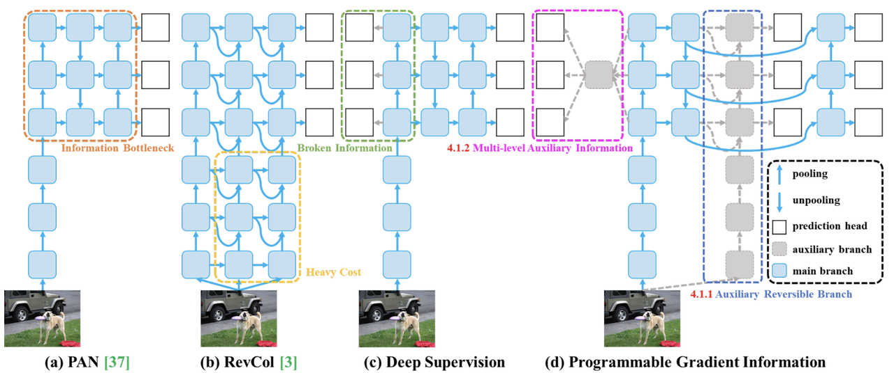
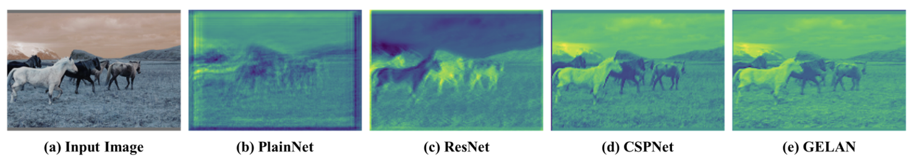

### YOLOv9

- **论文标题**：[《YOLOv9: Learning What You Want to Learn Using Programmable Gradient Information》](https://arxiv.org/pdf/2402.13616)
- **GitHub**：https://github.com/WongKinYiu/yolov9

**简介：**

标志着实时对象检测的重大进步，引入了突破性技术，如可编程梯度信息 (PGI) 和广义高效层聚合网络 (GELAN)。该模型在效率、准确性和适应性方面表现出显著的改进，在 MS COCO 数据集上设置了新的基准。

PGI和相关的网络架构及方法。（a）路径聚合网络（PAN），（b）可逆列（RevCol），（c）常规深度监控，以及（d）我们提出的可编程梯度信息（PGI）。
PGI主要由三个部分组成：（1）主分支：用于推理的架构，（2）辅助可逆分支：生成可靠的梯度，为主分支提供反向传输，（3）多级辅助信息：控制主分支学习可规划的多级语义信息。
YOLOv9 的进步深刻地植根于解决深度神经网络中信息丢失带来的挑战。信息瓶颈原理和可逆函数的创新使用是其设计的核心，确保 YOLOv9 保持高效率和准确性。

- **可编程梯度信息 (PGI)**

    PGI 是 YOLOv9 中引入的一个新概念，旨在解决信息瓶颈问题，确保在深层网络层中保留基本数据。这允许生成可靠的梯度，从而促进准确的模型更新并提高整体检测性能。

- **广义高效层聚合网络 (GELAN)**

    GELAN 代表了一种战略性的架构进步，使 YOLOv9 能够实现卓越的参数利用率和计算效率。它的设计允许灵活地集成各种计算块，使 YOLOv9 能够适应广泛的应用，而不会牺牲速度或准确性。

**不同网络架构的随机初始权重输出特征图的可视化结果**：（a）输入图像（b）PlainNet（c）ResNet（d）CSPNet，以及（e）GELAN。从图中可以看出，
在不同的架构中，提供给目标函数以计算损失的信息会不同程度地丢失，我们的架构可以保留最完整的信息，并为计算目标函数提供最可靠的梯度信息。