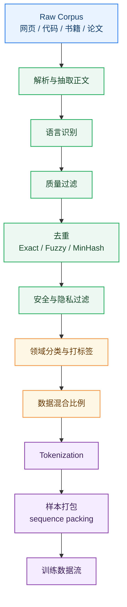
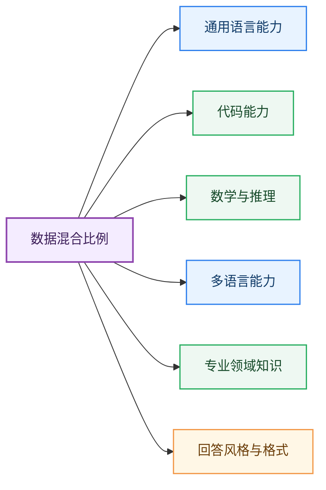
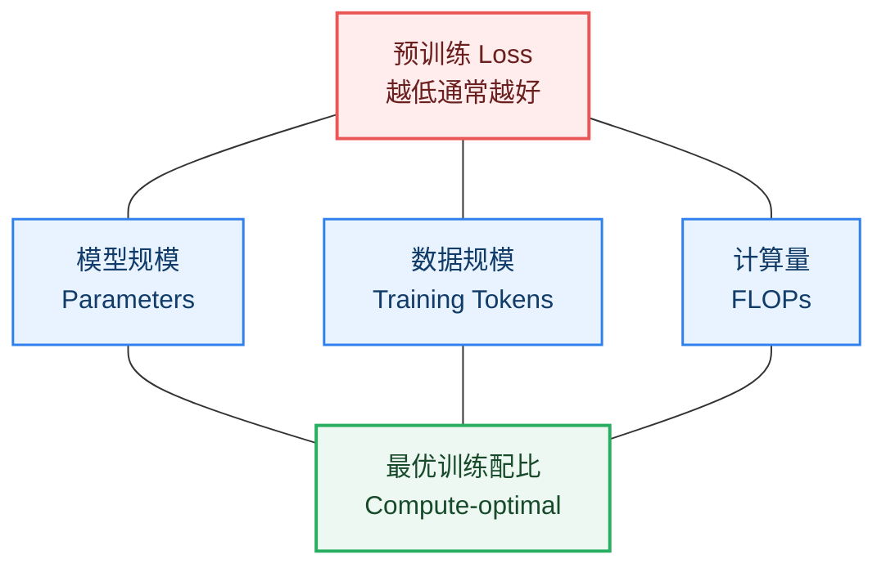
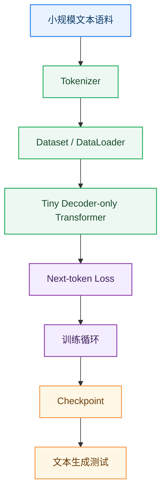

# 08_LLM 预训练

> 预训练是大语言模型能力的第一性来源。它让模型在海量文本、代码和多领域数据中学习语言规律、知识结构、推理模式和任务模板。

**By：猫先生 of 「魔方AI空间」**

## 本章导读

前面几章我们已经理解了 LLM 的模型结构：

```text
Token / Embedding
  -> Transformer
  -> Attention
  -> 位置编码
  -> MoE / Dense 架构
```

但模型结构本身只是一个“可训练的函数”。真正让模型获得语言能力、知识能力、代码能力和初步推理能力的，是大规模预训练。

预训练阶段通常回答的是：

> 给定前面的上下文，下一个 Token 最可能是什么？

这听起来简单，但当数据规模、模型规模和训练算力足够大时，模型会在这个任务中学习到大量隐含能力。

本章重点回答：

- LLM 预训练到底在训练什么？
- 预训练数据从哪里来，为什么数据质量如此关键？
- 下一个 Token 预测如何变成训练目标？
- 数据清洗、去重、混合比例、Tokenizer 为什么重要？
- 什么是 Scaling Law？
- 训练大模型为什么容易不稳定？
- Checkpoint、loss 曲线、困惑度应该怎么看？
- 从零训练一个小型 LLM 需要哪些步骤？

## 一句话理解预训练

LLM 预训练可以理解为：

> 用海量文本让模型反复练习“根据上下文预测下一个 Token”，从而把语言规律、知识关联和任务模式压缩进模型参数中。

一个极简训练样本：

```text
输入：大语言模型正在
目标：改变
```

模型会输出全词表 logits，然后和真实下一个 Token 做交叉熵损失。

训练足够多次后，模型逐渐学会：

- 语法和语义
- 世界知识
- 常见问答模式
- 代码结构
- 数学表达
- 文档格式
- 多语言对应关系
- 简单推理和任务迁移

## 预训练在 LLM 生命周期中的位置

一个常见 LLM 训练流程可以简化为：

```text
数据收集与清洗
  -> Tokenizer 训练 / 选择
  -> 大规模预训练
  -> 基础模型 Base Model
  -> 指令微调 SFT
  -> 偏好对齐 RLHF / DPO / GRPO
  -> Chat / Instruct / Reasoning Model
```

### 图解：LLM 训练流水线

```mermaid
flowchart LR
    DATA["原始数据<br/>网页 / 书籍 / 代码 / 论文"] --> CLEAN["清洗与去重"]
    CLEAN --> MIX["数据混合与采样"]
    MIX --> TOK["Tokenizer"]
    TOK --> PRE["预训练<br/>Next Token Prediction"]
    PRE --> BASE["Base Model"]
    BASE --> SFT["SFT<br/>指令微调"]
    SFT --> ALIGN["RLHF / DPO / GRPO<br/>偏好对齐"]
    ALIGN --> CHAT["Chat / Instruct / Reasoning Model"]

    classDef data fill:#E8F3FF,stroke:#2F80ED,color:#113B68,stroke-width:1.5px;
    classDef prep fill:#EEF8F2,stroke:#27AE60,color:#174A2A,stroke-width:1.5px;
    classDef train fill:#F4ECFF,stroke:#8E44AD,color:#3D1F5A,stroke-width:1.5px;
    classDef model fill:#FFF7E6,stroke:#F2994A,color:#6B3D09,stroke-width:1.5px;
    classDef align fill:#FFECEC,stroke:#EB5757,color:#6B1F1F,stroke-width:1.5px;
    class DATA data;
    class CLEAN,MIX,TOK prep;
    class PRE train;
    class BASE,CHAT model;
    class SFT,ALIGN align;
```



预训练得到的是 Base Model。它通常具备大量知识和语言能力，但还不一定擅长直接回答用户问题。GPT-2 的 [Language Models are Unsupervised Multitask Learners](https://cdn.openai.com/better-language-models/language_models_are_unsupervised_multitask_learners.pdf) 和 GPT-3 的 [Language Models are Few-Shot Learners](https://arxiv.org/abs/2005.14165) 都展示了大规模自回归预训练带来的通用迁移能力。要成为好用的助手，还需要后续 SFT 和对齐训练。

## 预训练目标：下一个 Token 预测

现代 Decoder-only LLM 最常见的预训练目标是自回归语言建模。这条路线从 GPT 系列一路延续到 LLaMA、Qwen、Mistral、DeepSeek 等主流模型；LLaMA 论文 [LLaMA: Open and Efficient Foundation Language Models](https://arxiv.org/abs/2302.13971) 也展示了高质量数据和高效训练配方对基础模型能力的重要性。

给定 Token 序列：

```text
[x1, x2, x3, x4, x5]
```

模型训练目标是：

```text
用 x1 预测 x2
用 x1, x2 预测 x3
用 x1, x2, x3 预测 x4
用 x1, x2, x3, x4 预测 x5
```

也就是：

```text
P(x_t | x_1, x_2, ..., x_{t-1})
```

在训练中，模型会对每个位置都做预测：

```text
输入 Tokens:  [大, 语言, 模型, 正在, 改变]
目标 Tokens:  [语言, 模型, 正在, 改变, 世界]
```

## Loss 是怎么来的？

模型在每个位置输出一个词表大小的 logits。

假设词表大小是 `100000`：

```text
hidden state -> LM Head -> 100000 个 logits
```

这些 logits 经过 softmax 变成概率分布。训练时，我们希望真实下一个 Token 的概率尽可能高。

常见损失函数是 Cross Entropy Loss：

```text
Loss = -log P(真实下一个 Token | 上下文)
```

如果模型预测得越准，loss 越低。

## 预训练数据从哪里来？

预训练数据通常来自多个来源。

| 数据类型 | 作用 | 注意点 |
| --- | --- | --- |
| 网页文本 | 覆盖广、规模大 | 噪声多，需要清洗 |
| 书籍 | 长文本、叙事和知识密度高 | 版权和质量控制 |
| 百科 | 结构化知识 | 容易过拟合固定表达 |
| 论文 | 科学和专业知识 | 数学、公式和格式处理 |
| 代码 | 编程能力 | 许可证、重复代码、质量 |
| 问答社区 | 任务和交互模式 | 噪声、偏见和安全问题 |
| 多语言语料 | 多语言能力 | 采样比例和 Tokenizer 效率 |
| 合成数据 | 强化特定能力 | 质量和多样性风险 |

数据不是越多越好。高质量数据通常比低质量重复数据更有价值。公开语料工作如 [The Pile](https://arxiv.org/abs/2101.00027)、[The RefinedWeb Dataset for Falcon LLM](https://arxiv.org/abs/2306.01116)、[Dolma](https://arxiv.org/abs/2402.00159) 都说明：预训练语料的来源、清洗、去重和可复现性，会深刻影响模型训练质量。

## 数据处理流水线

大模型预训练的数据工程非常复杂，常见流程如下：

```text
原始数据
  -> 文档解析
  -> 语言识别
  -> 质量过滤
  -> 去重
  -> 敏感信息过滤
  -> 安全过滤
  -> 数据分类
  -> 混合采样
  -> Tokenization
  -> 打包成训练样本
```

### 图解：预训练数据处理



## 数据清洗为什么重要？

低质量数据会直接污染模型能力。

常见问题包括：

- HTML 噪声
- 广告和导航栏
- 重复网页
- 机器翻译垃圾文本
- 乱码
- 低质量 SEO 内容
- 有害内容
- 隐私信息
- 版权敏感内容
- 重复代码和自动生成代码

如果不清洗，模型可能学到：

- 错误事实
- 重复表达
- 不稳定格式
- 偏见和有害输出
- 低质量代码风格

因此，数据工程往往是 LLM 训练中最重要但最不显眼的部分。比如 [CCNet](https://aclanthology.org/2020.lrec-1.494/) 展示了 Common Crawl 级网页语料清洗流程，[RefinedWeb](https://arxiv.org/abs/2306.01116) 则进一步强调过滤和去重对高质量开放 LLM 语料的重要性。

## 去重

去重是预训练数据处理中非常关键的一环。

常见去重类型：

| 去重类型 | 目标 |
| --- | --- |
| Exact Dedup | 去掉完全相同文档 |
| Near Dedup | 去掉高度相似文档 |
| MinHash / SimHash | 高效发现大规模相似文本 |
| Benchmark Dedup | 避免评测集泄漏 |
| Code Dedup | 去掉重复仓库、重复文件、生成代码 |

去重的价值：

- 降低重复训练
- 减少记忆训练样本
- 提升泛化能力
- 降低 benchmark contamination 风险
- 提高训练 token 的有效信息密度

[Deduplicating Training Data Makes Language Models Better](https://arxiv.org/abs/2107.06499) 系统研究了训练语料重复对语言模型记忆和泛化的影响，是理解预训练去重价值的一篇重要论文。

## 数据混合比例

预训练不是简单把所有数据混在一起。

不同数据类型的比例会显著影响模型能力。

例如：

```text
网页文本：通用语言能力
代码数据：编程能力
数学数据：推理和符号能力
论文数据：专业知识
多语言数据：跨语言能力
高质量指令式文本：任务理解
```

如果代码比例太低，模型代码能力会弱；如果低质量网页比例太高，模型表达和事实性可能变差。

### 图解：数据混合影响能力



数据配方是大模型公司的核心壁垒之一。LLaMA、Falcon、Dolma 等公开工作都反复强调：模型能力不是单纯由参数规模决定，数据来源、清洗策略和采样比例同样关键。

## Tokenizer 与预训练

Tokenizer 会影响预训练效率和模型能力。

重点影响：

- 同一文本被切成多少 Token
- 中文、多语言、代码的压缩效率
- 词表大小
- 特殊 Token 设计
- 长上下文可用空间
- 训练成本和推理成本

例如，同样一段中文，如果 Tokenizer A 切成 1000 个 Token，Tokenizer B 切成 1500 个 Token，那么在相同上下文窗口和训练预算下，Tokenizer A 更高效。

Tokenizer 相关内容可回看：[Token 与 Embedding](../02_Token与Embedding/README.md)。如果想进一步理解子词切分，可以读 BPE 论文 [Neural Machine Translation of Rare Words with Subword Units](https://arxiv.org/abs/1508.07909) 和 [SentencePiece](https://arxiv.org/abs/1808.06226)。

## 样本打包

预训练时通常不会一篇文档一个 batch 简单送入模型，而是会把 Token 流打包成固定长度序列。

例如上下文长度是 4096：

```text
文档 A tokens + 文档 B tokens + 文档 C tokens
  -> 打包成长度 4096 的训练样本
```

这样做可以提高训练效率，减少 padding 浪费。

但需要注意：

- 文档边界处理
- 特殊分隔符
- 超长文档截断
- 短文档拼接
- 是否允许跨文档 Attention

## 训练循环

一个简化的预训练循环如下：

```text
读取 batch
  -> 前向传播
  -> 计算 next-token loss
  -> 反向传播
  -> 梯度裁剪
  -> optimizer 更新参数
  -> learning rate scheduler 更新学习率
  -> 周期性保存 checkpoint
```

### 图解：预训练训练循环

```mermaid
flowchart LR
    BATCH["Batch Tokens"] --> FWD["Forward"]
    FWD --> LOSS["Cross Entropy Loss"]
    LOSS --> BWD["Backward"]
    BWD --> CLIP["Gradient Clipping"]
    CLIP --> OPT["Optimizer Step"]
    OPT --> LR["LR Scheduler"]
    LR --> CKPT["Save Checkpoint"]
    LR --> BATCH

    classDef data fill:#E8F3FF,stroke:#2F80ED,color:#113B68,stroke-width:1.5px;
    classDef compute fill:#F4ECFF,stroke:#8E44AD,color:#3D1F5A,stroke-width:1.5px;
    classDef stable fill:#EEF8F2,stroke:#27AE60,color:#174A2A,stroke-width:1.5px;
    classDef artifact fill:#FFF7E6,stroke:#F2994A,color:#6B3D09,stroke-width:1.5px;
    class BATCH data;
    class FWD,LOSS,BWD compute;
    class CLIP,OPT,LR stable;
    class CKPT artifact;
```



## Optimizer 与学习率

LLM 预训练中常见优化器包括：

- AdamW
- Adafactor
- Lion 等变体

其中 AdamW 来自 [Decoupled Weight Decay Regularization](https://arxiv.org/abs/1711.05101)，Adafactor 来自 [Adafactor: Adaptive Learning Rates with Sublinear Memory Cost](https://arxiv.org/abs/1804.04235)。在大模型训练中，优化器不仅影响收敛速度，也会显著影响显存和分布式训练成本。

学习率通常不是固定不变的，而是有调度策略。

常见形式：

```text
Warmup
  -> Peak LR
  -> Cosine Decay / Linear Decay
```

Warmup 很重要，因为训练初期模型参数还不稳定，学习率直接拉满容易导致 loss spike 或训练崩溃。

## Batch Size 与梯度累积

大模型训练需要非常大的 global batch size。

但单张 GPU 显存有限，所以常用：

- Data Parallel
- Gradient Accumulation
- Tensor Parallel
- Pipeline Parallel
- Sequence Parallel
- ZeRO / FSDP

Global batch size 大致可以理解为：

```text
global batch size = micro batch size * data parallel size * gradient accumulation steps
```

Batch size 会影响：

- 训练稳定性
- 收敛速度
- 学习率选择
- 吞吐
- 泛化能力

## Scaling Law

Scaling Law 研究的是模型性能与模型规模、数据规模、计算量之间的关系。

直觉上：

```text
模型参数越大
训练数据越多
计算量越大
loss 通常越低
```

但三者需要平衡。

如果模型很大但数据不足，会数据受限；如果数据很多但模型太小，会模型容量受限；如果算力不够，训练无法充分收敛。

### 图解：Scaling Law 三要素



Scaling Law 的代表性工作包括 OpenAI 的 [Scaling Laws for Neural Language Models](https://arxiv.org/abs/2001.08361) 和 DeepMind 的 [Training Compute-Optimal Large Language Models](https://arxiv.org/abs/2203.15556)。

## Chinchilla Scaling

Chinchilla 的重要启发是：在固定计算预算下，很多早期大模型“参数太多、数据太少”。

更优策略往往是：

```text
适当减小模型参数
  -> 增加训练 Token 数
  -> 在同样计算预算下获得更低 loss
```

这也是为什么现代 LLM 越来越重视高质量、多轮次、足量 token 的训练，而不是只盲目堆参数量。Chinchilla 之后，很多开源模型报告都会明确讨论训练 token 数、模型参数量和计算预算之间的平衡。

## 训练稳定性

大模型预训练很容易出现不稳定。

常见问题：

- loss spike
- 梯度爆炸
- NaN / Inf
- 激活值异常
- 学习率过大
- 数据 batch 异常
- 混合精度溢出
- 并行通信错误
- MoE 负载不均

稳定训练通常需要：

- 合理初始化
- 学习率 warmup
- 梯度裁剪
- BF16 / FP32 关键路径
- loss scaling
- 数据异常检测
- checkpoint 回滚
- 训练监控报警

大规模训练系统层面的参考可以阅读 [Megatron-LM](https://arxiv.org/abs/1909.08053)、[ZeRO](https://arxiv.org/abs/1910.02054) 和 [PyTorch FSDP](https://arxiv.org/abs/2304.11277) 相关工作，它们分别代表了张量并行、优化器状态分片和全分片数据并行等关键工程路线。

## Checkpoint

Checkpoint 是训练过程中的模型快照。

它通常包含：

- 模型参数
- Optimizer 状态
- Scheduler 状态
- 随机数状态
- 当前 step
- 数据读取状态

Checkpoint 的作用：

- 训练中断后恢复
- 出现 loss spike 后回滚
- 评估中间模型
- 继续预训练
- 做 SFT 或对齐训练的起点

保存 checkpoint 也有成本，因为大模型 checkpoint 可能非常大，需要高吞吐存储系统。

## Loss 曲线怎么看？

预训练 loss 曲线通常应该整体平滑下降。

需要关注：

| 现象 | 可能原因 |
| --- | --- |
| loss 平稳下降 | 训练正常 |
| loss 突然 spike | 数据异常、学习率过大、数值不稳定 |
| loss 长期不降 | 学习率、数据质量、模型容量或 bug |
| eval loss 上升 | 过拟合、数据分布偏差 |
| 某类数据 loss 异常 | 数据混合或清洗问题 |

训练大模型时，通常会监控不同数据域的 loss，例如：

- web loss
- code loss
- math loss
- multilingual loss
- validation loss

## 困惑度 Perplexity

Perplexity 可以理解为模型对下一个 Token 的“不确定程度”。

通常：

```text
Perplexity = exp(loss)
```

loss 越低，perplexity 越低，说明模型对文本预测越有把握。

但注意：

- Perplexity 主要衡量语言建模能力
- 不等于指令跟随能力
- 不等于安全能力
- 不等于真实任务表现

所以预训练完成后，还需要下游评测和后训练。

## 评估与数据污染

预训练阶段非常容易出现 benchmark contamination，也就是评测数据混入训练集。

如果模型见过测试题，评测分数就会虚高。

常见处理：

- benchmark 去重
- n-gram overlap 检测
- 文档级去重
- 时间切分
- 私有评测集
- 动态生成评测题

对大模型来说，干净评测和干净数据同样重要。

数据污染问题在 GPT-3 论文 [Language Models are Few-Shot Learners](https://arxiv.org/abs/2005.14165) 中已经被专门讨论；后续很多评测工作也会通过去重、时间切分和私有集来降低 benchmark contamination 风险。

## 继续预训练

继续预训练通常指在已有 Base Model 上，用新数据继续训练。

常见场景：

- 加强中文能力
- 加强代码能力
- 加强数学能力
- 加强金融、医疗、法律等领域能力
- 扩展长上下文
- 适配企业私有语料

继续预训练和 SFT 不一样：

| 方式 | 目标 | 数据形式 |
| --- | --- | --- |
| 继续预训练 | 增强知识和领域分布 | 大规模原始文本 / 领域语料 |
| SFT | 学会按指令回答 | 指令-回答样本 |

如果只是想让模型“知道更多领域知识”，继续预训练可能更合适；如果想让模型“更会回答问题”，SFT 更直接。

继续预训练的经典参考是 [Don't Stop Pretraining: Adapt Language Models to Domains and Tasks](https://arxiv.org/abs/2004.10964)，它展示了领域自适应预训练和任务自适应预训练对下游任务的价值。

## 从零训练小型 LLM 的流程

如果只是学习，可以不从千亿参数开始。训练一个 tiny GPT 更适合入门。

最小流程：

```text
1. 准备文本数据
2. 训练或选择 Tokenizer
3. 构建 Dataset 和 DataLoader
4. 实现 Decoder-only Transformer
5. 设置 next-token prediction loss
6. 训练若干 epoch / steps
7. 保存 checkpoint
8. 写生成脚本
9. 观察 loss 和生成样例
```

### 图解：从零训练 tiny GPT



建议配合项目实战：[From-Zero-to-Transformer](../../10_项目实战/From-Zero-to-Transformer/README.md)

## 预训练与后训练的区别

很多初学者容易混淆预训练、SFT 和 RLHF。

| 阶段 | 目标 | 典型数据 | 输出模型 |
| --- | --- | --- | --- |
| 预训练 | 学语言、知识和通用模式 | 海量文本 / 代码 / 多语言语料 | Base Model |
| SFT | 学会遵循指令 | 指令-回答对 | Instruct Model |
| RLHF / DPO / GRPO | 学会符合偏好 | 偏好数据 / 奖励信号 | Aligned Model |

可以这样理解：

```text
预训练：让模型有知识和语言能力
SFT：让模型听得懂指令
对齐：让模型回答更符合人类偏好
```

## 常见误区

### 1. 预训练不是把知识库塞进模型

预训练是优化语言建模目标，不是把文档逐条写入数据库。模型可能记住一些事实，但也可能遗忘或生成幻觉。

### 2. 数据越多不一定越好

低质量、重复、污染数据可能降低模型质量。高质量数据配方非常关键。

### 3. Loss 低不等于模型好用

预训练 loss 低说明语言建模能力强，但模型是否好用还取决于 SFT、对齐和真实任务评测。

### 4. Base Model 不等于 Chat Model

Base Model 可能会补全文本，而不是像助手一样回答问题。

### 5. 继续预训练不等于 SFT

继续预训练增强分布和知识，SFT 增强指令跟随和回答格式。

## 核心概念表

| 概念 | 简单解释 | 关键作用 |
| --- | --- | --- |
| Pretraining | 在海量语料上训练语言模型 | 获得基础能力 |
| Next Token Prediction | 根据上下文预测下一个 Token | Decoder-only LLM 核心目标 |
| Cross Entropy Loss | 真实 Token 的负对数似然 | 优化预测概率 |
| Data Mixture | 不同数据源的混合比例 | 决定能力分布 |
| Deduplication | 去除重复和相似数据 | 提升有效信息密度 |
| Scaling Law | 规模、数据、计算与 loss 的关系 | 指导训练配比 |
| Checkpoint | 训练过程快照 | 恢复、评估、后训练 |
| Perplexity | 语言建模不确定性指标 | 衡量预测能力 |
| Continued Pretraining | 在已有模型上继续预训练 | 增强领域或语言能力 |
| Contamination | 评测数据泄漏进训练集 | 导致评测虚高 |

## 学习建议

学习预训练时，建议抓住四条主线：

1. **目标主线**：next-token prediction 是 Decoder-only LLM 的基础目标。
2. **数据主线**：数据质量、去重、混合比例决定模型能力上限。
3. **规模主线**：参数量、训练 token 和算力需要按 Scaling Law 平衡。
4. **工程主线**：稳定性、并行训练、checkpoint 和监控决定训练能不能跑完。

## 推荐阅读

### 预训练与基础模型

- [Language Models are Unsupervised Multitask Learners](https://cdn.openai.com/better-language-models/language_models_are_unsupervised_multitask_learners.pdf)
- [Language Models are Few-Shot Learners](https://arxiv.org/abs/2005.14165)
- [LLaMA: Open and Efficient Foundation Language Models](https://arxiv.org/abs/2302.13971)

### Scaling Law 与训练配比

- [Scaling Laws for Neural Language Models](https://arxiv.org/abs/2001.08361)
- [Training Compute-Optimal Large Language Models](https://arxiv.org/abs/2203.15556)

### 预训练数据与去重

- [The Pile: An 800GB Dataset of Diverse Text for Language Modeling](https://arxiv.org/abs/2101.00027)
- [The RefinedWeb Dataset for Falcon LLM](https://arxiv.org/abs/2306.01116)
- [Dolma: an Open Corpus of Three Trillion Tokens for Language Model Pretraining Research](https://arxiv.org/abs/2402.00159)
- [Deduplicating Training Data Makes Language Models Better](https://arxiv.org/abs/2107.06499)
- [CCNet: Extracting High Quality Monolingual Datasets from Web Crawl Data](https://aclanthology.org/2020.lrec-1.494/)

### Tokenizer 与子词建模

- [Neural Machine Translation of Rare Words with Subword Units](https://arxiv.org/abs/1508.07909)
- [SentencePiece: A simple and language independent subword tokenizer and detokenizer for Neural Text Processing](https://arxiv.org/abs/1808.06226)

### 分布式训练与稳定性

- [Megatron-LM: Training Multi-Billion Parameter Language Models Using Model Parallelism](https://arxiv.org/abs/1909.08053)
- [ZeRO: Memory Optimizations Toward Training Trillion Parameter Models](https://arxiv.org/abs/1910.02054)
- [PyTorch FSDP: Experiences on Scaling Fully Sharded Data Parallel](https://arxiv.org/abs/2304.11277)

### 继续预训练

- [Don't Stop Pretraining: Adapt Language Models to Domains and Tasks](https://arxiv.org/abs/2004.10964)

## 小结

LLM 预训练的核心可以概括为：

```text
高质量大规模数据
  -> Tokenization
  -> Next-token prediction
  -> Cross entropy loss
  -> 大规模分布式训练
  -> Base Model
```

预训练决定了模型的基础能力，但它只是 LLM 生命周期的第一阶段。一个真正好用的助手模型，还需要后续的指令微调、偏好对齐、工具调用和系统工程。

---

**上一章：**[MoE 模型](../07_MoE模型/README.md)  
**下一章建议阅读：**[指令微调](../09_指令微调/README.md)
