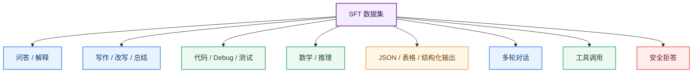
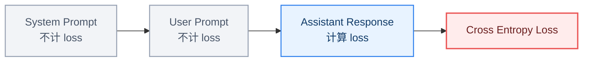
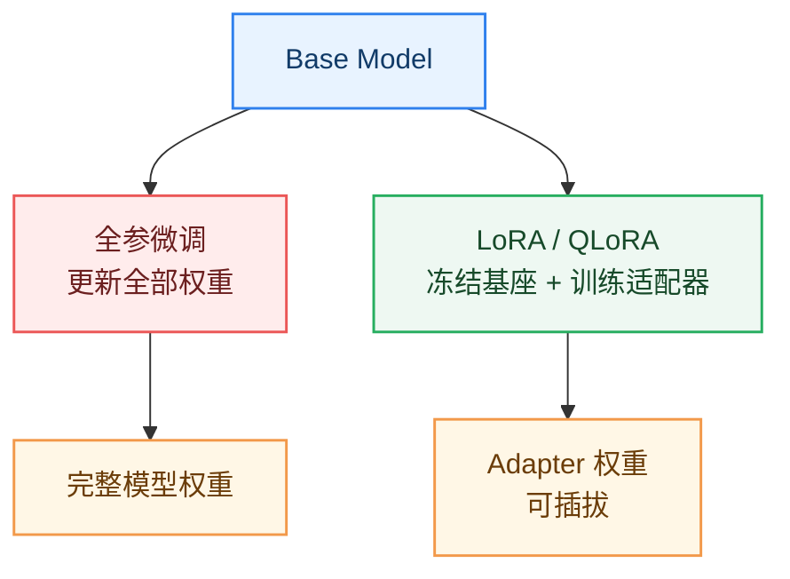

# 09_指令微调

> 指令微调（Supervised Fine-Tuning，SFT）是把 Base Model 训练成 Instruct / Chat Model 的关键阶段。它让模型从“会续写文本”变成“能理解并遵循用户指令”。

**By：猫先生 of 「魔方AI空间」**

## 本章导读

预训练阶段让模型学会语言、知识和通用模式，但 Base Model 往往只是一个“文本续写器”。

例如输入：

```text
请解释什么是 Transformer。
```

Base Model 可能继续补全文本，也可能生成类似训练语料中的段落，而不一定像助手一样清晰回答。

指令微调要解决的问题是：

```text
用户提出任务
  -> 模型理解意图
  -> 按指定格式和风格回答
```

本章重点回答：

- 指令微调和预训练有什么区别？
- SFT 数据长什么样？
- 单轮、多轮、系统提示词如何组织？
- Chat Template 为什么重要？
- Loss Mask 为什么关键？
- 全参微调、LoRA、QLoRA 如何选择？
- SFT 数据质量为什么比数量更重要？
- SFT 和 RLHF / DPO / GRPO 如何衔接？

## 一句话理解指令微调

指令微调可以理解为：

> 用高质量“指令 -> 回答”样本继续训练模型，让它学会按照用户意图完成任务，而不是单纯续写文本。

一个典型 SFT 样本：

```text
User:
请用三句话解释什么是大语言模型。

Assistant:
大语言模型是一类在海量文本上训练的神经网络模型。
它可以根据上下文预测并生成后续文本。
经过指令微调和对齐后，它可以更好地完成问答、写作、代码和推理任务。
```

## SFT 在 LLM 生命周期中的位置

SFT 位于预训练之后、偏好对齐之前。

```text
预训练
  -> Base Model
  -> SFT
  -> Instruct / Chat Model
  -> RLHF / DPO / GRPO
  -> Aligned Model
```

### 图解：从 Base Model 到 Chat Model


OpenAI 的 [InstructGPT](https://arxiv.org/abs/2203.02155) 是理解“预训练模型 -> 指令模型 -> 偏好对齐模型”这条路线的经典论文。

## 预训练 vs 指令微调

| 对比维度 | 预训练 | 指令微调 |
| --- | --- | --- |
| 目标 | 学语言和知识分布 | 学会遵循指令 |
| 数据 | 海量原始文本、代码、多语言语料 | 指令-回答样本 |
| 模型输出 | Base Model | Instruct / Chat Model |
| 训练规模 | 通常极大 | 通常远小于预训练 |
| 关键难点 | 数据规模、稳定训练、算力 | 数据质量、格式、任务覆盖 |
| 典型损失 | Next-token loss | Assistant response loss |

预训练让模型“有能力”，SFT 让模型“会使用这些能力回答用户”。

## SFT 数据长什么样？

最简单的 SFT 数据是单轮指令。

```json
{
  "instruction": "解释什么是注意力机制",
  "input": "",
  "output": "注意力机制是一种让模型根据上下文动态选择关键信息的计算方法..."
}
```

聊天模型通常使用多轮消息格式。

```json
{
  "messages": [
    {"role": "system", "content": "你是一个严谨的 AI 教学助手。"},
    {"role": "user", "content": "什么是 MoE？"},
    {"role": "assistant", "content": "MoE 是 Mixture of Experts 的缩写..."}
  ]
}
```

常见数据字段：

| 字段 | 作用 |
| --- | --- |
| system | 定义助手身份、规则和边界 |
| user | 用户指令或问题 |
| assistant | 模型应该学习生成的回答 |
| tool | 工具返回结果 |
| metadata | 数据来源、任务类型、难度、语言等 |

## 指令数据来源

SFT 数据通常来自多种来源。

| 数据来源 | 优点 | 风险 |
| --- | --- | --- |
| 人工标注 | 质量高、意图清晰 | 成本高、规模有限 |
| 公开指令数据 | 易获取、覆盖广 | 质量参差、可能重复 |
| 模型生成数据 | 扩展快、成本低 | 容易继承教师模型偏差 |
| 业务日志改写 | 贴近真实场景 | 隐私和安全要求高 |
| 专家数据 | 专业性强 | 覆盖面窄、成本高 |
| 工具调用轨迹 | 训练 Agent / Tool Use | 格式复杂、验证难 |

代表性工作包括 [Self-Instruct](https://arxiv.org/abs/2212.10560)、[Alpaca](https://crfm.stanford.edu/2023/03/13/alpaca.html)、[OpenAssistant Conversations](https://arxiv.org/abs/2304.07327) 和 [LIMA](https://arxiv.org/abs/2305.11206)。

## 指令数据类型

高质量 SFT 数据应该覆盖不同任务类型。

常见类型：

- 问答
- 总结
- 翻译
- 改写
- 分类
- 信息抽取
- 代码生成
- 代码解释
- 数学推理
- 表格转文本
- 结构化输出
- 多轮对话
- 工具调用
- 安全拒答

### 图解：SFT 数据能力覆盖



## Chat Template

同一组 messages 需要被转换成模型能训练的文本格式，这个格式叫 Chat Template。

例如 Qwen、LLaMA、ChatML 等模型都有各自的聊天模板。

一个简化模板：

```text
<|system|>
你是一个有帮助的 AI 助手。
<|user|>
解释什么是 Transformer。
<|assistant|>
Transformer 是一种基于注意力机制的神经网络架构...
```

Chat Template 的作用：

- 区分 system / user / assistant
- 固定训练和推理格式
- 让模型学会何时开始回答
- 支持多轮对话
- 支持工具调用和结构化消息

如果训练模板和推理模板不一致，模型表现会明显下降。

## Loss Mask

SFT 训练时，通常只希望模型学习 assistant 的回答，而不是学习生成用户问题。

例如：

```text
<user> 什么是 MoE？
<assistant> MoE 是一种混合专家架构...
```

训练时：

```text
user 部分：mask 掉，不计算 loss
assistant 部分：计算 loss
```

### 图解：SFT Loss Mask



Loss Mask 很关键。否则模型可能会学会生成用户输入、系统提示词，甚至破坏多轮对话边界。

## SFT 训练目标

SFT 本质上仍然是 next-token prediction，只是训练样本变成了指令格式，并且 loss 通常只作用在 assistant tokens 上。

```text
输入：system + user + assistant 前缀
目标：assistant 后续 tokens
```

损失仍然可以理解为：

```text
Loss = -log P(assistant token | system, user, previous assistant tokens)
```

也就是说，SFT 没有改变语言模型的基本训练形式，它改变的是数据分布和监督目标。

## 全参微调、LoRA 与 QLoRA

SFT 可以有不同训练方式。

| 方法 | 训练哪些参数 | 优点 | 缺点 |
| --- | --- | --- | --- |
| 全参微调 | 更新全部模型参数 | 效果上限高 | 显存和算力成本高 |
| LoRA | 只训练低秩适配器 | 成本低、易保存多个版本 | 表达能力受 rank 限制 |
| QLoRA | 量化基座 + LoRA | 显存更省 | 工程细节更多 |
| Adapter | 插入小模块 | 参数高效 | 架构侵入性较强 |

[LoRA](https://arxiv.org/abs/2106.09685) 和 [QLoRA](https://arxiv.org/abs/2305.14314) 是最常见的参数高效微调路线，适合个人和中小团队做领域模型、风格模型和任务适配。

### 图解：全参微调 vs LoRA



## SFT 训练流程

一个典型 SFT 流程：

```text
准备指令数据
  -> 清洗和去重
  -> 转成统一 messages 格式
  -> 应用 Chat Template
  -> Tokenization
  -> 构造 labels 和 loss mask
  -> 训练
  -> 验证和人工抽查
  -> 保存 Instruct Model
```

### 图解：SFT 工程流水线


## 数据质量比数量更重要

SFT 数据规模通常远小于预训练数据，但质量要求更高。

高质量样本应具备：

- 指令清晰
- 回答准确
- 格式稳定
- 逻辑完整
- 覆盖真实任务
- 避免幻觉
- 安全边界明确
- 多轮上下文一致

低质量 SFT 数据会让模型学到坏习惯：

- 啰嗦
- 空话套话
- 过度拒答
- 格式混乱
- 编造事实
- 误解用户意图
- 多轮上下文遗忘

[LIMA](https://arxiv.org/abs/2305.11206) 提出了“少量高质量示范也能产生强指令跟随能力”的观点，虽然结论需要结合模型基座和任务分布理解，但它很好地提醒我们：SFT 不是简单堆数据量。

## 多轮对话 SFT

多轮对话数据用于训练模型保持上下文、追问和连续解决问题。

示例：

```json
{
  "messages": [
    {"role": "user", "content": "帮我解释 Transformer。"},
    {"role": "assistant", "content": "Transformer 是一种基于注意力机制的架构..."},
    {"role": "user", "content": "那 Self-Attention 是什么？"},
    {"role": "assistant", "content": "Self-Attention 让序列中的每个 Token 关注其他 Token..."}
  ]
}
```

多轮 SFT 的关键点：

- 角色边界清晰
- 历史上下文不能错乱
- assistant 回答要与前文一致
- 不同轮次的 loss mask 要正确
- 长对话要注意上下文截断策略

## 工具调用 SFT

如果希望模型学会调用工具，需要把工具描述、函数参数和工具返回结果也纳入训练格式。

一个简化工具调用样例：

```json
{
  "messages": [
    {"role": "user", "content": "查一下今天上海天气。"},
    {
      "role": "assistant",
      "content": "{\"tool_name\": \"weather\", \"arguments\": {\"city\": \"上海\"}}"
    },
    {"role": "tool", "content": "{\"temperature\": \"25C\", \"condition\": \"晴\"}"},
    {"role": "assistant", "content": "今天上海天气晴，气温约 25C。"}
  ]
}
```

工具调用相关思想可以参考 [Toolformer](https://arxiv.org/abs/2302.04761)。实际工程中，还需要配合函数调用协议、参数校验和执行结果回填。

## 安全拒答数据

SFT 不只是训练模型“会回答”，也要训练模型“知道哪些不能直接回答”。

安全数据通常包括：

- 有害请求拒答
- 隐私和敏感信息保护
- 医疗、法律、金融风险提示
- 未成年人安全
- 网络攻击和危险操作边界
- 版权和数据泄露风险

但安全拒答要控制分寸。如果拒答数据过多或质量不佳，模型容易变得过度保守。

## 过拟合与灾难性遗忘

SFT 数据规模小，如果训练过头，模型可能过拟合到特定风格或任务。

常见问题：

- 回答模板化
- 泛化能力下降
- 原有知识退化
- 只适应某类指令
- 对开放问题变得机械

缓解方法：

- 控制 epoch
- 使用验证集
- 降低学习率
- 混入通用指令数据
- 使用 early stopping
- 保留一部分通用能力评测

## SFT 评估

SFT 之后需要评估模型是否真的更会遵循指令。

常见评估维度：

| 维度 | 看什么 |
| --- | --- |
| 指令遵循 | 是否按用户要求完成任务 |
| 正确性 | 回答是否事实准确 |
| 格式控制 | 是否稳定输出 JSON、表格等格式 |
| 多轮一致性 | 是否记住上下文 |
| 代码能力 | 是否能生成可运行代码 |
| 数学推理 | 是否能给出正确步骤 |
| 安全性 | 是否拒绝高风险请求 |
| 风格 | 是否简洁、清晰、符合角色 |

可以结合自动评测、人类偏好评测和真实业务集评测。

## SFT 与 RLHF / DPO / GRPO 的关系

SFT 是让模型“学会按指令回答”，但不一定让模型“回答得最好”。

后续偏好对齐会继续优化：

- 哪个回答更有帮助
- 哪个回答更安全
- 哪个回答更符合人类偏好
- 哪个推理过程更可靠
- 哪种拒答更合适

因此常见流程是：

```text
Base Model
  -> SFT
  -> Reward Model / Preference Data
  -> RLHF / DPO / GRPO
  -> Aligned Model
```

下一章 [RLHF](../RLHF/README.md) 会继续展开 PPO、DPO、GRPO 等算法。

## 一个最小 SFT 伪代码

下面是帮助理解的极简训练结构，不代表完整工程实现。

```python
for batch in dataloader:
    input_ids = batch["input_ids"]
    attention_mask = batch["attention_mask"]
    labels = batch["labels"]  # user/system tokens 通常设置为 -100

    outputs = model(
        input_ids=input_ids,
        attention_mask=attention_mask,
        labels=labels,
    )

    loss = outputs.loss
    loss.backward()
    optimizer.step()
    scheduler.step()
    optimizer.zero_grad()
```

关键点是 labels：

```text
system/user token label = -100，不计算 loss
assistant token label = token_id，计算 loss
```

## 常见误区

### 1. SFT 不是让模型学新知识的最佳方式

SFT 更擅长训练行为和格式。如果要大规模注入领域知识，继续预训练或 RAG 可能更合适。

### 2. 指令数据越多越好

低质量指令数据会污染模型风格。SFT 更强调高质量、多样性和任务覆盖。

### 3. 只训练 assistant 回答不重要

Loss Mask 非常重要。如果把 user 和 system 也纳入 loss，模型可能学会生成用户问题或破坏对话格式。

### 4. LoRA 一定不如全参微调

这取决于任务、数据规模、rank、基座模型和算力预算。很多应用场景 LoRA 已经足够好。

### 5. SFT 完就是 ChatGPT

SFT 只是第一步。真正稳定、有帮助、安全的助手模型，通常还需要偏好对齐、评测和系统层约束。

## 核心概念表

| 概念 | 简单解释 | 关键作用 |
| --- | --- | --- |
| SFT | 用指令-回答数据监督微调 | 让模型遵循指令 |
| Instruction Data | 指令微调样本 | 决定行为和任务覆盖 |
| Chat Template | messages 到文本的转换格式 | 保证训练推理一致 |
| Loss Mask | 控制哪些 token 计算 loss | 通常只训练 assistant 输出 |
| Full Fine-tuning | 更新全部参数 | 效果上限高，成本高 |
| LoRA | 低秩适配器微调 | 参数高效 |
| QLoRA | 量化基座 + LoRA | 更省显存 |
| Multi-turn SFT | 多轮对话微调 | 提升上下文对话能力 |
| Tool-use SFT | 工具调用轨迹微调 | 训练函数调用和 Agent 能力 |
| Safety SFT | 安全拒答和边界数据 | 降低高风险输出 |

## 学习建议

学习指令微调时，建议抓住四条主线：

1. **数据主线**：指令、回答、多轮、工具、安全数据如何组织。
2. **格式主线**：Chat Template 和 loss mask 必须训练推理一致。
3. **训练主线**：全参微调、LoRA、QLoRA 对应不同成本和效果。
4. **对齐主线**：SFT 解决“会不会听指令”，RLHF / DPO / GRPO 解决“回答偏好是否更好”。

## 推荐阅读

### 指令微调与对齐起点

- [Training language models to follow instructions with human feedback](https://arxiv.org/abs/2203.02155)
- [Finetuned Language Models Are Zero-Shot Learners](https://arxiv.org/abs/2109.01652)
- [Multitask Prompted Training Enables Zero-Shot Task Generalization](https://arxiv.org/abs/2110.08207)

### 指令数据构建

- [Self-Instruct: Aligning Language Models with Self-Generated Instructions](https://arxiv.org/abs/2212.10560)
- [Stanford Alpaca](https://crfm.stanford.edu/2023/03/13/alpaca.html)
- [OpenAssistant Conversations](https://arxiv.org/abs/2304.07327)
- [LIMA: Less Is More for Alignment](https://arxiv.org/abs/2305.11206)

### 参数高效微调

- [LoRA: Low-Rank Adaptation of Large Language Models](https://arxiv.org/abs/2106.09685)
- [QLoRA: Efficient Finetuning of Quantized LLMs](https://arxiv.org/abs/2305.14314)

### 工具调用与后训练

- [Toolformer: Language Models Can Teach Themselves to Use Tools](https://arxiv.org/abs/2302.04761)
- [Zephyr: Direct Distillation of LM Alignment](https://arxiv.org/abs/2310.16944)

## 小结

指令微调的核心可以概括为：

```text
Base Model
  -> 高质量指令数据
  -> Chat Template
  -> Loss Mask
  -> SFT 训练
  -> Instruct / Chat Model
```

SFT 让模型从“语言模型”变成“助手模型”的雏形。它解决的是“能不能理解并执行用户指令”，而后续 RLHF、DPO、GRPO 则进一步解决“回答是否更符合人类偏好”。

---

**上一章：**[LLM 预训练](../08_预训练/README.md)  
**下一章建议阅读：**[RLHF](../RLHF/README.md)
