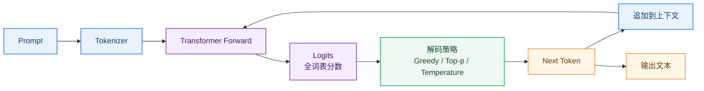
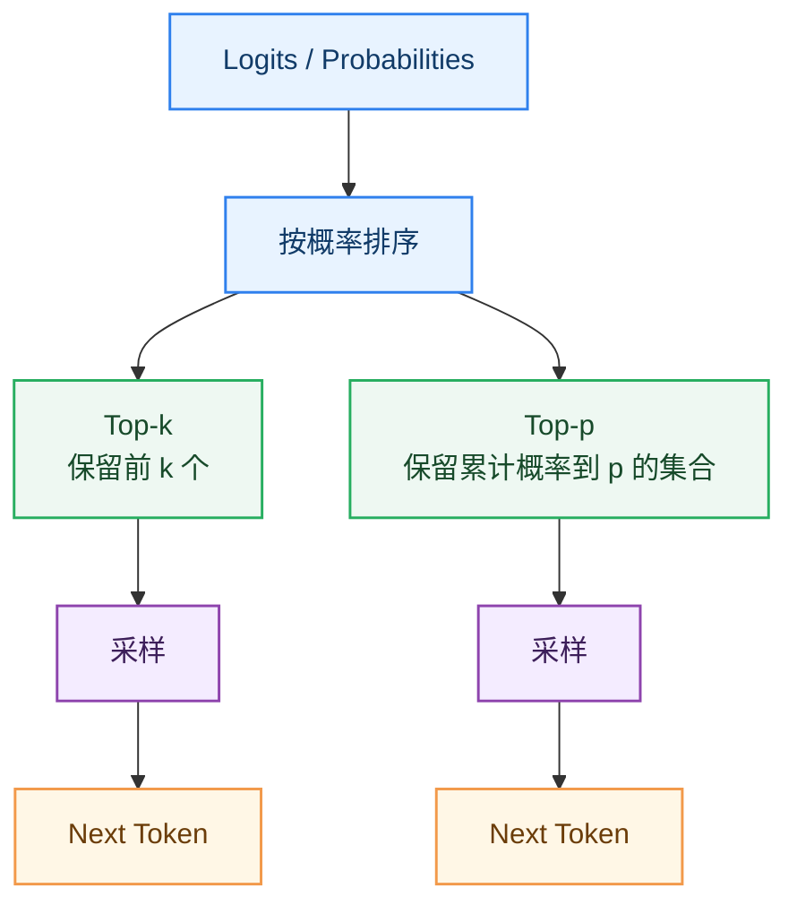
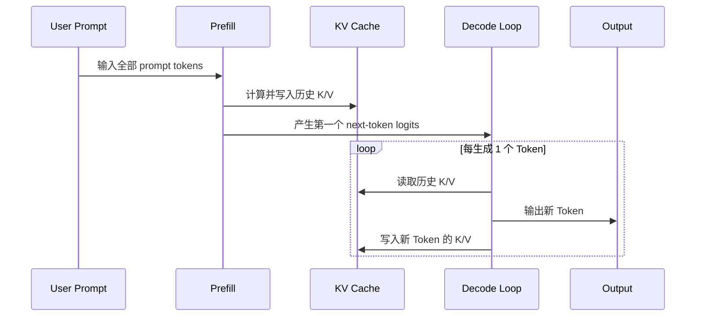

# 11_推理与生成

> 推理与生成是 LLM 从“模型参数”变成“实际回答”的过程。理解生成策略、采样参数、KV Cache 和 Prefill / Decode，是把大模型用好的关键。

**By：猫先生 of 「魔方AI空间」**

## 本章导读

前面章节我们已经理解了模型如何被训练出来：

```text
预训练
  -> 指令微调
  -> RLHF / DPO / GRPO
  -> Chat / Instruct Model
```

但当用户真正输入一个问题时，模型并不是一次性吐出完整回答，而是一个 Token 一个 Token 地生成。

例如：

```text
用户：什么是 KV Cache？
模型：KV Cache 是 ...
```

底层过程更像是：

```text
上下文 -> logits -> 选择下一个 Token -> 拼回上下文 -> 继续预测
```

本章重点回答：

- LLM 是如何从 logits 生成下一个 Token 的？
- Greedy、Beam Search、Top-k、Top-p、Temperature 有什么区别？
- 为什么同一个模型参数不同，回答风格会完全不同？
- Stop Words、EOS、Repetition Penalty 有什么作用？
- Prefill 和 Decode 分别是什么？
- KV Cache 为什么能加速推理？
- 流式输出、吞吐、延迟、显存分别受什么影响？
- 长上下文推理为什么贵？

## 一句话理解生成

LLM 生成可以理解为：

> 模型根据当前上下文预测下一个 Token 的概率分布，然后按照某种解码策略选择一个 Token，再把它追加到上下文中，循环直到结束。

一个简化流程：

```text
Prompt
  -> Tokenizer
  -> Transformer Forward
  -> LM Head 输出 logits
  -> 解码策略选择下一个 Token
  -> append 到上下文
  -> 重复
```

### 图解：自回归生成循环



## 从 logits 到概率

模型最后一层输出的是 logits，也就是每个候选 Token 的原始分数。

假设词表中有 5 个候选 Token：

| Token | Logit |
| --- | ---: |
| 大 | 2.4 |
| 语言 | 4.8 |
| 模型 | 3.7 |
| 苹果 | -1.2 |
| 。 | 0.3 |

这些 logits 会经过 softmax 转成概率分布。

```text
probabilities = softmax(logits)
```

然后解码策略决定选择哪个 Token。

## Greedy Search

Greedy Search 每一步都选择概率最高的 Token。

```text
next_token = argmax(probabilities)
```

优点：

- 简单
- 稳定
- 速度快
- 适合确定性任务

缺点：

- 容易保守
- 可能重复
- 缺乏多样性
- 可能陷入局部最优

适合场景：

- 简短问答
- 代码补全
- 格式化输出
- 需要稳定性的任务

## Beam Search

Beam Search 会同时保留多个候选序列，而不是每一步只选一个 Token。

例如 beam size = 3：

```text
每一步保留概率最高的 3 条路径
```

优点：

- 比 Greedy 更全局
- 常用于翻译、摘要等任务

缺点：

- 计算更慢
- 对开放式对话不一定好
- 可能生成过于模板化的内容

在现代聊天 LLM 中，Beam Search 不如采样策略常用。

## Sampling

Sampling 是从概率分布中随机采样一个 Token。

如果概率分布是：

| Token | Probability |
| --- | ---: |
| 模型 | 0.50 |
| 系统 | 0.25 |
| 工具 | 0.15 |
| 苹果 | 0.10 |

采样不一定永远选“模型”，也可能选“系统”或“工具”。

这让回答更有多样性，但也可能带来不稳定。

## Temperature

Temperature 用来控制概率分布的“尖锐”或“平滑”。

```text
logits = logits / temperature
```

| Temperature | 效果 | 适合场景 |
| ---: | --- | --- |
| 0 或接近 0 | 更确定，接近 Greedy | 代码、事实、格式任务 |
| 0.2 - 0.7 | 稳定但不死板 | 问答、总结、教学 |
| 0.8 - 1.2 | 更有多样性 | 创作、头脑风暴 |
| > 1.2 | 更随机 | 创意探索，但风险更高 |

直觉：

```text
temperature 低：模型更保守
temperature 高：模型更发散
```

## Top-k Sampling

Top-k 只保留概率最高的 k 个 Token，然后在其中采样。

例如 `top_k = 3`：

```text
只从概率最高的 3 个候选 Token 中采样
```

优点：

- 去掉低概率噪声 Token
- 控制随机性
- 简单直观

缺点：

- k 是固定值，不适应不同分布形状
- 有时会截断合理候选

## Top-p Sampling

Top-p 也叫 nucleus sampling，来自论文 [The Curious Case of Neural Text Degeneration](https://arxiv.org/abs/1904.09751)。

它不是保留固定数量的 Token，而是保留累计概率达到 p 的最小候选集合。

例如 `top_p = 0.9`：

```text
按概率从高到低排序
  -> 累计概率达到 0.9
  -> 只在这些 Token 中采样
```

优点：

- 比 Top-k 更自适应
- 概率分布尖锐时候选少
- 概率分布平缓时候选多

开放式生成中，Top-p 非常常见。

### 图解：Top-k 与 Top-p



## 常见参数组合

不同任务可以使用不同参数。

| 场景 | Temperature | Top-p | 说明 |
| --- | ---: | ---: | --- |
| 事实问答 | 0.1 - 0.5 | 0.8 - 0.95 | 稳定优先 |
| 代码生成 | 0 - 0.3 | 0.8 - 0.95 | 降低随机错误 |
| 总结改写 | 0.3 - 0.7 | 0.8 - 0.95 | 稳定兼顾表达 |
| 创意写作 | 0.8 - 1.2 | 0.9 - 0.98 | 增加多样性 |
| JSON 输出 | 0 - 0.2 | 0.8 - 0.95 | 格式稳定 |

这只是经验范围，具体还要看模型、任务和提示词。

## Repetition Penalty

Repetition Penalty 用来降低模型重复生成同样词句的概率。

常见重复问题：

```text
这个问题很重要，很重要，很重要，很重要...
```

相关参数：

- repetition_penalty
- frequency_penalty
- presence_penalty

直觉区别：

| 参数 | 作用 |
| --- | --- |
| repetition_penalty | 惩罚已经出现过的 Token |
| frequency_penalty | 出现越多惩罚越强 |
| presence_penalty | 只要出现过就惩罚 |

这些参数可以减少重复，但设置太强可能破坏专业术语、代码变量名和固定格式。

## Stop Words 与 EOS

模型生成需要知道什么时候停止。

常见停止方式：

- 生成 EOS Token
- 遇到 stop words
- 达到 max_new_tokens
- 工具调用完成
- 输出格式闭合，例如 JSON 完整结束

Stop Words 常用于：

- 多轮对话边界
- 函数调用边界
- 防止模型生成下一轮 user
- 控制结构化输出

如果 stop 条件设计不好，模型可能提前停止或一直生成。

## Prefill 与 Decode

LLM 推理可以分成两个阶段。

### 1. Prefill

Prefill 处理用户输入的完整 prompt。

```text
输入 prompt tokens
  -> 一次前向计算
  -> 得到最后位置 logits
  -> 建立 KV Cache
```

Prefill 的特点：

- 并行处理 prompt 中所有 Token
- 成本与输入长度强相关
- 长上下文时非常耗时

### 2. Decode

Decode 每次生成一个新 Token。

```text
生成一个 Token
  -> 更新 KV Cache
  -> 再生成下一个 Token
```

Decode 的特点：

- 自回归串行
- 受 KV Cache 和 batch 调度影响
- 输出越长，Decode 时间越长

### 图解：Prefill 与 Decode



## KV Cache

KV Cache 是推理加速的核心机制。

在 Transformer Attention 中，每个 Token 都会产生 Key 和 Value。

自回归生成时，历史 Token 的 K/V 不需要反复计算，可以缓存起来。

```text
不使用 KV Cache：
每生成一个 Token，都重新计算全部历史 K/V

使用 KV Cache：
历史 K/V 缓存，只计算新 Token 的 Q/K/V
```

KV Cache 的好处：

- 显著减少重复计算
- 提升 decode 速度
- 支持流式生成

代价：

- 占用显存
- 上下文越长占用越大
- batch 越大占用越大
- 层数、KV heads、head_dim 都会影响大小

KV Cache 相关高效推理系统可以参考 [vLLM / PagedAttention](https://arxiv.org/abs/2309.06180)。

## KV Cache 显存直觉

KV Cache 大小大致与下面因素成正比：

```text
batch_size
  * sequence_length
  * num_layers
  * num_kv_heads
  * head_dim
  * 2
  * dtype_size
```

其中 `2` 代表 K 和 V。

这也是为什么：

- 长上下文更吃显存
- GQA / MQA 可以降低 KV Cache
- MLA 这类方法会优化 K/V 表示
- PagedAttention 能改善 KV Cache 管理

## 流式输出

流式输出不是模型一次性生成完整回答，而是边生成边返回。

```text
Token 1 -> 返回
Token 2 -> 返回
Token 3 -> 返回
...
```

用户体验上，流式输出可以显著降低等待感。

关键指标：

- TTFT：Time To First Token
- TPOT：Time Per Output Token
- Tokens/s：每秒生成 Token 数

## 延迟与吞吐

推理服务中经常同时关注两个指标：

| 指标 | 含义 | 影响因素 |
| --- | --- | --- |
| Latency | 单个请求耗时 | 输入长度、输出长度、模型大小 |
| Throughput | 系统单位时间处理能力 | batch、并行、调度、KV Cache |
| TTFT | 首 token 时间 | prefill 成本、排队时间 |
| TPOT | 每个输出 token 时间 | decode 成本、batch 调度 |

高吞吐和低延迟常常需要权衡。

## Continuous Batching

LLM 请求长度不同、到达时间不同，如果简单固定 batch，会浪费大量算力。

Continuous Batching 会动态把不同请求加入或移出 batch。

```text
请求 A 正在 decode
请求 B 新到达
请求 C 已结束
调度器动态重组 batch
```

这能显著提升推理吞吐。

相关系统：

- [Orca](https://www.usenix.org/conference/osdi22/presentation/yu)
- [vLLM](https://arxiv.org/abs/2309.06180)
- [SGLang](https://arxiv.org/abs/2312.07104)

### 图解：推理服务关键路径

```mermaid
flowchart LR
    REQ["用户请求"] --> QUEUE["请求队列"]
    QUEUE --> SCHED["调度器<br/>Continuous Batching"]
    SCHED --> PREFILL["Prefill"]
    PREFILL --> CACHE["KV Cache"]
    CACHE --> DECODE["Decode"]
    DECODE --> STREAM["流式输出"]
    DECODE --> CACHE

    classDef request fill:#E8F3FF,stroke:#2F80ED,color:#113B68,stroke-width:1.5px;
    classDef sched fill:#EEF8F2,stroke:#27AE60,color:#174A2A,stroke-width:1.5px;
    classDef compute fill:#F4ECFF,stroke:#8E44AD,color:#3D1F5A,stroke-width:1.5px;
    classDef cache fill:#FFF7E6,stroke:#F2994A,color:#6B3D09,stroke-width:1.5px;
    classDef out fill:#FFECEC,stroke:#EB5757,color:#6B1F1F,stroke-width:1.5px;
    class REQ,QUEUE request;
    class SCHED sched;
    class PREFILL,DECODE compute;
    class CACHE cache;
    class STREAM out;
```



## 长上下文推理

长上下文推理比短上下文贵很多。

原因：

- Prefill token 更多
- Attention 计算更多
- KV Cache 更大
- 检索相关信息更难
- 模型可能出现 lost in the middle

长上下文并不等于模型一定能有效利用全部上下文。相关研究可以参考 [Lost in the Middle](https://arxiv.org/abs/2307.03172)。

## Speculative Decoding

Speculative Decoding 用小模型先草拟多个 Token，再让大模型验证，从而加速生成。

核心思想：

```text
Draft model 快速生成候选 token
  -> Target model 批量验证
  -> 接受一部分候选
  -> 减少大模型逐 token 调用次数
```

代表论文：

- [Fast Inference from Transformers via Speculative Decoding](https://arxiv.org/abs/2211.17192)
- [Accelerating Large Language Model Decoding with Speculative Sampling](https://arxiv.org/abs/2302.01318)

它适合对延迟敏感的推理服务，但需要额外 draft model 和工程调度。

## 结构化输出

很多应用需要模型输出 JSON、SQL、函数调用参数或固定格式。

常见方法：

- 低 temperature
- 明确 schema
- stop words
- JSON mode / grammar constrained decoding
- 函数调用协议
- 输出后校验与重试

结构化输出的关键不是只靠 prompt，还要结合解码约束和后处理校验。

## 一个最小生成伪代码

下面是极简自回归生成逻辑，用于理解流程，不代表高性能实现。

```python
input_ids = tokenizer.encode(prompt)

for _ in range(max_new_tokens):
    outputs = model(input_ids=input_ids)
    logits = outputs.logits[:, -1, :]

    logits = logits / temperature
    probs = softmax(top_p_filter(logits, top_p=0.9))
    next_token = sample(probs)

    input_ids = concat(input_ids, next_token)

    if next_token == eos_token_id:
        break

text = tokenizer.decode(input_ids)
```

真实推理系统会加入：

- KV Cache
- batch 调度
- tensor parallel
- quantization
- CUDA kernel 优化
- FlashAttention
- PagedAttention
- streaming
- tool calling
- grammar decoding

## 常见误区

### 1. Temperature 越高越聪明

Temperature 只控制随机性，不代表能力更强。事实问答和代码任务通常不适合过高 temperature。

### 2. Top-p 和 Top-k 越大越好

候选空间越大，输出越多样，但错误和跑偏概率也会增加。

### 3. KV Cache 会减少所有显存

KV Cache 减少重复计算，但本身会占显存。长上下文和大 batch 时 KV Cache 是主要显存压力之一。

### 4. 长上下文一定优于 RAG

长上下文能放更多内容，但不保证模型能准确检索和利用。很多场景仍需要 RAG、重排和引用定位。

### 5. 流式输出让模型更快

流式输出主要改善用户感知延迟，不一定降低总计算量。

## 核心概念表

| 概念 | 简单解释 | 关键作用 |
| --- | --- | --- |
| Logits | 每个候选 Token 的原始分数 | 解码输入 |
| Greedy Search | 每步选概率最高 Token | 稳定确定 |
| Beam Search | 保留多条候选路径 | 翻译摘要常见 |
| Sampling | 按概率采样 | 增加多样性 |
| Temperature | 控制概率分布平滑程度 | 调节随机性 |
| Top-k | 只保留前 k 个候选 | 截断低概率噪声 |
| Top-p | 保留累计概率到 p 的候选集合 | 自适应采样 |
| Stop Words | 停止生成的字符串规则 | 控制边界 |
| Prefill | 处理输入 prompt | 影响首 token 时间 |
| Decode | 逐 token 生成 | 影响输出速度 |
| KV Cache | 缓存历史 K/V | 加速自回归生成 |
| TTFT | 首 token 延迟 | 用户等待感 |
| TPOT | 每 token 延迟 | 生成速度 |

## 学习建议

学习推理与生成时，建议抓住四条主线：

1. **生成主线**：logits -> decoding -> next token。
2. **参数主线**：temperature、top-p、top-k、stop 控制输出行为。
3. **性能主线**：prefill、decode、KV Cache 决定推理成本。
4. **服务主线**：batching、streaming、调度决定线上体验。

## 推荐阅读

### 解码与采样

- [The Curious Case of Neural Text Degeneration](https://arxiv.org/abs/1904.09751)
- [A Simple, Fast Diverse Decoding Algorithm for Neural Generation](https://arxiv.org/abs/1611.08562)

### KV Cache 与推理系统

- [Orca: A Distributed Serving System for Transformer-Based Generative Models](https://www.usenix.org/conference/osdi22/presentation/yu)
- [vLLM: Easy, Fast, and Cheap LLM Serving with PagedAttention](https://arxiv.org/abs/2309.06180)
- [SGLang: Efficient Execution of Structured Language Model Programs](https://arxiv.org/abs/2312.07104)

### 加速解码

- [Fast Inference from Transformers via Speculative Decoding](https://arxiv.org/abs/2211.17192)
- [Accelerating Large Language Model Decoding with Speculative Sampling](https://arxiv.org/abs/2302.01318)

### 长上下文

- [Lost in the Middle: How Language Models Use Long Contexts](https://arxiv.org/abs/2307.03172)
- [FlashAttention: Fast and Memory-Efficient Exact Attention with IO-Awareness](https://arxiv.org/abs/2205.14135)

## 小结

LLM 生成的核心可以概括为：

```text
Prompt
  -> Prefill
  -> logits
  -> 解码策略
  -> next token
  -> KV Cache 更新
  -> Decode 循环
  -> 输出文本
```

真正用好大模型，不只是选择一个模型，还要理解生成参数、停止条件、KV Cache、推理调度和结构化输出。很多“模型回答不稳定”的问题，实际上来自解码策略和工程配置。

---

**上一章：**[RLHF](../10_RLHF/README.md)  
**下一章建议阅读：**[Prompt Engineering](../README.md#12-prompt-engineering)
