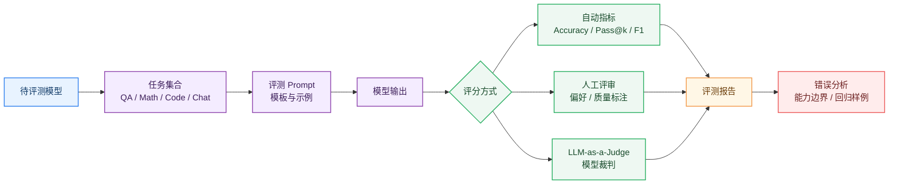
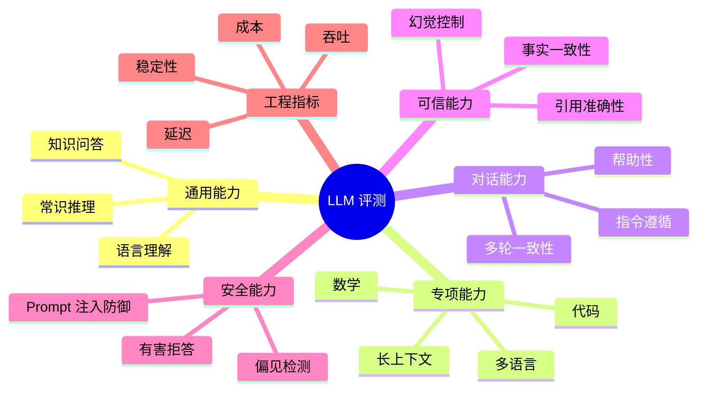
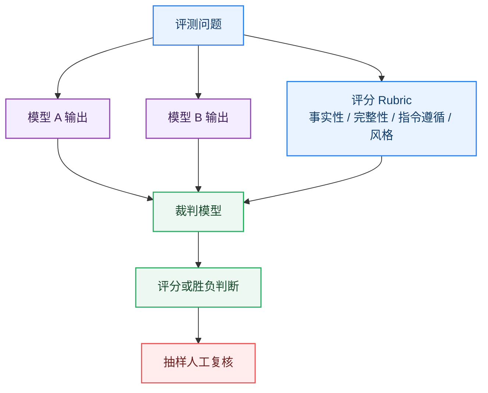

# 13_LLM 评测

> LLM 评测不是简单地跑一个排行榜分数，而是用一组任务、指标和人工/自动评审方法，判断模型在真实场景中是否更准确、更稳定、更安全、更可用。

**By：猫先生 of 「魔方AI空间」**

## 本章导读

前面章节我们已经理解了模型如何训练、对齐和生成：

```text
预训练
  -> 指令微调
  -> RLHF / DPO / GRPO
  -> Prompt 工程
  -> 面向用户的模型输出
```

但一个关键问题随之出现：

```text
模型 A 比模型 B 更强吗？
```

这个问题看起来简单，实际很复杂。因为“更强”可能指很多不同能力：

- 知识问答更准确
- 数学推理更可靠
- 代码生成更能通过测试
- 中文表达更自然
- 长上下文检索更稳定
- 多轮对话更符合用户意图
- 更少幻觉
- 更安全、更不容易被诱导
- 在真实业务任务中更有价值

本章重点回答：

- LLM 评测到底在评什么？
- Benchmark、Metric、Leaderboard 分别是什么？
- 通用能力、数学、代码、推理、中文、安全、幻觉分别怎么评？
- 为什么同一个模型在不同榜单上排名会差异很大？
- LLM-as-a-Judge 为什么流行？它有什么风险？
- 真实业务中应该如何构建自己的评测集？

## 一句话理解 LLM 评测

LLM 评测可以理解为：

> 用一套可复现的问题、评分规则和分析方法，判断模型在特定任务、特定场景和特定约束下的表现。

这里有三个关键词：

- **特定任务**：问答、推理、代码、摘要、翻译、RAG、Agent 等。
- **特定场景**：中文教育、客服、医学、金融、编程、办公、搜索等。
- **特定约束**：准确性、安全性、成本、延迟、格式稳定性、可解释性等。

所以评测不是一个分数就能完成的事情，而是一套评估体系。

## LLM 评测的基本流程

一个典型评测流程如下：



核心不是“跑完分数”，而是形成一个可解释的评测闭环：

```text
任务设计
  -> 模型生成
  -> 指标评分
  -> 错误分析
  -> 定位短板
  -> 反向改进模型、数据或 Prompt
```

## 评测对象：你到底在评什么？

评测前首先要明确对象。

| 评测对象 | 关注点 | 例子 |
| --- | --- | --- |
| Base Model | 预训练模型的知识、语言建模和基础能力 | LLaMA Base、Qwen Base |
| Chat / Instruct Model | 指令遵循、多轮对话、帮助性和安全性 | ChatGPT、Qwen-Instruct |
| Reasoning Model | 数学、代码、复杂推理、长链路问题解决 | DeepSeek-R1、o 系列推理模型 |
| RAG System | 检索、引用、答案忠实性、召回质量 | 企业知识库问答 |
| Agent System | 工具调用、规划、执行、恢复能力 | 浏览器 Agent、代码 Agent |
| 多模态模型 | 图文理解、视觉问答、视频理解 | VLM、MLLM |

同一个模型，在不同对象层面的评测结论可能完全不同。

例如：

- Base Model 的 MMLU 分数高，不代表它一定适合当聊天助手。
- Chat Model 的对话体验好，不代表代码修复能力强。
- RAG 系统答案好，不一定是生成模型强，也可能是检索质量高。
- Agent 成功率低，不一定是 LLM 弱，也可能是工具接口、环境状态或任务分解出了问题。

## 评测维度

LLM 常见评测维度可以分成几类：

| 维度 | 核心问题 | 常见指标或方法 |
| --- | --- | --- |
| 知识能力 | 模型是否掌握事实和学科知识？ | Accuracy、EM |
| 推理能力 | 能否处理多步逻辑、数学和复杂问题？ | Accuracy、Pass Rate |
| 代码能力 | 能否生成可运行、可通过测试的代码？ | Pass@k、单元测试通过率 |
| 指令遵循 | 是否按用户要求完成任务？ | 人工评审、LLM Judge |
| 对话质量 | 是否有帮助、自然、连贯？ | 偏好胜率、Arena Elo |
| 长上下文 | 是否能在长文中定位和综合信息？ | 位置敏感测试、召回率 |
| 幻觉控制 | 是否编造事实、引用或依据？ | Faithfulness、事实一致性 |
| 安全对齐 | 是否拒绝有害请求、避免偏见？ | 安全测试集、红队评测 |
| 工程表现 | 延迟、吞吐、成本、稳定性如何？ | TTFT、TPS、成功率 |

### 图解：LLM 评测维度



## Benchmark 是什么？

Benchmark 可以理解为一套标准化评测题集。

它通常包含：

- 任务说明
- 测试样本
- 标准答案或评分规则
- 评测脚本
- 结果汇总方式

例如 MMLU 主要评估多学科知识与推理能力，GSM8K 主要评估小学数学应用题，HumanEval 主要评估代码生成能否通过单元测试。

Benchmark 的价值在于：

- 方便横向比较模型
- 能追踪模型版本变化
- 有利于论文和技术报告复现
- 能暴露模型在特定能力上的短板

但 Benchmark 也有明显局限：

- 容易被训练数据污染
- 题目数量有限，覆盖不了真实业务
- 高分不一定等于用户体验好
- 可能过度优化榜单，而不是优化真实能力
- 对中文、本地行业和长尾任务覆盖不足

## 常见通用评测集

| 评测集 | 主要评估内容 | 代表意义 |
| --- | --- | --- |
| MMLU | 多学科选择题 | 通用知识与学科能力 |
| BIG-Bench / BBH | 多任务复杂能力 | 泛化与困难推理 |
| HELM | 多场景综合评测框架 | 从准确性、公平性、鲁棒性等多维度评估 |
| ARC | 科学问答与常识推理 | 基础推理能力 |
| HellaSwag | 常识推理与语境续写 | 语言理解和常识判断 |
| TruthfulQA | 真实性与抗误导 | 减少模仿错误常识 |
| MT-Bench | 多轮对话质量 | Chat 模型对话能力 |
| Chatbot Arena | 人类偏好对战 | 真实用户偏好排名 |

这些评测集适合做基础能力横向比较，但不能直接替代业务评测。

## 数学与推理评测

数学和推理能力是 LLM 评测中的重点方向。

常见评测包括：

| 评测集 | 主要内容 | 特点 |
| --- | --- | --- |
| GSM8K | 小学数学应用题 | 适合评估基础多步算术推理 |
| MATH | 竞赛数学题 | 难度更高，覆盖代数、几何、数论等 |
| BBH | BIG-Bench 中较困难任务集合 | 强调复杂推理与泛化 |
| GPQA | 高难度研究生级科学问答 | 更难被浅层模式匹配解决 |

数学评测需要注意：

- 只看最终答案可能忽略推理过程错误。
- CoT 输出可能看起来合理，但中间步骤仍然可能出错。
- 多次采样加自一致性可能提高分数，但会增加成本。
- 推理模型通常需要区分“思考预算”和“最终回答质量”。

## 代码能力评测

代码评测比普通问答更容易自动化，因为可以运行测试。

典型流程：

```text
题目描述
  -> 模型生成代码
  -> 放入测试框架
  -> 执行单元测试
  -> 统计通过率
```

常见评测包括：

| 评测集 | 主要内容 | 常见指标 |
| --- | --- | --- |
| HumanEval | 函数级代码生成 | Pass@k |
| MBPP | Python 编程题 | Pass@k |
| APPS | 竞赛编程题 | 测试通过率 |
| SWE-bench | 真实 GitHub Issue 修复 | Issue 解决率 |

代码评测常见指标：

- **Pass@1**：模型第一次生成就通过测试的比例。
- **Pass@k**：采样 k 次，只要有一次通过就算成功。
- **Unit Test Pass Rate**：测试用例通过比例。
- **Issue Resolve Rate**：真实代码仓库任务解决比例。

需要注意的是，代码任务更接近真实工程，但也更容易受到执行环境、依赖版本、测试覆盖率和题目泄漏影响。

## 中文能力评测

中文 LLM 评测不能只看英文 Benchmark。

中文场景常见关注点包括：

- 中文常识和文化知识
- 中文语义理解
- 中文长文本阅读
- 古文、成语、诗词、法律、医疗等领域任务
- 中英混合任务
- 中文指令遵循和表达质量

常见中文或中文相关评测包括：

| 评测集 | 主要内容 |
| --- | --- |
| C-Eval | 中文多学科知识评测 |
| CMMLU | 中文多任务语言理解 |
| AGIEval | 面向人类考试的综合评测 |
| GAOKAO-Bench | 高考相关题目评测 |
| CLUE / SuperCLUE | 中文语言理解与综合能力评测 |

中文评测容易出现的问题：

- 翻译题与原生中文题混用，难度不一致。
- 部分题目已经进入训练语料。
- 选择题分数高，不代表开放式中文写作好。
- 对地方知识、行业术语、政策文本覆盖不足。

## 长上下文评测

长上下文能力不是简单地把上下文窗口拉长。

真正要评估的是：

- 模型能否在长文中找到关键信息
- 是否存在位置偏置
- 能否跨段落、跨文档综合推理
- 是否会忽略中间位置的信息
- 长上下文下生成是否仍然稳定
- 成本和延迟是否可接受

常见测试方式包括：

| 测试方式 | 关注点 |
| --- | --- |
| Needle-in-a-Haystack | 在长文本中找隐藏信息 |
| 多文档问答 | 跨文档检索与综合 |
| 长文摘要 | 保持覆盖率与事实一致性 |
| 长代码库问答 | 跨文件理解 |
| LongBench 类评测 | 多任务长上下文能力 |

长上下文评测要特别警惕一种情况：

```text
模型支持 128K 上下文
  !=
模型在 128K 中都能稳定利用信息
```

上下文长度是容量上限，信息利用率才是真正的能力。

## RAG 评测

RAG 评测不是只评 LLM，而是评一个系统。

一个 RAG 系统通常包含：

```text
用户问题
  -> Query 改写
  -> 检索
  -> Rerank
  -> 上下文拼接
  -> LLM 生成
  -> 引用与答案
```

因此 RAG 至少要评两层：

| 层级 | 评测重点 |
| --- | --- |
| 检索层 | Recall、Precision、MRR、NDCG、命中文档 |
| 生成层 | Answer Correctness、Faithfulness、Citation Accuracy |

RAG 常见问题：

- 检索没召回正确资料
- 召回了资料但排序靠后
- 上下文太长导致模型忽略关键段落
- 模型没有忠实使用资料
- 引用与答案不匹配
- 答案看起来流畅但事实错误

所以 RAG 评测一定要把“检索错误”和“生成错误”拆开看。

## Agent 评测

Agent 评测比普通问答更难，因为它评的是一个动态执行过程。

Agent 任务可能包括：

- 调用工具
- 浏览网页
- 修改文件
- 运行代码
- 查询数据库
- 多步规划
- 从失败中恢复

Agent 评测常见指标：

| 指标 | 含义 |
| --- | --- |
| Task Success Rate | 最终任务是否完成 |
| Step Success Rate | 每一步动作是否正确 |
| Tool Call Accuracy | 是否调用了正确工具和参数 |
| Recovery Rate | 出错后能否恢复 |
| Cost | Token、工具调用、运行时间成本 |
| Safety Violation Rate | 是否越权或执行危险操作 |

Agent 评测最重要的不是模型说得好不好，而是：

```text
任务是否真的完成
过程是否可控
失败是否可诊断
```

## 幻觉评测

幻觉是 LLM 评测中的核心问题之一。

常见幻觉类型：

| 类型 | 例子 |
| --- | --- |
| 事实幻觉 | 编造不存在的事实、人物、论文、数据 |
| 引用幻觉 | 给出不存在或不匹配的引用链接 |
| 依据幻觉 | 声称基于资料回答，但资料中没有相关内容 |
| 推理幻觉 | 中间推理看似合理，但结论错误 |
| 工具幻觉 | 声称已经查询、执行或验证，但实际没有 |

幻觉评测常见方法：

- 与标准答案对比
- 与检索证据对比
- 人工事实核查
- LLM-as-a-Judge 辅助判断
- 引用一致性检查
- 不可回答问题测试

一个优秀模型不只是“知道更多”，还要知道：

```text
什么时候不确定
什么时候应该说明依据不足
什么时候应该拒绝编造
```

## 安全与对齐评测

安全评测关注模型是否会产生有害、违规、偏见或不可靠输出。

常见维度包括：

- 暴力、自伤、违法、恶意代码等有害内容
- 隐私泄露和敏感信息处理
- 偏见、歧视和刻板印象
- Prompt Injection
- Jailbreak
- 越权工具调用
- 误导性医疗、法律、金融建议

安全评测通常需要结合：

- 标准安全测试集
- 红队攻击样例
- 多轮对话攻击
- 工具调用权限测试
- 真实用户日志回放

对齐模型的目标不是“所有问题都拒绝”，而是在帮助性和安全性之间取得平衡。

## LLM-as-a-Judge

随着开放式问答、对话和写作任务增多，很多输出没有唯一标准答案。

这时可以让另一个强模型充当裁判，也就是 LLM-as-a-Judge。

典型流程：



LLM-as-a-Judge 的优点：

- 成本低于大规模人工评测
- 适合开放式文本
- 可以输出评分理由
- 方便批量回归测试

但它也有风险：

- 裁判模型可能偏好更长答案
- 可能偏好自己家族模型的风格
- 对细粒度事实错误不敏感
- 可能被被评测输出“说服”
- Rubric 设计不清晰会导致评分漂移

所以工程上常见做法是：

```text
LLM Judge 批量初筛
  -> 人工抽样复核
  -> 对争议样本二次标注
  -> 建立稳定回归集
```

## 人类偏好评测

对于聊天助手、写作、创意、复杂任务解决等场景，人类偏好仍然非常重要。

常见方式包括：

| 方法 | 说明 |
| --- | --- |
| Pairwise Comparison | 给同一问题的两个回答，让人选择更好 |
| Rating | 按维度打分，例如 1 到 5 分 |
| Ranking | 对多个模型输出排序 |
| Error Annotation | 标注事实错误、格式错误、安全问题 |
| User A/B Test | 在线真实用户偏好测试 |

人类评测要注意：

- 标注指南必须清晰
- 样本要覆盖真实场景
- 标注者需要校准
- 要计算一致性
- 不要只看平均分，也要看严重失败样例

## 业务评测集怎么构建？

真实业务中，通用 Benchmark 只能作为参考，最重要的是构建自己的 Eval Set。

一个可用的业务评测集通常来自：

- 真实用户问题
- 历史客服记录
- 领域专家编写样例
- 线上失败案例
- 高风险边界问题
- 合成但经过审核的数据

构建步骤：


建议至少保留三类集合：

| 集合 | 用途 |
| --- | --- |
| Dev Set | 日常调 Prompt、调系统时使用 |
| Regression Set | 每次版本变更必须跑，防止能力退化 |
| Hidden Set | 不暴露给开发过程，用于最终验收 |

## 评测指标不要只看平均分

LLM 评测最容易犯的错误之一，是只看一个平均分。

更好的分析方式包括：

- 按任务类型拆分
- 按难度拆分
- 按语言拆分
- 按输入长度拆分
- 按用户场景拆分
- 看严重错误样例
- 看失败是否集中在某类问题
- 看成本、延迟和成功率的平衡

例如一个模型平均分很高，但在医疗类问题上偶发严重幻觉，那么在医疗场景中就不能直接上线。

## Leaderboard 为什么不等于真实能力？

排行榜有价值，但不能迷信。

原因包括：

### 1. 数据污染

测试集可能已经出现在训练数据中，导致分数虚高。

### 2. 过拟合榜单

模型可能专门针对常见 Benchmark 优化，但真实任务没有同步提升。

### 3. 任务覆盖不足

很多榜单偏向选择题、英文任务或短文本任务，无法覆盖业务复杂性。

### 4. 评分方式有限

Accuracy 适合选择题，但不适合开放式写作、咨询、规划和 Agent 任务。

### 5. 成本被忽略

一个模型分数略高，但延迟和价格高很多，实际产品中未必更优。

所以更合理的做法是：

```text
公开 Benchmark 看上限
业务 Eval 看可用性
安全评测看边界
线上 A/B 看真实价值
```

## 评测报告应该包含什么？

一个工程上可用的评测报告，至少应该包含：

| 模块 | 内容 |
| --- | --- |
| 模型信息 | 模型版本、参数、量化方式、推理参数 |
| 数据集 | 样本来源、规模、任务分布、是否去重 |
| Prompt | 评测模板、Few-shot 示例、系统提示词 |
| 指标 | Accuracy、Pass@k、胜率、人工评分等 |
| 结果 | 总分、分任务结果、置信区间 |
| 错误分析 | 典型失败、严重问题、能力短板 |
| 成本指标 | Token 成本、延迟、吞吐、失败率 |
| 风险结论 | 是否适合上线、哪些场景需要限制 |

评测报告的目标不是“证明模型很强”，而是帮助团队做决策：

```text
能不能用？
在哪些场景能用？
哪些场景不能用？
下一步该优化什么？
```

## 常见误区

### 1. 只看总分，不看任务分布

总分可能掩盖关键短板。真实应用更关心目标场景下的表现。

### 2. 只看 Benchmark，不看业务数据

公开 Benchmark 不能替代业务 Eval Set。

### 3. 只看准确性，不看成本

模型更准但慢很多、贵很多，未必适合生产环境。

### 4. 只看单轮问答，不看多轮稳定性

很多模型单轮表现不错，但多轮上下文、追问和纠错能力不足。

### 5. 只相信 LLM 裁判

LLM-as-a-Judge 很有用，但重要任务仍然需要人工抽样复核。

### 6. 忽略失败样例

平均分提升 1 分不一定重要，一个严重安全失败可能决定模型不能上线。

## 核心概念表

| 概念 | 简单解释 | 关键作用 |
| --- | --- | --- |
| Benchmark | 标准化评测题集 | 横向比较模型 |
| Metric | 评分指标 | 把模型输出转成分数 |
| Leaderboard | 排行榜 | 展示公开评测结果 |
| Accuracy | 正确率 | 选择题、分类题常用 |
| Pass@k | k 次生成中至少一次通过 | 代码评测常用 |
| Human Evaluation | 人工评测 | 判断开放式回答质量 |
| LLM-as-a-Judge | 用 LLM 当裁判 | 批量评估开放式输出 |
| Eval Set | 自建评测集 | 贴近业务场景 |
| Regression Set | 回归测试集 | 防止版本退化 |
| Hallucination | 幻觉 | 衡量事实可靠性 |
| Faithfulness | 忠实性 | RAG 答案是否基于证据 |
| Safety Eval | 安全评测 | 检查有害、越权和偏见输出 |

## 学习建议

学习 LLM 评测时，建议抓住四条主线：

1. **能力主线**：知识、推理、代码、中文、长上下文。
2. **质量主线**：准确性、指令遵循、对话体验、幻觉控制。
3. **安全主线**：拒答边界、Prompt 注入、越权工具调用。
4. **工程主线**：成本、延迟、吞吐、回归测试、线上 A/B。

一个成熟的大模型项目，一定会把评测作为日常工程基础设施，而不是发布前临时跑一次分数。

## 推荐阅读

### 综合评测框架

- [Holistic Evaluation of Language Models](https://arxiv.org/abs/2211.09110)
- [Beyond the Imitation Game: Quantifying and extrapolating the capabilities of language models](https://arxiv.org/abs/2206.04615)
- [A Survey on Evaluation of Large Language Models](https://doi.org/10.1145/3641289)

### 通用能力与知识评测

- [Measuring Massive Multitask Language Understanding](https://arxiv.org/abs/2009.03300)
- [AI2 Reasoning Challenge](https://arxiv.org/abs/1803.05457)
- [HellaSwag: Can a Machine Really Finish Your Sentence?](https://arxiv.org/abs/1905.07830)
- [TruthfulQA: Measuring How Models Mimic Human Falsehoods](https://arxiv.org/abs/2109.07958)

### 数学、推理与代码

- [Training Verifiers to Solve Math Word Problems](https://arxiv.org/abs/2110.14168)
- [Measuring Mathematical Problem Solving With the MATH Dataset](https://arxiv.org/abs/2103.03874)
- [Challenging BIG-Bench Tasks and Whether Chain-of-Thought Can Solve Them](https://arxiv.org/abs/2210.09261)
- [GPQA: A Graduate-Level Google-Proof Q&A Benchmark](https://arxiv.org/abs/2311.12022)
- [Evaluating Large Language Models Trained on Code](https://arxiv.org/abs/2107.03374)
- [SWE-bench: Can Language Models Resolve Real-World GitHub Issues?](https://arxiv.org/abs/2310.06770)

### 对话、人类偏好与 LLM 裁判

- [Judging LLM-as-a-Judge with MT-Bench and Chatbot Arena](https://arxiv.org/abs/2306.05685)
- [Chatbot Arena: An Open Platform for Evaluating LLMs by Human Preference](https://arxiv.org/abs/2403.04132)
- [AlpacaEval: An Automatic Evaluator of Instruction-following Models](https://arxiv.org/abs/2305.14387)

### 长上下文、RAG 与安全

- [LongBench: A Bilingual, Multitask Benchmark for Long Context Understanding](https://arxiv.org/abs/2308.14508)
- [RAGAS: Automated Evaluation of Retrieval Augmented Generation](https://arxiv.org/abs/2309.15217)
- [Prompt Injection attack against LLM-integrated Applications](https://arxiv.org/abs/2306.05499)
- [A Survey on Hallucination in Large Language Models](https://arxiv.org/abs/2311.05232)

## 小结

LLM 评测的核心可以概括为：

```text
明确评测目标
  -> 选择合适任务和数据
  -> 设计评分指标
  -> 运行自动/人工/模型裁判评测
  -> 分析错误样例
  -> 反向改进模型、Prompt 或系统
```

公开 Benchmark 可以帮助我们理解模型上限，但真正决定模型能不能落地的，是贴近业务场景的自建评测集、持续回归测试和对失败样例的深入分析。

---

**上一章：**[Prompt 工程](../12_Prompt工程/README.md)  
**下一章建议阅读：**[LLM 应用前置知识](../README.md#14-llm-应用前置知识)
