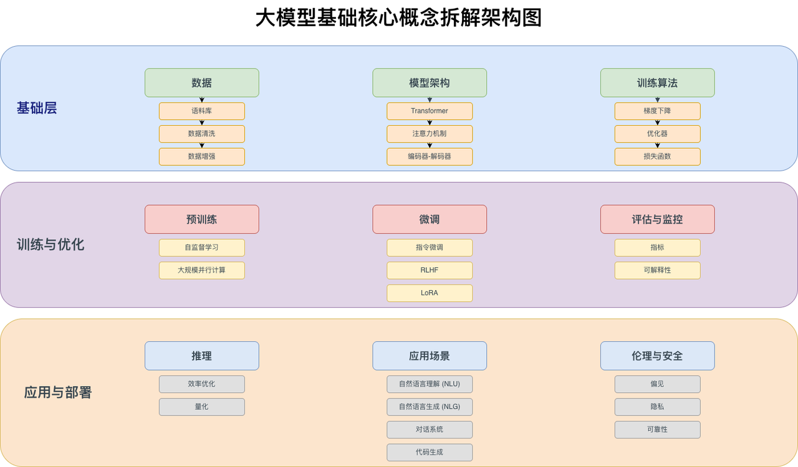

# 02_LLM 基础入门

> 从 Token 到 Transformer，从预训练到对齐，从 Prompt 到 Agent 应用前置知识，系统建立大语言模型的核心知识框架。

**By：猫先生 of 「魔方AI空间」**



## 学习目标

本板块面向希望系统理解大语言模型的读者，目标是把 LLM 的关键概念、模型结构、训练流程、对齐方法和应用基础串成一条完整主线。

学完本板块后，你应该能够：

- 解释 LLM 为什么本质上是在做“下一个 Token 预测”。
- 理解 Tokenizer、Embedding、Transformer、Attention、位置编码等基础组件。
- 看懂 Decoder-only LLM 的主体架构，以及 GPT、LLaMA、Qwen、DeepSeek 等模型路线的共同点。
- 理解预训练、SFT、RLHF、DPO、GRPO 等后训练方法的作用。
- 掌握生成参数、KV Cache、Prompt Engineering、Function Calling、RAG、Agent 等应用前置知识。
- 为后续学习多模态大模型、Agent/RAG/MCP、大模型部署打好基础。

## 推荐学习路线

```text
LLM 基本概念
  -> Token 与 Embedding
  -> Transformer 架构
  -> Attention 机制
  -> 位置编码
  -> 主流 LLM 架构演进
  -> 预训练
  -> 指令微调与 RLHF
  -> 推理与生成
  -> Prompt Engineering
  -> LLM 评测
  -> RAG / Agent / MCP 前置知识
```

## 目录导航

| 模块 | 核心问题 | 解读链接🔗 | 状态 |
| --- | --- | --- | --- |
| 0. 板块导读 | LLM 学习应该从哪里开始？ | [大模型如何工作](https://blog.csdn.net/m_aigc2022/article/details/139785981?spm=1001.2014.3001.5501) | 规划中 |
| 1. 大语言模型基础概念 | 什么是 LLM？它和传统 NLP 模型有什么区别？ | [什么是大语言模型？](https://blog.csdn.net/m_aigc2022/article/details/139678783?spm=1001.2014.3001.5502) | 规划中 |
| 2. Token 与 Embedding | 文本如何变成模型可以计算的向量？ | [Tokens 和 Embeddings](https://blog.csdn.net/m_aigc2022/article/details/140588456?spm=1001.2014.3001.5502) | 规划中 |
| 3. Transformer 架构核心 | Transformer 为什么成为 LLM 的基础架构？ | [Transformer 架构](https://blog.csdn.net/m_aigc2022/article/details/140025423?spm=1001.2014.3001.5501) | 规划中 |
| 4. Attention 机制深入解析 | Q、K、V 和注意力分数到底在算什么？ | [手动求解 Transformer](https://blog.csdn.net/m_aigc2022/article/details/140260384?spm=1001.2014.3001.5502) | 规划中 |
| 5. [位置编码](位置编码/README.md) | 模型如何理解 Token 的顺序和距离？ | [详解位置编码](https://mp.weixin.qq.com/s/t5kTS6iOaH3u6TzfpRv3kQ) | 已更新 |
| 6. 典型 LLM 架构演进 | GPT、LLaMA、Qwen、DeepSeek 的结构如何演进？ | 待补充 | 规划中 |
| 7. MoE 模型 | 为什么大模型开始大量使用混合专家架构？ | [详解 MoE 模型](http://mp.weixin.qq.com/s/qR6ExUarwvL6jbHK5qy_Rg?token=1354273325&lang=zh_CN) | 规划中 |
| 8. LLM 预训练 | 大模型是如何从海量语料中学到能力的？ | 待补充 | 规划中 |
| 9. 指令微调与对齐 | 模型如何从“会补全文本”变成“会听指令”？ | 待补充 | 规划中 |
| 10. [RLHF](RLHF/README.md) | PPO、DPO、GRPO 等对齐算法如何演进？ | [RLHF 进化史](http://mp.weixin.qq.com/s/7QrKR2WqjnGAXdV7lwSPUA?token=496007473&lang=zh_CN) | 已更新 |
| 11. 推理与生成基础 | Temperature、Top-p、KV Cache 分别控制什么？ | 待补充 | 规划中 |
| 12. Prompt Engineering | 如何更稳定地引导 LLM 完成任务？ | 待补充 | 规划中 |
| 13. LLM 评测体系 | 如何判断一个模型真的更强？ | 待补充 | 规划中 |
| 14. LLM 应用前置知识 | RAG、Agent、Tool Use、MCP 和 LLM 如何连接？ | [Agent/RAG/MCP 板块](../07_Agent-RAG-MCP/README.md) | 规划中 |
| 15. 论文与综述阅读 | 哪些论文适合作为 LLM 入门主线？ | 待补充 | 规划中 |
| 16. 实战项目 | 如何从零实现一个小型 Transformer / GPT？ | [从头开始编写 LLM 代码](https://blog.csdn.net/m_aigc2022/article/details/140086462?spm=1001.2014.3001.5501) | 规划中 |

## 0. 板块导读

这一章用于建立 LLM 的全局视角，回答三个问题：

- 为什么 LLM 是生成式 AI 的核心基础设施？
- LLM 的能力来自模型结构、训练数据、参数规模，还是后训练？
- 学习 LLM 应该先抓住哪些主线，哪些细节可以后置？

建议先建立“输入文本 -> Token -> Embedding -> Transformer Blocks -> logits -> 下一个 Token”的整体链路，再进入各模块细节。

## 1. 大语言模型基础概念

本章关注 LLM 的基本定义和技术脉络。

- 语言模型的基本任务
- 自回归建模与下一个 Token 预测
- Encoder、Decoder、Encoder-Decoder 架构区别
- GPT、BERT、T5、LLaMA 等模型路线
- 参数量、上下文长度、训练数据、能力涌现
- 基础模型、对话模型、推理模型的关系

## 2. Token 与 Embedding

LLM 不能直接理解自然语言文本，必须先经过 Tokenizer 和 Embedding。

- Token、词表、特殊符号
- BPE、WordPiece、SentencePiece
- 中文 Tokenizer 的特点与问题
- 输入 Embedding 与输出 Head
- 权重共享
- Token 粒度对上下文长度和推理成本的影响

## 3. Transformer 架构核心

Transformer 是现代 LLM 的主干架构。本章重点理解 Decoder-only LLM 的核心结构。

- Transformer 整体结构
- Self-Attention
- Multi-Head Attention
- Feed Forward Network
- Residual Connection
- LayerNorm / RMSNorm
- Pre-Norm 与 Post-Norm
- Decoder-only 架构详解

## 4. Attention 机制深入解析

Attention 是 LLM 的关键计算模块，决定了模型如何在上下文中聚合信息。

- Q、K、V 的含义
- Attention Score 如何计算
- Masked Attention 与 Causal Mask
- Attention 的计算复杂度
- MHA、MQA、GQA、MLA 等注意力变体
- 长上下文下 Attention 的效率瓶颈

## 5. 位置编码

已更新：[位置编码技术全景解析](位置编码/README.md)

位置编码用于弥补 Transformer 本身不具备顺序感知能力的问题，是理解长上下文模型的重要入口。

- 绝对位置编码
- 相对位置编码
- RoPE
- ALiBi
- NTK Scaling / YaRN / 长上下文扩展
- DeepSeek 等模型中的位置编码优化

## 6. 典型 LLM 架构演进

本章用于横向理解主流模型家族的共性与差异。

- GPT 系列
- LLaMA 系列
- Qwen 系列
- DeepSeek 系列
- Mistral / Mixtral
- Phi / Gemma 等小模型路线
- Dense 模型与 MoE 模型区别

## 7. MoE 模型

MoE 是提升模型容量和训练/推理效率的重要路线，DeepSeek、Mixtral 等模型都与 MoE 技术密切相关。

- Expert 的作用
- Router 与 Top-k 路由
- 稀疏激活
- 负载均衡损失
- MoE 的训练难点
- MoE 的推理部署挑战

## 8. LLM 预训练

预训练决定了基础模型的知识、语言能力和通用表征能力。

- 预训练目标
- 训练数据构建
- 数据清洗与去重
- Curriculum Learning
- Scaling Law
- 训练稳定性
- Checkpoint 与损失曲线
- 从零训练一个小型 LLM 的基本流程

## 9. 指令微调与对齐

预训练模型只是在学习语言分布，指令微调和对齐让模型更适合作为助手使用。

- SFT：监督微调
- 指令数据构建
- Preference Data：偏好数据
- Reward Model
- RLHF 总体流程
- RLAIF 与 Constitutional AI
- 后训练技术趋势

## 10. RLHF

已更新：[一文梳理 RLHF 进化史：从 PPO -> DPO -> GRPO -> GSPO](RLHF/README.md)

本模块系统梳理对齐算法的演进路径：

- [PPO](RLHF/PPO/readme.md)
- [DPO](RLHF/DPO/readme.md)
- [GRPO](RLHF/GRPO/readme.md)
- [Dr.GRPO](RLHF/Dr.GRPO/readme.md)
- [DAPO](RLHF/DAPO/readme.md)
- [GSPO](RLHF/GSPO/readme.md)

## 11. 推理与生成基础

本章连接模型原理和工程应用，解释为什么相同模型在不同生成参数下表现不同。

- Greedy Search
- Beam Search
- Top-k Sampling
- Top-p Sampling
- Temperature
- Repetition Penalty
- Stop Words
- KV Cache
- Prefill 与 Decode
- 长上下文推理基础

## 12. Prompt Engineering

Prompt Engineering 是使用 LLM 的基础技能，也是理解 Agent 和 RAG 的前置知识。

- Prompt 的基本结构
- Zero-shot / Few-shot
- Chain-of-Thought
- Self-Consistency
- ReAct
- System Prompt
- 结构化输出
- Prompt 注入与安全问题

## 13. LLM 评测体系

评测决定我们如何比较模型，也决定模型优化的方向。

- 通用能力评测
- 知识能力评测
- 数学与代码能力评测
- 推理能力评测
- 中文能力评测
- 安全与对齐评测
- 幻觉评测
- Benchmark 的局限性

## 14. LLM 应用前置知识

本章和后续 [Agent/RAG/MCP](../07_Agent-RAG-MCP/README.md) 板块衔接。

- Function Calling
- Tool Use
- RAG 基础概念
- Agent 基础概念
- Memory
- Planning
- MCP 简介
- LLM 应用开发常见架构

## 15. 论文与综述阅读

建议从综述论文和经典基础论文开始，再进入具体方向。

### LLM 总览

- [A Survey of Large Language Models](https://arxiv.org/abs/2303.18223)
- [Large Language Models: A Survey](https://arxiv.org/abs/2402.06196)
- [Large language models: survey, technical frameworks, and future challenges](https://link.springer.com/article/10.1007/s10462-024-10888-y)

### Transformer / Attention

- [Attention Is All You Need](https://arxiv.org/abs/1706.03762)
- [FlashAttention: Fast and Memory-Efficient Exact Attention with IO-Awareness](https://arxiv.org/abs/2205.14135)

### RAG / Agent / 评测 / 对齐

- [Retrieval-Augmented Generation for Large Language Models: A Survey](https://arxiv.org/abs/2312.10997)
- [A Survey on Large Language Model based Autonomous Agents](https://link.springer.com/article/10.1007/s11704-024-40231-1)
- [A Survey on Evaluation of Large Language Models](https://doi.org/10.1145/3641289)
- [A Survey on Hallucination in Large Language Models](https://arxiv.org/abs/2311.05232)
- [A Comprehensive Survey of LLM Alignment Techniques: RLHF, RLAIF, PPO, DPO and More](https://arxiv.org/abs/2407.16216)

## 16. 实战项目

建议配合 [From-Zero-to-Transformer](../10_项目实战/From-Zero-to-Transformer/README.md) 逐步实践。

- 从零实现 Tokenizer
- 从零实现 Self-Attention
- 从零实现 Transformer Block
- 从零训练 tiny GPT
- 加载 HuggingFace 模型推理
- 实现一个简单 ChatBot
- 实现流式输出
- 实现一个最小 RAG Demo

## 已发布文章

- [（一）什么是大语言模型？](https://blog.csdn.net/m_aigc2022/article/details/139678783?spm=1001.2014.3001.5502)
- [（二）大模型如何工作](https://blog.csdn.net/m_aigc2022/article/details/139785981?spm=1001.2014.3001.5501)
- [（三）Transformer 架构](https://blog.csdn.net/m_aigc2022/article/details/140025423?spm=1001.2014.3001.5501)
- [（四）从头开始编写 LLM 代码](https://blog.csdn.net/m_aigc2022/article/details/140086462?spm=1001.2014.3001.5501)
- [（五）手动求解 Transformer](https://blog.csdn.net/m_aigc2022/article/details/140260384?spm=1001.2014.3001.5502)
- [（六）Tokens 和 Embeddings](https://blog.csdn.net/m_aigc2022/article/details/140588456?spm=1001.2014.3001.5502)
- [（七）详解 MoE 模型](http://mp.weixin.qq.com/s/qR6ExUarwvL6jbHK5qy_Rg?token=1354273325&lang=zh_CN)
- [（八）详解位置编码](https://mp.weixin.qq.com/s/t5kTS6iOaH3u6TzfpRv3kQ)

## 后续更新计划

- 补齐 `Token 与 Embedding`、`Transformer 架构`、`Attention 机制` 三个基础章节。
- 将已发布文章沉淀为仓库内 Markdown 文档，形成可离线阅读的知识库。
- 增加 tiny GPT、Tokenizer、Self-Attention 等最小实现代码。
- 增加 LLM 综述论文阅读清单和经典论文导读。
- 与 `07_Agent-RAG-MCP`、`09_大模型部署系列` 建立交叉索引。

---

> 如果你是第一次系统学习 LLM，建议先按“Token -> Embedding -> Transformer -> Attention -> 位置编码 -> 预训练 -> RLHF -> 推理生成”的顺序阅读；如果你已经有深度学习基础，可以直接从 Transformer、位置编码、RLHF 和 MoE 开始。
