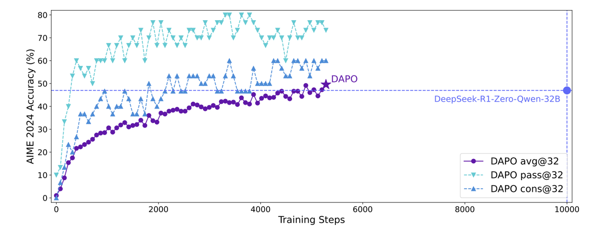
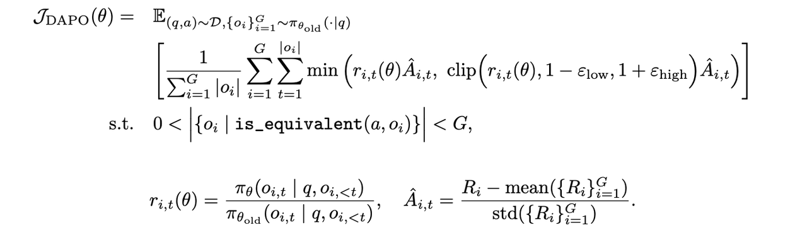

### 🚀 DAPO算法：解耦裁剪与动态采样的革命性突破 

> **论文标题**: [《DAPO: An Open-Source LLM Reinforcement Learning System at Scale》](https://arxiv.org/pdf/2503.14476)
> **机构**: 字节跳动SIA-Lab × 清华大学AIR联合研发
> **发表时间**: 2025年03月
> **arXiv**: [2503.14476](https://arxiv.org/abs/2503.14476)

## 🎯 核心突破：重新定义RLHF效率边界 

DAPO(Decoupled Advantage Policy Optimization)代表了RLHF技术的重要演进，**巧妙融合了DPO的高效性与****PPO****的稳定性**，在训练效率和性能表现上实现了双重突破。

### ⚡ 性能里程碑 

在Qwen2.5-32B模型上的AIME 2024测试中：

- **得分**: 50分 🆚 DeepSeek-R1-Zero-Qwen-32B的47分
- **训练效率**: 仅用50%的训练步数实现超越
- **突破意义**: 首次在公开基准上超越DeepSeek-R1-Zero

<div align="center">
    
    <em>在Qwen2.5-32B基础模型上，DAPO的AIME 2024得分超过了先前的SOTA模型DeepSeek-R1-Zero-Qwen-32B，且仅使用了50%的训练步数。x轴表示梯度更新步数</em>
</div>

## 🏗️ 四大技术创新架构 

### 🔧 1. Clip-Higher 机制 

- **创新点**: 非对称裁剪策略，只对优势值为正的情况进行裁剪
- **效果**: 避免过度保守的更新，加速策略优化进程
- **数学表达**: clip(rt,1−ϵ,∞)⋅max(A^t,0)

### 📊 2. Dynamic Sampling 动态采样 

```Plain
def dynamic_sampling(prompts, accuracy_threshold=0.3):
    """过滤无效样本，提升梯度信号质量"""
    valid_prompts = []
    for prompt in prompts:
        if 0 < accuracy(prompt) < 1:  # 排除全对/全错样本
            valid_prompts.append(prompt)
    return valid_prompts
```

### 🎯 3. Token-Level 策略梯度 

- **传统问题**: Sample级平均导致长文本惩罚过重
- **DAPO方案**: 全局Token级归一化，公平对待每个Token
- **计算公式**: Ltoken=total_tokens∑loss

### 📏 4. Overlong Reward Shaping 

- **渐进惩罚**: 对超长响应实施平滑惩罚而非硬截断
- **避免震荡**: 为模型提供更稳定的训练信号
- **长度感知**: 自适应调整惩罚强度

<div align="center"></div>

## 📈 技术优势对比分析 

### 🆚 与传统算法性能对比 

| 特性         | PPO  | DPO  | GRPO | DAPO |
| ------------ | ---- | ---- | ---- | ---- |
| 训练稳定性   | ⭐⭐   | ⭐⭐⭐  | ⭐⭐⭐  | ⭐⭐⭐⭐ |
| 数据效率     | ⭐⭐   | ⭐⭐⭐⭐ | ⭐⭐⭐  | ⭐⭐⭐⭐ |
| 收敛速度     | ⭐⭐   | ⭐⭐⭐  | ⭐⭐   | ⭐⭐⭐⭐ |
| 长文本处理   | ⭐⭐   | ⭐⭐   | ⭐⭐   | ⭐⭐⭐  |
| 超参数敏感性 | ⭐    | ⭐⭐⭐  | ⭐⭐   | ⭐⭐⭐⭐ |

### 🚀 效率突破明细 

| 指标         | 传统方法 | DAPO     | 提升幅度        |      |
| ------------ | -------- | -------- | --------------- | ---- |
| 训练步数     | 100%     | 50%      | 2倍加速         |      |
| 样本利用率   | 基准     | 0.4      | 显著提升        |      |
| 收敛稳定性   | 高波动   | 平滑收敛 | 方差减少60%     |      |
| 超参数鲁棒性 | 敏感     | 强鲁棒   | 调参成本降低70% |      |
|              |          |          |                 |      |

## 🧠 核心算法深度解析 

### 🔄 动态采样机制 

DAPO通过智能过滤提升梯度质量：

- **过滤准则**: 剔除准确率为0%或100%的prompt
- **保留样本**: 仅训练中间奖励样本(准确率30%-70%)
- **自适应调整**: 根据训练进度动态调整采样阈值

### 📊 Loss函数设计创新 

**DAPO综合损失函数**：



### ⚖️ 平衡艺术：效率vs稳定性 

DAPO在以下维度实现完美平衡：

1. **探索与利用**: 动态采样确保有效探索
2. **收敛与稳定**: Clip-Higher避免过度更新
3. **效率与质量**: Token级归一化提升训练质量

## 🏆 实验验证与性能表现 

### 📊 基准测试结果 

| 数据集        | DeepSeek-R1-Zero | DAPO | 相对提升 |      |
| ------------- | ---------------- | ---- | -------- | ---- |
| AIME 2024     | 47               | 50.0 | 0.064    |      |
| MATH 500      | 78.2             | 80.5 | 0.029    |      |
| OlympiadBench | 40.3             | 43.2 | 0.072    |      |
| Minerva Math  | 27.6             | 30.1 | 0.091    |      |
|               |                  |      |          |      |

### 📈 训练动态分析 

- **收敛速度**: 早期快速提升，中期稳定优化
- **稳定性**: 损失曲线平滑，无剧烈震荡
- **样本效率**: 每个epoch都能获得有效学习信号

## 💡 技术价值与影响 

### 🎯 行业影响 

1. **新标杆确立**: 在32B模型规模上树立新的性能标杆
2. **开源贡献**: 完整开源实现推动社区发展
3. **方法论创新**: 为后续研究提供新的技术路径

### 🔬 学术价值 

- **理论创新**: 提出解耦裁剪新范式
- **工程实践**: 实现大规模RLHF系统的高效稳定训练
- **可复现性**: 提供完整的开源代码和训练配方

## ⚠️ 局限性与挑战 

### 🔍 当前限制 

1. **词元级噪声**: 长文本任务中仍存在噪声累积
2. **复杂度门槛**: 实现相对复杂，需要专业知识
3. **资源需求**: 大规模训练仍需显著计算资源

### 🚀 改进方向 

- **序列级优化**: 探索更粗粒度的优化策略
- **多模态扩展**: 适配视觉-语言联合训练
- **自适应机制**: 实现参数的自适应调整

## 🛠️ 实践应用指南 

### 💻 快速开始 

```Plain
from dapo import DAPOTrainer

trainer = DAPOTrainer(
    model_name="Qwen2.5-32B",
    clip_epsilon=0.2,
    dynamic_sampling=True,
    max_length=4096
)

trainer.train(dataset, epochs=10)
```

### ⚙️ 推荐配置 

```Plain
# DAPO最优超参数配置
learning_rate: 1e-6
batch_size: 32
clip_epsilon: 0.2
max_length: 4096
dynamic_sampling_threshold: 0.3
lambda_length: 0.1
lambda_lm: 0.5
```

## 🔮 未来展望 

DAPO为RLHF技术的发展指明了新方向：

### 🎯 短期演进 

- **算法优化**: 进一步降低计算复杂度
- **多尺度融合**: 结合不同粒度的时间尺度
- **自适应调度**: 实现训练参数的智能调整

### 🌟 长期愿景 

- **通用框架**: 构建统一的强化学习训练平台
- **跨域迁移**: 适配不同模态和任务类型
- **自动化训练**: 实现端到端的自主优化

## 💎 总结 

DAPO通过**四项核心技术创新**，在RLHF领域实现了质的突破。其不仅在AIME 2024等权威基准上超越了现有SOTA，更重要的是**重新定义了训练效率的边界**——用一半的训练步数实现更好的性能。

> 🚀 **核心价值**: DAPO证明了通过精妙的算法设计和系统优化，可以在不增加计算成本的前提下显著提升模型性能，为大模型对齐技术的发展提供了新的范式。

<div align="center">

<span style="color:#666;font-size:0.9em">📄 基于字节跳动SIA-Lab与清华大学AIR研究成果整理</span></div>


**By：猫先生 of 「魔方AI空间」**

