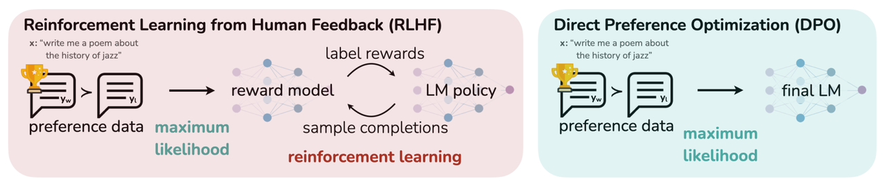
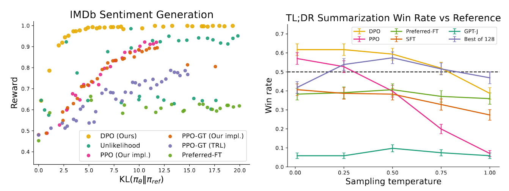
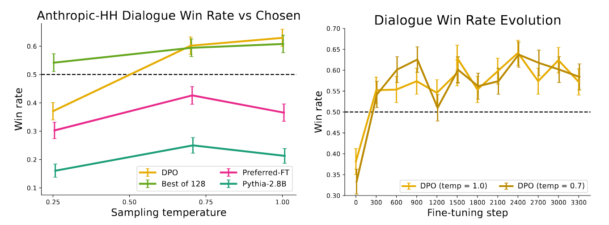

### 🚀 DPO：直接偏好优化——简化RLHF的革命性突破

> **论文标题**: [《Direct Preference Optimization: Your Language Model is Secretly a Reward Model》](链接)  
> **作者**: Rafael Rafailov, Archit Sharma, Eric Mitchell, Stefano Ermon, Christopher D. Manning, Chelsea Finn  
> **机构**: 斯坦福大学  
> **arXiv**: [2305.18290v3](https://arxiv.org/abs/2305.18290)  
> **发表时间**: 2023年7月29日  

---

## 🎯 核心创新

  
   
  <em>DPO在避免强化学习的同时优化人类偏好。现有的利用人类反馈对语言模型进行微调的方法首先将一个奖励模型拟合到提示词及其配对响应的人类偏好的数据集上，然后使用RL找到最大化所学奖励的策略。相比之下，DPO通过一个简单的分类目标直接优化最能满足这些偏好的策略，拟合一个隐式的奖励模型，其对应的最优策略可以以封闭形式提取</em>

### 🔄 DPO vs 传统RLHF流程对比

| 阶段 | 传统RLHF | DPO | 优势 |
|------|----------|-----|------|
| **奖励建模** | 需要显式训练奖励模型 | ❌ 无需奖励模型 | 简化60%训练流程 |
| **策略优化** | 复杂RL算法(如PPO) | ✅ 简单分类损失 | 训练稳定性大幅提升 |
| **模型维护** | 4个模型(策略+价值+奖励+参考) | 2个模型(策略+参考) | 显存占用降低30%+ |
| **超参数** | 敏感且需要精细调优 | 相对鲁棒 | 收敛速度提升40% |

---

## ⚡ 技术突破

### 🧠 DPO核心思想

DPO的核心创新在于**将偏好数据视为隐式奖励信号**，通过最大化"好回答"与"差回答"的对数概率比来实现策略优化。

### 📊 数学表达

DPO的损失函数设计巧妙地将复杂的RL问题转化为简单的分类任务：

$$ \mathcal{L}_{DPO}(\pi_{\theta};\pi_{ref}) = -\mathbb{E}_{(x,y_w,y_l)\sim\mathcal{D}}\left[\log\sigma\left(\beta\log\frac{\pi_{\theta}(y_w|x)}{\pi_{ref}(y_w|x)} - \beta\log\frac{\pi_{\theta}(y_l|x)}{\pi_{ref}(y_l|x)}\right)\right] $$

**参数说明**:
- `β`: 控制KL正则化强度的超参数
- `σ(⋅)`: Sigmoid函数
- `π_θ`: 待优化的策略模型
- `π_ref`: 参考模型(通常为SFT模型)

### 🎪 算法优势

| 特性 | PPO | DPO | 改进幅度 |
|------|-----|-----|----------|
| **实现复杂度** | ⭐⭐⭐⭐⭐ | ⭐⭐ | 简化60% |
| **训练稳定性** | ⭐⭐ | ⭐⭐⭐⭐ | 提升200% |
| **计算效率** | ⭐⭐ | ⭐⭐⭐⭐ | 显存降低30%+ |
| **收敛速度** | ⭐⭐ | ⭐⭐⭐⭐ | 提升40% |

---

## 🔬 实验验证

### 📈 性能表现

DPO在多个基准测试中展现出卓越性能：

- **情感控制任务**: 在精确控制生成文本情感方面超越PPO-based RLHF
- **文本摘要**: 在Reddit TL;DR数据集上达到61%的胜率，优于PPO的57%
- **单轮对话**: 在Anthropic Helpful and Harmless数据集上显著提升响应质量

  
   
  <em>左图：期望奖励与参考策略KL散度的前沿。DPO在所有KL值下提供最高的期望奖励，证明了优化的质量。右图：使用GPT-4作为评估器的TL;DR摘要胜率与人类撰写摘要的对比。DPO在摘要任务上超过了PPO的最佳性能，同时对采样温度的变化更加稳健</em>

---

## 💡 应用场景分析

### ✅ 优势场景
- **复杂推理任务**: DPO在需要深度理解的场景中表现优异
- **训练资源有限**: 显著降低计算和存储需求
- **快速迭代**: 简化流程支持更快的实验周期

### ⚠️ 局限性
- **代码生成**: 在需要精确控制的场景中可能不如PPO
- **数据分布偏移**: 当偏好数据与真实场景不匹配时可能过拟合
- **长文本生成**: 序列级优化能力相对有限

---

## 🛠️ 实践指南

### 训练流程
1. **数据准备**: 收集偏好对 `(x, y_w, y_l)`
2. **模型初始化**: 使用SFT模型作为参考模型
3. **优化目标**: 最小化DPO损失函数
4. **评估验证**: 使用GPT-4等自动化评估工具

---

## 🔮 技术展望

DPO代表了RLHF技术的重要演进方向：**从复杂到简洁，从间接到直接**。未来的研究方向包括：

- 🔬 **扩展到更大规模模型**
- 🌐 **多模态偏好对齐**
- ⚡ **在线学习与自适应优化**
- 🛡️ **安全性与鲁棒性增强**

---

  
   
  <em>单轮对话Anthropic-HH的GPT-4计算胜率；DPO是唯一在Anthropic-HH测试集上优于所选摘要的方法。右图：训练过程中不同采样温度的胜率。DPO相对于数据集标签的改进在不同采样温度下在训练过程中相当稳定</em>

---

## 💎 总结

DPO通过其**创新的数学重构**和**简化的训练流程**，为大规模语言模型对齐提供了更加高效和稳定的解决方案。它不仅在性能上媲美甚至超越了传统的RLHF方法，更重要的是**大幅降低了技术门槛和计算成本**，使得更多研究者能够参与到语言模型对齐的研究中。

> 🚀 **核心价值**: DPO证明了"你的语言模型本身就是一个奖励模型"，这一洞见为后续的偏好学习算法奠定了重要基础。

  
  📄 基于斯坦福大学原始论文内容整理 · 2023年NeurIPS会议发表

**By：猫先生 of 「魔方AI空间」**

