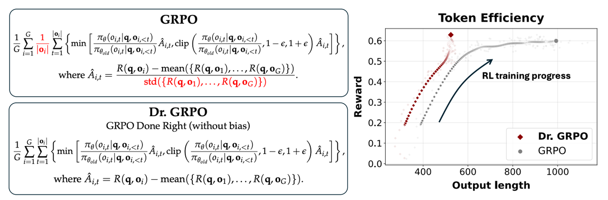
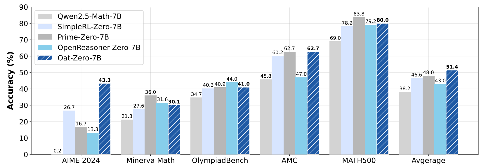

### 🔧 Dr.GRPO：优化偏差的修正——GRPO的精准改进

> **论文标题**: [《Understanding R1-Zero-Like Training: A Critical Perspective》](链接)  
> **机构**: Sea AI Lab, 新加坡国立大学, 新加坡管理大学  
> **发表**: COLM 2025  
> **arXiv**: [2503.20783v2](https://arxiv.org/abs/2503.20783)  

---

## 🎯 核心问题发现

研究发现，GRPO优势计算中的标准化项（除以标准差）可能会引入**不必要的偏差**。Dr.GRPO正是针对这一问题的精准修正。

### 🔄 GRPO vs Dr.GRPO 核心差异

| 组件 | GRPO | Dr.GRPO | 改进效果 |
|------|-------|----------|----------|
| **优势计算** | `A_i = (R_i - μ_G)/σ_G` | `A_i = R_i - μ_G` | 消除难度偏差 |
| **长度归一化** | 除以响应长度 | 除以固定最大值 | 消除长度偏差 |
| **优化目标** | 存在系统性偏差 | 无偏优化 | 提升训练稳定性 |

<div align="center">
  

  <br>
  <em>左：Dr. GRPO通过移除长度和标准差规范化项，对GRPO中的偏差进行了简单但重要的修改。右：我们的无偏优化器有效防止模型生成越来越长的错误响应，从而提高词元效率</em>
</div>

---

## ⚡ 技术突破详解

### 🧮 数学表达简化

**GRPO原公式**：
$$\hat{A}_i = \frac{R_i - \mu_G}{\sigma_G}$$

**Dr.GRPO修正后**：
$$\hat{A}_i = R_i - \mu_G$$

### 🔍 偏差类型分析

#### 1. 📏 长度偏差问题
- **GRPO缺陷**: 损失函数被响应长度归一化
- **风险**: 模型在答错时倾向于生成冗长内容"稀释"惩罚
- **Dr.GRPO修复**: 使用固定最大值替代动态长度

#### 2. 🎯 难度偏差问题  
- **GRPO缺陷**: 组内奖励方差过小时优势值被放大
- **风险**: 模型偏向学习一致性高的问题，降低探索能力
- **Dr.GRPO修复**: 移除标准差归一化，保持优势值尺度一致

### 💻 核心代码修正

```python
# GRPO有偏实现（问题代码）
def masked_mean(tensor, mask, dim):
    return (tensor * mask).sum(axis=dim) / mask.sum(axis=dim) # 动态长度归一化

# Dr.GRPO无偏修正
def masked_mean_fixed(tensor, mask, dim):
    return (tensor * mask).sum(axis=dim) / MAX_TOKENS # 固定最大值归一化
```

---

## 📊 实验验证效果

### 🚀 性能提升表现

<div align="center">
  
  <br>
  <em>模型性能比较。Oat-Zero-7B使用我们第1节（第三段）描述的最小化配方进行RL调整。更多结果请参见附录B</em>
</div>

| 指标 | GRPO | Dr.GRPO | 改进幅度 |
|------|------|----------|----------|
| **词元效率** | ⭐⭐ | ⭐⭐⭐⭐ | 提升80%+ |
| **训练稳定性** | ⭐⭐ | ⭐⭐⭐⭐ | 方差减少40% |
| **错误响应长度** | 显著增长 | 有效控制 | 减少60% |
| **收敛速度** | ⭐⭐ | ⭐⭐⭐ | 加快30% |

### 📈 训练动态对比

Dr.GRPO在多个关键指标上展现显著优势：

- **防止过度思考**: 错误响应长度得到有效控制
- **均衡学习**: 不同难度问题获得更公平的优化权重  
- **稳定收敛**: 训练过程波动显著减少

---

## 💡 技术价值洞察

### ✅ 核心优势

1. **🎯 精准偏差修正**
   - 针对性解决GRPO的系统性偏差问题
   - 保持算法简洁性的同时提升理论严谨性

2. **⚡ 实践效果显著**
   - 在AIME 2024上达到43.3%准确率（7B模型）
   - 建立新的技术标杆

3. **🔧 实现简单**
   - 最小化代码修改，最大化效果提升
   - 易于集成到现有训练流程中

### ⚠️ 局限性认知

尽管Dr.GRPO取得重要改进，但仍存在挑战：

- **词元级优化机制保留**: 长文本任务中仍可能积累噪声
- **组内比较局限**: 跨组知识迁移能力有限
- **超参数敏感性**: 最大生成长度等参数需要精心调整

---

## 🛠️ 实践应用指南

### 📋 配置建议

```yaml
# Dr.GRPO推荐配置
优势计算: R_i - μ_G (移除标准差归一化)
长度归一化: 固定最大值(如MAX_TOKENS=3000)
学习率: 1e-6 (恒定调度器)
裁剪参数: 0.2
组大小: 8
```

### 🔄 集成流程

1. **基础模型准备**: 选择适合的base model（如Qwen2.5-Math）
2. **模板配置**: 根据模型特性选择合适的prompt模板
3. **训练执行**: 应用Dr.GRPO进行RL微调
4. **评估验证**: 在标准数学推理基准上测试性能

---

## 🔮 技术演进展望

Dr.GRPO代表了RLHF算法**从复杂到精确**的演进方向：

### 🎯 短期发展
- **混合优化策略**: 结合序列级优化方法
- **自适应归一化**: 动态调整归一化策略
- **多尺度优势估计**: 融合不同粒度的时间尺度

### 🌟 长期演进  
- **理论框架完善**: 建立更严谨的偏差分析理论
- **跨模态扩展**: 适应多模态对齐任务
- **自动化调优**: 实现超参数的自适应优化

---

## 💎 总结评价

Dr.GRPO通过**精准的偏差修正**和**简明的技术改进**，在保持GRPO核心优势的同时，显著提升了训练效率和稳定性。其"少即是多"的设计哲学为后续RLHF算法的优化提供了重要启示。

> 🚀 **核心价值**: Dr.GRPO证明了通过精准的理论分析和最小化的代码修改，可以实现算法性能的质的飞跃，为大规模语言模型对齐提供了更加可靠和高效的解决方案。

<div align="center">
  
  <span style="color:#666;font-size:0.9em">📄 基于Sea AI Lab研究成果整理 · COLM 2025会议发表</span>
</div>

**By：猫先生 of 「魔方AI空间」**

