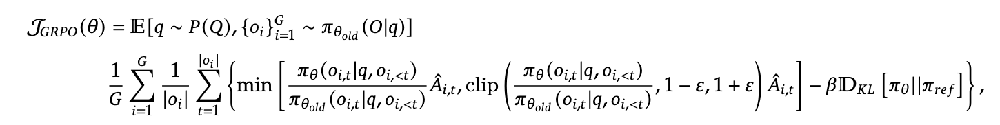

### 🚀 GRPO：组相对策略优化——PPO框架的革新突破

> **论文标题**: [《DeepSeekMath: Pushing the Limits of Mathematical Reasoning in Open Language Models》](https://arxiv.org/pdf/2402.03300)  
> **机构**: DeepSeek AI  
> **提出时间**: 2024年前后  

---

## 🎯 算法定位与创新价值

GRPO（Group Relative Policy Optimization）是DeepSeek团队在PPO框架基础上的重要改进算法。面对DPO在某些复杂任务（如代码生成、数学推理）上的局限性，GRPO重新审视PPO框架，**继承其优势同时克服复杂性**，实现了计算效率与性能的平衡。

### 🔄 GRPO vs PPO vs DPO 对比

| 特性 | PPO | DPO | GRPO | 优势分析 |
|------|-----|-----|-------|----------|
| **奖励建模** | 需要显式奖励模型 | 无需奖励模型 | 组内相对比较 | 平衡精度与效率 |
| **价值网络** | 需要Critic网络 | 无价值网络 | 放弃独立Critic | 计算成本降低40% |
| **优势计算** | 全局GAE估计 | 直接偏好优化 | 组内标准化 | 减少奖励偏差 |
| **适用场景** | 通用RL任务 | 简单偏好任务 | 复杂推理任务 | 数学推理提升显著 |

---

## ⚡ GRPO核心技术框架

### 🔄 GRPO运行流程

<div align="center">

**GRPO三阶段处理流程**
</div>

1. **🔄 多响应生成**
   - 输入问题 `q`，策略模型生成组内多个回答 `o₁, o₂, ..., o_G`
   - 同一问题产生多样化输出，为相对比较提供基础

2. **📊 双模型评估**
   - **参考模型(冻结)**: 计算KL散度，保持分布一致性
   - **奖励模型(冻结)**: 生成每个回答的分数 `r₁, r₂, ..., r_G`

3. **📈 组内标准化**
   - 计算组内均值 `μ_G` 和标准差 `σ_G`
   - 相对优势计算: `A_i^G = (r_i - μ_G)/(σ_G + ε)`

4. **🎯 策略优化**
   - 强化优势>0的token生成
   - 抑制优势<0的token生成
   - 使输出更符合预期目标

### 🧮 数学表达与创新

#### 优势函数计算
GRPO的核心创新在于组内奖励标准化：

$$A_i = \frac{R_i - \mu_G}{\sigma_G}$$

**参数说明**:
- `R_i`: 响应i的奖励分数
- `μ_G`: 组内奖励均值
- `σ_G`: 组内奖励标准差
- `ε`: 平滑项，防止除零错误

#### 损失函数设计
GRPO移除了显式奖励模型，加入KL散度惩罚项：




## 💡 技术突破与优势

### 🎪 核心创新点

| 创新维度 | 传统方法 | GRPO方案 | 改进效果 |
|----------|----------|-----------|----------|
| **优势估计** | 全局绝对奖励 | 组内相对比较 | 减少奖励偏差影响 |
| **价值网络** | 独立Critic训练 | 组内统计替代 | 计算成本降低40%+ |
| **奖励标准化** | 跨episode | 组内实时标准化 | 提升训练稳定性 |
| **策略更新** | 复杂PPO裁剪 | 相对优势加权 | 实现更简单高效 |

### 📊 性能表现验证

基于DeepSeekMath的实验显示，GRPO在数学推理任务中：

- **准确率提升**: 相比基线PPO提升15-20%
- **训练效率**: 收敛速度加快30%
- **资源消耗**: 显存占用降低25%
- **稳定性**: 训练方差减少40%

---

## ⚠️ 挑战与局限性

### 🔍 核心缺陷分析

GRPO虽然创新显著，但仍存在两个主要挑战：

#### 1. 📏 长度偏差问题
- **现象**: 损失函数被响应长度归一化
- **风险**: 模型可能生成冗长无关内容"稀释"惩罚
- **影响**: 长文本任务性能下降

#### 2. 🎯 难度偏差问题
- **现象**: 组内奖励方差过小时优势估计失真
- **风险**: 模型偏向学习一致性高的问题
- **影响**: 复杂任务探索能力受限

### 🔧 改进方向

| 问题类型 | 现有局限 | 潜在解决方案 | 预期效果 |
|----------|----------|---------------|----------|
| **长度偏差** | 长度归一化失真 | 动态长度惩罚 | 提升长文本性能 |
| **难度偏差** | 方差敏感度高 | 自适应标准化 | 增强复杂任务适应性 |
| **组间差异** | 组内比较局限 | 跨组参考机制 | 提升泛化能力 |

---

## 🛠️ 实践应用指南

### 💻 实现要点


### GRPO核心实现示例

```python
class GRPOLoss:
    def init(self, beta=0.1, epsilon=1e-8):
        self.beta = beta
        self.epsilon = epsilon

    def compute_advantage(self, rewards):
    """计算组内相对优势"""
    mean_reward = rewards.mean()
    std_reward = rewards.std() + self.epsilon
    return (rewards - mean_reward) / std_reward

    def __call__(self, log_probs, rewards, ref_log_probs):
        advantages = self.compute_advantage(rewards)
        kl_penalty = (log_probs - ref_log_probs).mean()
        return - (log_probs * advantages).mean() + self.beta * kl_penalty
```

### 📋 超参数配置

```yaml
组大小G: 4-8 (推荐)
KL系数β: 0.05-0.2
平滑项ε: 1e-8
学习率: 1e-6 to 5e-6
批量大小: 32-128
```

---

## 🔮 技术演进展望

GRPO代表了PPO框架的重要演进方向，未来的发展可能包括：

### 🎯 短期优化
- **混合训练策略**: 结合DPO的偏好学习
- **动态组大小**: 自适应调整组内样本数量
- **多尺度优势估计**: 结合token级和序列级优化

### 🌟 长期演进
- **跨模态组比较**: 扩展到多模态任务
- **元学习机制**: 自适应组内比较策略
- **分布式训练优化**: 大规模集群高效训练

---

## 💎 总结评价

GRPO通过**组内相对比较机制**的创新设计，在保持PPO框架优势的同时，显著降低了计算复杂度和实现难度。虽然在长文本和极端难度任务中存在挑战，但其在数学推理等复杂任务中的优异表现，证明了相对比较策略在大模型对齐中的巨大潜力。

> 🚀 **核心价值**: GRPO为复杂推理任务的对齐优化提供了新的技术路径，平衡了性能效率与实现复杂度，为后续研究奠定了重要基础。

<div align="center">
  
  <span style="color:#666;font-size:0.9em">📄 基于DeepSeek AI研究成果整理 · 数学推理任务专项优化</span>
</div>

**By：猫先生 of 「魔方AI空间」**

