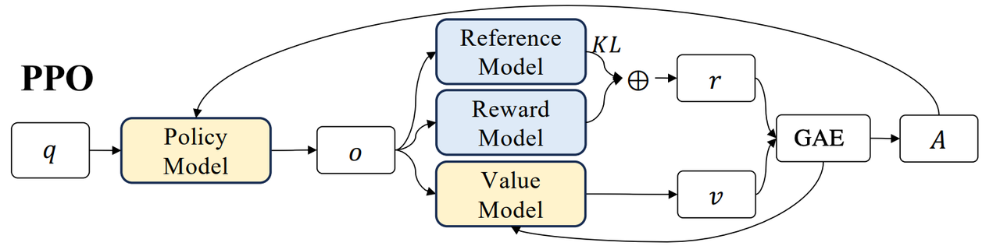
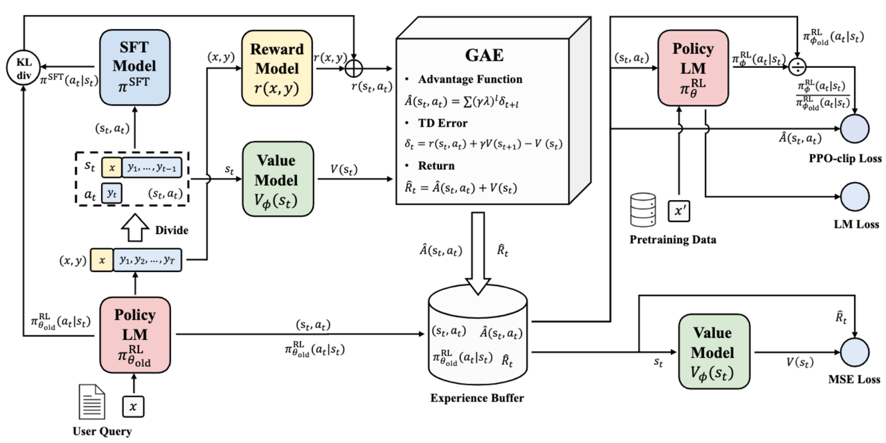

## 🚀 PPO: 近端策略优化算法——RLHF的基石

> **论文标题**: [《Proximal Policy Optimization Algorithms》](链接)  
> **作者**: John Schulman, Filip Wolski, Prafulla Dhariwal, Alec Radford, Oleg Klimov  
> **机构**: OpenAI  
> **arXiv**: [1707.06347v2](https://arxiv.org/abs/1707.06347)  

---

## 📖 核心概述

PPO（Proximal Policy Optimization）是 **OpenAI 于2017年提出的重要强化学习算法**，作为RLHF（从人类反馈中强化学习）技术的基石。PPO的核心创新在于通过**裁剪策略更新幅度**来确保训练稳定性，摒弃了TRPO复杂的KL散度约束计算，转而采用更简单高效的裁剪机制。

在LLM对齐中，PPO将语言模型视为策略网络(Actor)，生成文本的过程视为动作序列的选择，同时引入价值网络(Critic)来评估状态价值，从而计算优势函数。




## 🎯 算法核心思想

### 🔄 PPO 运行流程

输入问题 **q**，经过**策略模型（Policy Model，更新）**，生成回答 **o**。接着输出 **o** 被输入到 3 个关键模型：

| 模型 | 状态 | 功能描述 |
|------|------|----------|
| **参考模型（Reference，冻结）** | ❄️ 冻结 | 计算输出 o 与训练数据之间的 KL 散度，限制策略更新幅度 |
| **奖励模型（Reward，冻结）** | ❄️ 冻结 | 生成奖励 r，提供实际分数反馈 |
| **价值模型（Value，更新）** | 🔄 更新 | 输出 o 的预期分数，用于优势函数计算 |

<div align="center">
  
  <br>
  <em>图1：PPO 工作流，描述算法执行的顺序步骤。该过程从环境中采样开始，接着应用GAE以改进优势近似。然后，图表展示了 PPO 中使用的各种损失函数的计算，这表明了学习过程的迭代性质以及从中得出的策略更新</em>
</div>

---

## 🏗️ 大模型训练三阶段

#### 1. 📚 有监督微调（SFT）
- **目标**: 模型通过模仿人类标注的对话样例学习通用的人类式对话
- **方法**: 使用高质量的对话数据进行监督学习

#### 2. 🏆 奖励模型（RM）训练  
- **目标**: 训练模型学会根据人类反馈比较不同回复的偏好
- **方法**: 使用成对比较数据训练奖励函数

#### 3. ⚡ 近端策略优化（PPO）
- **目标**: 基于奖励模型的反馈进行策略优化
- **方法**: 通过探索和利用发现最优策略

---

## 🎪 算法优势对比

| 特性 | PPO | TRPO | 传统PG |
|------|-----|------|--------|
| **实现复杂度** | ⭐⭐ | ⭐⭐⭐⭐ | ⭐ |
| **训练稳定性** | ⭐⭐⭐⭐ | ⭐⭐⭐⭐⭐ | ⭐⭐ |
| **样本效率** | ⭐⭐⭐⭐ | ⭐⭐⭐ | ⭐⭐ |

---

## 🔬 实验验证

- **连续控制任务**: 在MuJoCo模拟环境中超越TRPO和其他基线方法
- **Atari游戏**: 在样本复杂度方面显著优于A2C
- **3D人形机器人**: 成功实现复杂 locomotion 任务

> 💡 **关键洞见**: PPO在稳定性、实现简易性和性能之间达到了最佳平衡

---

## 🛠️ 实用信息

### 超参数设置（典型值）

```yaml
Horizon (T): 2048
Adam步长: 3e-4
训练轮数: 10
Mini-batch大小: 64
折扣因子 (γ): 0.99
裁剪参数 (ε): 0.2
```


---

## 💎 总结

PPO算法通过其**简洁的实现**、**优秀的稳定性**和**高效的样本利用**，已经成为现代强化学习特别是大语言模型对齐领域的**核心技术**。


**By：猫先生 of 「魔方AI空间」**


