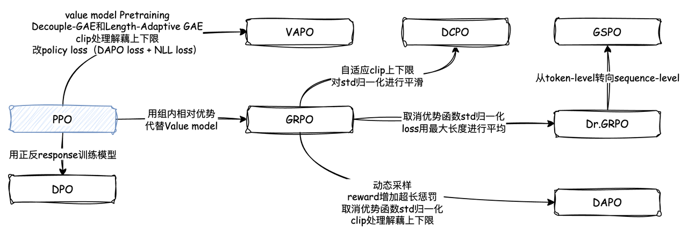

## 一文梳理 RLHF 进化史：从PPO、DPO、GRPO到GSPO

**简介：**

本文以经典的PPO算法为起点，系统性地梳理 RLHF 核心对齐算法的演进史，深入剖析从PPO到DPO，再到GRPO及其一系列改进变体（如Dr.GRPO, DAPO, GSPO）的内在逻辑与创新点。
近年来，随着大语言模型（LLM）的飞速发展，如何使模型输出与人类的价值观和偏好对齐，已成为人工智能领域的核心挑战。
基于人类反馈的强化学习（Reinforcement Learning from Human Feedback, RLHF）是解决这一问题的关键技术范式，从PPO到GSPO的算法演进体现了AI领域对模型安全与性能平衡的不断探索。
PPO作为RLHF的起点，通过裁剪机制和GAE优势函数计算，在策略更新与稳定性间取得平衡。
随后，DPO通过直接偏好优化绕过奖励模型训练，GRPO引入组内相对比较机制，Dr.GRPO修正了长度和难度偏差，DAPO提出解耦裁剪和动态采样，GSPO则将优化粒度从token提升到序列级别，针对MoE架构提供更稳定的训练方案。
这些算法在优势函数计算、clip处理和loss设计上的创新，共同推动了大模型对齐技术的快速发展。

**目录：**

- [PPO](PPO/readme.md)：近端策略优化算法
- [DPO](DPO/readme.md)：直接偏好优化算法
- [GRPO](GRPO/readme.md)：组相对策略优化算法
- [Dr.GRPO](Dr.GRPO/readme.md)：优化偏差的修正
- [DAPO](DAPO/readme.md)：解耦裁剪与动态采样
- [GSPO](GSPO/readme.md)：序列级优化

| 算法 | 优势函数计算 | Clip处理 | Loss设计 | 主要改进点 | 适用场景 |
| :--- | :--- | :--- | :--- | :--- | :--- |
| PPO | GAE(全局) | 对称裁剪([1-ε, 1+ε]) | Token级梯度+KL惩罚+熵正则 | 稳定性与探索的平衡 | 通用RL任务 |
| DPO | 直接偏好对齐 | 无裁剪 | 序列级偏好对齐+熵正则 | 绕过奖励模型训练 | 复杂推理任务 |
| GRPO | 组内标准化 | 对称裁剪 | Token级梯度+KL惩罚 | 组内相对比较替代Critic | 需要对齐人类偏好的任务 |
| Dr.GRPO | 组内均值 | 对称裁剪 | Token级梯度+KL惩罚 | 移除std归一化和长度归一化 | 长文本推理任务 |
| DAPO | 组内标准化 | 非对称裁剪([1-ε], [1+ε']) | Token级梯度+软惩罚 | Clip-Higher和动态采样 | 通用LLM对齐 |
| GSPO | 序列级优势 | 序列级裁剪 | 序列级梯度 | 序列级优化替代token级 | MoE模型和长文本任务 |
| GSPO-token | 序列级权重+token级优势 | 序列级裁剪 | Token级梯度+序列级权重 | 灵活性与稳定性的平衡 | 多轮对话等局部优化任务 |