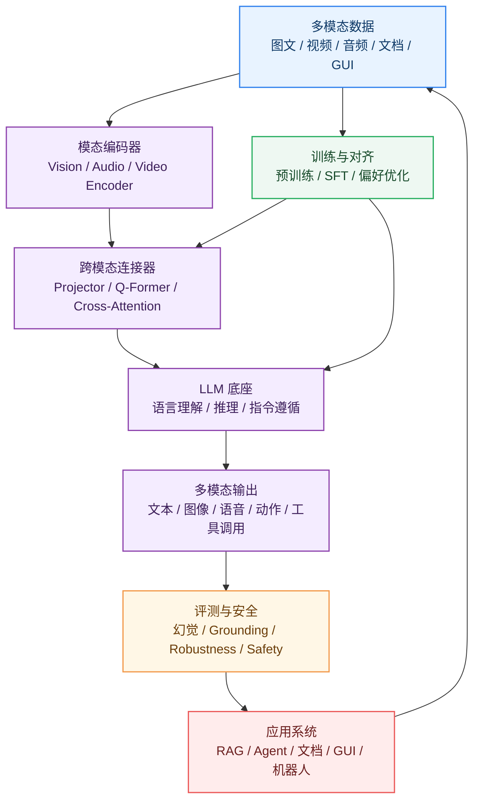

# 00_板块导读

> 这一章先不急着讲某个具体模型。我们先把多模态这条路看清楚：它从模态表示和跨模态对齐开始，逐步走向视觉语言模型、多模态生成、视频音频理解、评测安全，以及最终的多模态 Agent。

**By：猫先生 of 「魔方AI空间」**

## 本章定位

如果说 [LLM 基础入门](../../02_LLM基础入门/README.md) 主要回答“模型如何理解和生成语言”，那多模态这一部分要追问的是：

```text
模型如何把文本、图像、视频、音频、文档、界面和真实世界信号连接起来？
```

这件事远不只是给语言模型“加一个视觉输入”。一旦进入多模态，问题会立刻变成一整套系统工程：

- 不同模态如何编码成模型可计算的表示？
- 图像、视频、音频与文本如何对齐？
- 多模态模型如何既能遵循指令，又能基于图像、视频或音频做推理？
- 我们怎么判断模型是真的看懂了，而不是说出一个听起来合理的答案？
- 多模态能力如何进入 Agent、RAG、工具调用和真实产品？

所以本章更像一张地图：先说明该学什么、先后顺序是什么、哪些内容属于本板块，哪些内容应该交给 AI 绘画、AI 视频、Agent 或部署板块继续展开。

## 为什么需要单独学习多模态？

多模态值得单独拎出来学，是因为它把大模型从“会读会写”往“能感知环境、理解现场、辅助行动”推了一步。

LLM 主要面对文本序列，但真实世界很少以纯文本出现。我们每天处理的信息，大量藏在这些东西里：

- 图片、截图、海报、医学影像、工业照片
- 视频、直播、监控、动作和事件序列
- 语音、音乐、环境声和实时对话
- PDF、表格、图表、网页和 GUI 界面
- 3D 场景、传感器、机器人状态和空间信号

所以，多模态学习的核心不是“支持更多文件格式”，而是让模型逐步具备三类更底层的能力：

| 能力 | 说明 | 代表场景 |
| --- | --- | --- |
| 感知 | 把图像、视频、音频等非文本信息编码成可理解表示 | OCR、图像问答、视频理解、语音识别 |
| 对齐 | 把不同模态的信息映射到可交互、可推理的语义空间 | 图文检索、视觉指令、跨模态 RAG |
| 行动 | 基于多模态上下文进行决策、生成和工具调用 | GUI Agent、文档助手、设计助手、机器人 |

从长期看，这三类能力会成为 Agent、具身智能和真实世界自动化的底座。

## 本板块的知识边界

本板块不会试图把 CV、语音、视频生成、Agent 全部讲完。那样只会变成一个又大又散的目录。这里更关心的是：多模态大模型共同依赖的那一层基础。

| 范围 | 本板块关注 | 延伸到其他板块 |
| --- | --- | --- |
| 图像理解 | 视觉编码器、图文对齐、VLM、OCR、VQA | 图像生成细节进入 [AI 绘画基础入门](../../04_AI绘画基础入门/README.md) |
| 视频理解 | 帧采样、时序建模、长视频理解、视频问答 | 视频生成细节进入 [AI 视频基础入门](../../05_AI视频基础入门/README.md) |
| 音频语音 | ASR、TTS、Audio-Language、实时语音交互 | 专项语音工程后续单独扩展 |
| LLM 底座 | 多模态系统中 LLM 的角色和约束 | LLM 原理进入 [LLM 基础入门](../../02_LLM基础入门/README.md) |
| Agent 应用 | 多模态 RAG、GUI Agent、工具调用 | Agent 框架进入 [Agent/RAG/MCP](../../07_Agent-RAG-MCP/README.md) |
| 部署工程 | 视觉 Token、KV Cache、显存和延迟影响 | Serving、量化、并行进入 [大模型部署系列](../../09_大模型部署系列/README.md) |

换句话说：

> 本板块负责回答“多模态能力如何进入大模型系统”。至于图像生成、视频生成、Agent 框架和部署优化，则在对应板块继续深入。

## 知识地图

为了不被各种模型名绕晕，可以先把多模态系统拆成七层来看：



后续章节基本就围绕这七层展开：

- **数据层**：多模态数据与训练
- **编码层**：视觉编码器、音频语音、视频多模态
- **连接层**：跨模态对齐与连接器
- **语言层**：文本编码器与 LLM 底座
- **模型层**：视觉语言模型、多模态生成模型
- **评测层**：多模态评测
- **应用层**：多模态 Agent 与应用

## 推荐学习路线

### 第一阶段：建立基础概念

这一阶段不用追求读懂所有论文，先把系统组成搞清楚。

建议顺序：

```text
01_多模态基础概念
  -> 02_视觉编码器
  -> 03_文本编码器与LLM底座
  -> 04_跨模态对齐与连接器
```

读完这一阶段，至少应该能说清楚：

- 什么是模态、跨模态、多模态大模型。
- 图像如何被切成 Patch 并编码为视觉特征。
- LLM 在多模态系统中承担推理、指令遵循和生成角色。
- Projector、Q-Former、Cross-Attention 为什么是关键桥梁。

### 第二阶段：理解主流模型路线

这一阶段开始进入主流模型。目标不是背模型名字，而是能看懂 VLM / MLLM 架构图里每个模块在干什么。

建议顺序：

```text
05_视觉语言模型VLM
  -> 09_多模态数据与训练
  -> 10_多模态评测
```

这一阶段建议重点抓：

- CLIP、BLIP、BLIP-2、Flamingo、LLaVA、Qwen-VL 等路线的差异。
- 图文对齐、视觉指令微调、多模态 SFT 分别解决什么问题。
- 为什么多模态模型容易出现幻觉。
- VQA、OCR、MMBench、MMMU、HallusionBench 等评测关注什么。

### 第三阶段：进入生成与时序模态

这一阶段会离内容生产更近，也会遇到更难的时序问题。

建议顺序：

```text
06_多模态生成模型
  -> 07_视频多模态
  -> 08_音频语音多模态
```

这里最值得留意的是：

- 文生图、图生文、统一多模态生成之间的差异。
- 视频为什么比图像更难：时间、动作、事件、跨帧一致性。
- 音频语音为什么对延迟、流式和交互提出更高要求。

### 第四阶段：面向应用系统

这一阶段开始把模型能力接到真实任务里。

建议顺序：

```text
11_多模态Agent与应用
  -> 12_论文综述
  -> 13_实战项目
```

这一阶段建议重点看：

- 多模态 RAG 如何处理图像、PDF、表格、网页和视频。
- GUI Agent 如何看懂屏幕并执行操作。
- 多模态模型在办公、教育、医疗、工业、设计和内容生产中的能力边界。
- 如何把论文、模型和实验记录下来，避免学完之后只剩“好像看过”。

## 技术演进主线

多模态领域变化很快，但主线并不乱。大致可以沿着五条线看：

| 主线 | 早期形态 | 当前形态 | 长期方向 |
| --- | --- | --- | --- |
| 表示学习 | 单模态 CNN / RNN / Transformer | CLIP、ViT、Audio Encoder、Video Encoder | 更统一的模态 Token 化与语义表示 |
| 跨模态对齐 | 图文检索、Caption、VQA | Projector、Q-Former、Cross-Attention、Resampler | 更高效、更细粒度、更可解释的 Grounding |
| 指令遵循 | 单轮图文问答 | 视觉指令微调、多轮多图、多文档输入 | 多模态任务规划与复杂推理 |
| 生成能力 | 文生图、图生文分离 | 图像、视频、音频、文本统一建模 | 任意模态到任意模态的可控生成 |
| 应用系统 | Demo 级图文问答 | 多模态 RAG、GUI Agent、实时语音助手 | 面向真实世界的 Agent 和具身系统 |

这五条线不太会因为某个新模型发布就失效，因为它们对应的是多模态系统里绕不开的矛盾：

```text
不同模态的信息密度不同
  -> 表示方式不同
  -> 对齐难度不同
  -> 训练数据不同
  -> 评测标准不同
  -> 工程成本不同
```

## 长期不变的问题

模型会换，榜单会换，热门名词也会换。但下面这些问题，大概率会长期存在。

### 1. 模态表示问题

图像、视频、音频和文本的结构差异很大。

- 文本是离散 Token 序列。
- 图像是二维空间信号。
- 视频是空间加时间信号。
- 音频是连续波形和频谱信号。
- GUI 和文档同时包含视觉结构、文字、层级和交互语义。

所以第一步永远是表示问题：怎么把这些结构完全不同的信息，变成模型能处理、能比较、能推理的表示。

### 2. 对齐与 Grounding 问题

模型不仅要知道“图片里有什么”，还要知道：

- 文字描述对应图像中的哪个区域。
- 问题中的对象对应哪一帧、哪一块、哪一行文字。
- 生成答案是否真的基于视觉证据。
- 多轮对话中指代对象是否保持一致。

这就是 Grounding 的麻烦之处，也是多模态模型能不能可靠落地的关键。

### 3. 信息压缩问题

一张高清图、一个 PDF、一段长视频都可能产生大量视觉 Token。

多模态系统必须在三者之间取舍：

- 信息保真度
- 推理成本
- 上下文窗口占用

这就是为什么视觉 Token 压缩、动态分辨率、帧采样、区域选择这些看起来很工程的细节，会长期重要。

### 4. 幻觉与可靠性问题

多模态模型可能会说出图中不存在的对象、视频中没有发生的事件，或者引用文档中没有的内容。

所以多模态评测不能只看回答是不是流畅，还要追问：

- 是否忠实于输入模态。
- 是否能说明证据来源。
- 是否能拒绝回答不可判断的问题。
- 是否能在高风险场景保持边界。

### 5. 系统集成问题

多模态模型真正落地时，往往不是单模型调用，而是系统集成：

```text
文件解析
  -> 图像 / 文档 / 视频切分
  -> OCR / ASR / 检索
  -> 多模态模型推理
  -> 工具调用
  -> 结果校验
  -> 用户交互
```

很多时候，最后的体验并不只取决于模型参数，也取决于数据管线、评测体系和工程架构。

## 本板块章节说明

| 章节 | 作用 | 建议产出 |
| --- | --- | --- |
| [01_多模态基础概念](../01_多模态基础概念/README.md) | 建立基本概念和任务分类 | 概念图、任务表、术语解释 |
| [02_视觉编码器](../02_视觉编码器/README.md) | 理解图像如何进入模型 | ViT / CLIP / SigLIP 对比 |
| [03_文本编码器与LLM底座](../03_文本编码器与LLM底座/README.md) | 理解 LLM 在多模态中的角色 | LLM 底座能力清单 |
| [04_跨模态对齐与连接器](../04_跨模态对齐与连接器/README.md) | 理解视觉特征如何接入语言模型 | Projector / Q-Former / Cross-Attention 对比 |
| [05_视觉语言模型VLM](../05_视觉语言模型VLM/README.md) | 梳理 VLM 主流路线 | CLIP、BLIP、LLaVA、Qwen-VL 模型卡 |
| [06_多模态生成模型](../06_多模态生成模型/README.md) | 理解图文生成与统一生成 | 文生图、图生文、统一模型路线 |
| [07_视频多模态](../07_视频多模态/README.md) | 处理时间维度和视频任务 | 视频理解与生成任务图谱 |
| [08_音频语音多模态](../08_音频语音多模态/README.md) | 处理语音、音频和实时交互 | ASR / TTS / Audio-Language 对比 |
| [09_多模态数据与训练](../09_多模态数据与训练/README.md) | 理解数据和训练流程 | 数据类型、训练阶段、对齐方法 |
| [10_多模态评测](../10_多模态评测/README.md) | 建立评测和安全意识 | Benchmark、幻觉、安全测试 |
| [11_多模态Agent与应用](../11_多模态Agent与应用/README.md) | 连接真实业务系统 | RAG、GUI Agent、工具调用案例 |
| [12_论文综述](../12_论文综述/README.md) | 沉淀论文阅读路线 | 综述、经典论文、技术报告清单 |
| [13_实战项目](../13_实战项目/README.md) | 把知识落到实验和 Demo | 项目记录、复现、评测样例 |

## 学习者路线建议

不同背景的读者，不一定要从同一个地方开始。

| 背景 | 推荐路线 |
| --- | --- |
| 已学过 LLM | 01 -> 02 -> 04 -> 05 -> 09 -> 10 |
| CV 背景 | 03 -> 04 -> 05 -> 09 -> 11 |
| NLP / Agent 背景 | 01 -> 02 -> 04 -> 11 -> 10 |
| AIGC 创作者 | 01 -> 06 -> 07 -> 08 -> 13 |
| 工程落地 | 05 -> 09 -> 10 -> 11 -> 13 |
| 论文研究 | 12 -> 04 -> 05 -> 09 -> 10 |

如果你是第一次系统学习多模态，我更建议按主路线走一遍。先把地图搭起来，再去看单个模型，效率会高很多。

## 如何阅读多模态论文？

多模态论文经常一上来就堆很多模块：视觉编码器、连接器、LLM、数据、训练、评测。读的时候可以先别急着陷进细节，固定问五个问题：

| 问题 | 目的 |
| --- | --- |
| 输入输出是什么？ | 判断它是理解、生成、检索、Agent 还是统一模型 |
| 模态如何编码？ | 看视觉、视频、音频特征从哪里来 |
| 如何接入 LLM？ | 看 Projector、Q-Former、Cross-Attention 或 Token 化方案 |
| 用什么数据训练？ | 判断能力来自预训练、指令微调、偏好对齐还是合成数据 |
| 如何评测？ | 判断模型是否真的提升，而不是只在少数样例上好看 |

建议统一使用本板块的 [论文笔记模板](../templates/paper-note-template.md)。

## 如何判断一个多模态模型？

判断一个多模态模型，不要只看宣传图，也不要只看排行榜分数。更稳妥的做法是拆开看：

| 维度 | 关键问题 |
| --- | --- |
| 架构 | 使用什么视觉编码器、连接器和 LLM 底座？ |
| 输入 | 支持单图、多图、视频、音频、文档还是 GUI？ |
| 输出 | 只能输出文本，还是能生成图像、语音、动作或工具调用？ |
| Grounding | 能否把回答和图像区域、文档位置、视频片段对应起来？ |
| 数据 | 是否说明训练数据来源、规模、质量和安全过滤？ |
| 评测 | 是否覆盖 OCR、VQA、推理、幻觉、安全和真实任务？ |
| 成本 | 视觉 Token、上下文长度、延迟和显存是否可接受？ |
| 边界 | 是否说明不可回答、高风险场景和失败样例？ |

这个框架后面可以反复用，也适合直接放进模型卡里。

## 前瞻性判断

下面这些判断不追求“押中某个产品”，而是抓长期方向。

### 1. 从“图文理解”走向“多模态交互”

早期多模态系统大多围绕图文问答、Caption、OCR 展开。接下来更重要的是交互：

- 实时语音对话
- 屏幕理解与 GUI 操作
- 视频流理解
- 多轮多模态上下文
- 工具和环境反馈闭环

### 2. 从“看图回答”走向“可验证 Grounding”

未来的模型不能只给一句自然语言答案，还要能说明依据：

- 答案来自图中哪个区域
- 来自 PDF 的哪一页哪一段
- 来自视频的哪一帧或哪个片段
- 哪些信息不足以判断

这会把多模态模型和检索、引用、区域定位、可解释评测绑得更紧。

### 3. 从“单模型能力”走向“系统能力”

真实产品里的多模态能力，往往不是一次模型调用，而是一条系统链路：

- 文件解析
- 多模态检索
- OCR / ASR
- 模型推理
- 工具调用
- 结果校验
- 权限和安全控制

所以只理解模型结构还不够，还要理解数据怎么流、评测怎么跑、业务风险在哪里。

### 4. 从“离线生成”走向“实时多模态 Agent”

多模态 Agent 会把视觉、语音、文档、网页和工具连起来，逐渐接近真实工作流里的助手：

- 看屏幕
- 听语音
- 读文档
- 操作软件
- 调用工具
- 追踪任务状态

这也是多模态与 Agent、MCP、具身智能交汇的地方。

### 5. 从“Benchmark 高分”走向“可靠性和安全”

当多模态模型进入医疗、金融、教育、工业和办公场景后，关键就不只是“能力强”，而是“能不能信”：

- 不胡说图中没有的内容
- 不伪造文档依据
- 不泄露隐私
- 不执行危险操作
- 在不确定时表达不确定

长期看，评测、安全和可控性不会是附属项，而会和模型能力一样重要。

## 本板块维护原则

为了让这个板块不被热点牵着跑，后续维护可以守住几条原则：

| 原则 | 说明 |
| --- | --- |
| 先框架后细节 | 先说明技术位置，再展开具体模型 |
| 先主线后热点 | 热门模型进入章节时，需要说明它属于哪条主线 |
| 先任务后榜单 | 不只记录分数，要解释评测任务和适用场景 |
| 先能力后产品 | 关注模型能力、系统边界和工程约束，而不是只列工具 |
| 先复用后堆叠 | 新内容优先复用术语表、索引和模板 |
| 先局限后结论 | 每个模型、方法和应用都要记录适用边界 |

新增内容时，顺手检查这些入口：

- [总 README](../README.md)
- [总索引](../INDEX.md)
- [术语表](../GLOSSARY.md)
- [模板目录](../templates/README.md)

## 阶段性建设计划

| 阶段 | 目标 | 产出 |
| --- | --- | --- |
| v0.1 | 搭建长期知识库骨架 | 目录、索引、术语表、模板、导读 |
| v0.2 | 补齐基础概念和主流架构 | 多模态基础、视觉编码器、连接器、VLM |
| v0.3 | 建立论文和模型体系 | 论文综述、模型卡、技术路线对比 |
| v0.4 | 补充评测与安全 | Benchmark、幻觉、安全、业务评测样例 |
| v0.5 | 引入实战项目 | 图文检索、图像问答、文档理解、多模态 RAG |
| v1.0 | 形成可持续学习路径 | 章节闭环、项目闭环、论文索引、实战索引 |

## 小结

最后，把这条主线压缩成一句话：

```text
理解不同模态
  -> 编码成模型表示
  -> 通过连接器对齐到 LLM
  -> 用数据和训练获得能力
  -> 用评测和安全约束可靠性
  -> 接入 Agent、RAG 和真实应用
```

学习多模态，别只追模型名。模型会一代一代换，但“模态表示、跨模态对齐、训练数据、评测安全、系统应用”这几条线会一直在。主线清楚了，新模型来了，也能把它放回地图里，而不是每次都从零开始。

---

**上一层：**[多模态基础入门](../README.md)  
**下一章建议阅读：**[多模态基础概念](../01_多模态基础概念/README.md)
