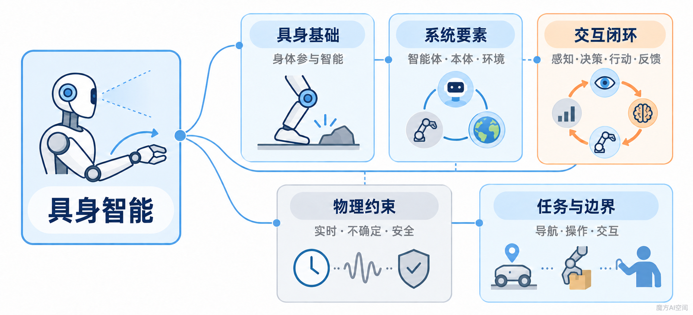
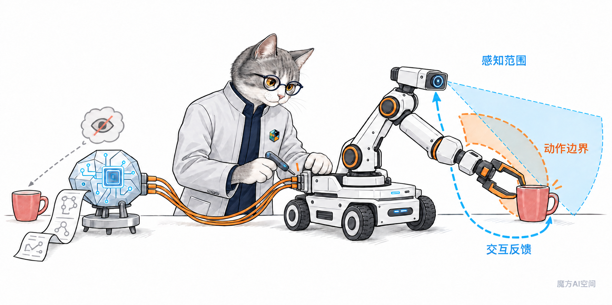
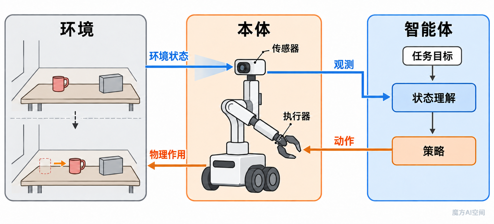
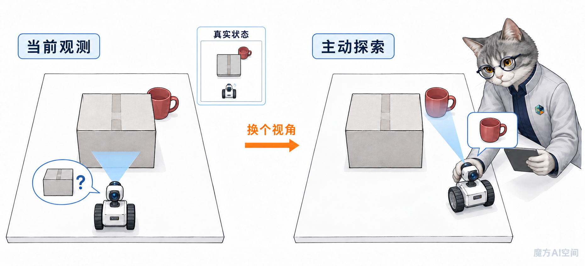
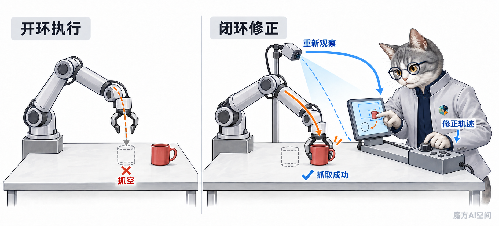

# 01_具身智能基础概念

> 建立理解具身智能所需的共同语言，认识身体、环境、感知与行动如何共同构成智能闭环。

## 本章定位

“具身智能”不是某一种模型、某一种机器人或某一种训练算法。它关注的是：一个拥有明确本体的智能体，如何在真实或仿真环境中持续感知、决策和行动，并利用环境反馈完成任务、修正行为和学习能力。

本章只建立后续学习所需的概念坐标系，重点讲清智能体、环境、本体、观测、状态、策略、动作与反馈之间的关系。运动学、控制、机器人学习、VLA 和世界模型的具体方法，将分别在后续章节展开。

## 读完本章，你应该能够

- 用自己的语言解释“具身”和“具身智能”。
- 区分智能体、环境、本体、观测、状态、策略和动作。
- 说明为什么身体会改变智能体能够感知、学习和完成的任务。
- 解释部分可观测性，以及为什么真实机器人通常需要闭环执行。
- 区分导航、操作、移动操作、全身运动和人机交互等任务。
- 区分具身智能与机器人学、数字 Agent、VLM、VLA 和人形机器人。

## 核心知识点地图

```text
具身智能
├── 具身基础
│   ├── 身体不是外壳
│   └── 智能来自智能体与环境的交互
├── 系统要素
│   ├── 智能体、环境与本体
│   └── 目标、观测、状态、策略与动作
├── 交互闭环
│   ├── 感知与状态估计
│   ├── 决策与动作执行
│   └── 反馈、修正与学习
├── 物理约束
│   ├── 部分可观测、实时与动态
│   ├── 不确定性与动作不可逆
│   └── 安全、数据成本与本体差异
└── 任务与边界
    ├── 导航、操作、移动操作与全身运动
    └── 机器人学、Agent、VLM、VLA 与人形机器人
```



| 知识模块 | 核心问题 | 关键概念 |
| --- | --- | --- |
| [具身基础](#embodiment) | “具身”给智能系统增加了什么？ | 身体、感觉运动、环境交互 |
| [系统要素](#agent-environment) | 一个具身系统由什么组成？ | 智能体、环境、本体、任务 |
| [交互闭环](#interaction-loop) | 智能体如何从感知走向行动？ | 观测、状态、策略、动作、反馈 |
| [物理约束](#physical-constraints) | 物理世界为什么比数字环境更难？ | 部分可观测、实时性、不确定性、安全 |
| [任务类型](#task-types) | 具身智能主要解决哪些任务？ | 导航、操作、移动操作、全身运动、交互 |
| [概念边界](#concept-boundaries) | 它与相邻领域是什么关系？ | 机器人学、Agent、VLM、VLA、人形机器人 |

<a id="embodiment"></a>

## “具身”究竟给智能系统增加了什么？

**一句话理解：具身不是给算法安装一个外壳，而是让身体成为感知、行动和学习过程的一部分。**

一个只处理文本的模型，可以忽略自己的尺寸、重量、摩擦、关节范围和反应延迟；机器人不能。它能看见什么、够到哪里、以多快速度移动、碰撞会造成什么后果，都受到本体和环境约束。



身体至少改变了四件事：

1. **感知范围**：传感器的位置、种类和精度决定智能体能够获得哪些信息。
2. **动作空间**：关节、执行器和运动结构决定智能体可以采取哪些动作。
3. **交互代价**：动作会消耗时间和能量，还可能造成碰撞、掉落或损坏。
4. **学习经验**：智能体获得的数据来自特定身体与环境的交互，因此经验天然带有本体特征。

例如，同样是“拿起杯子”：机械臂需要计算抓取位姿，移动机器人还要先接近桌面，人形机器人则可能同时涉及平衡、躯干姿态和双臂协调。任务语言相同，并不意味着它们面对的是同一个控制问题。

早期行为式机器人研究已经强调，应从完整系统与真实世界的感知—行动联系出发理解智能，而不是假设孤立模块最终自然拼成智能系统。Rodney Brooks 的经典论文 [*Intelligence without Representation*](https://people.csail.mit.edu/brooks/papers/representation.pdf) 是这一思想的重要代表。

> **容易混淆：** 有一个物理外壳并不自动意味着系统具有具身智能。若机器人只机械执行预先录制的动作，没有根据环境反馈调整行为，它拥有身体，但体现出的具身适应能力仍然有限。

## 什么是具身智能？

**一句话理解：具身智能研究智能体如何依托身体，在环境中通过感知—行动—反馈闭环表现和学习智能。**

不同研究传统对“具身智能”的范围并不完全一致。本仓库采用下面的工作定义：

> 具身智能是智能体依托物理或虚拟本体，在环境中持续获得观测、形成决策、执行动作并接收反馈，从而完成任务、适应变化或获得新能力的智能形态与研究领域。

这个定义包含四个必要关注点：

- **有明确本体**：智能体具有特定传感器、动作空间和物理或仿真约束。
- **处于环境中**：智能不是脱离场景的单次输入输出，而是面向持续变化的环境。
- **能够采取行动**：输出会改变智能体自身、目标对象或环境状态。
- **形成交互闭环**：后续决策会利用动作产生的新观测和反馈。

[AI Habitat](https://aihabitat.org/) 将具身 AI 描述为研究具有物理或虚拟本体的智能机器，并把导航、交互、指令跟随和具身问答等任务放在可交互环境中训练和评测。这也说明：**仿真智能体可以是具身智能的研究对象，但它必须拥有明确的本体、观测和动作约束，而不是普通网页中的任意软件进程。**

具身智能与具身认知相关，但二者不完全相同：

- **具身认知（embodied cognition）** 更侧重一种认知观点：认知受到身体及其感觉运动经验的塑造。
- **具身智能（embodied intelligence / embodied AI）** 更侧重如何构建、训练和评测能够在环境中感知与行动的智能系统。

<a id="agent-environment"></a>

## 智能体、环境与本体是什么关系？

**一句话理解：智能体是决策与行动的主体，环境是它所在并影响的世界，本体规定了它与世界交换信息和作用力的方式。**

| 概念 | 它回答的问题 | 具身任务中的例子 |
| --- | --- | --- |
| 智能体（agent） | 谁在接收信息并选择行动？ | 控制移动机械臂完成整理任务的系统 |
| 环境（environment） | 智能体在什么世界中行动？ | 房间、家具、物体、人和物理规律 |
| 本体（embodiment） | 智能体通过什么身体感知和行动？ | 底盘、机械臂、夹爪、相机、关节和控制接口 |
| 任务（task） | 智能体要完成什么，以及怎样算成功？ | 把红色杯子放进托盘且不发生碰撞 |
| 目标（goal） | 当前期望达到什么结果？ | 杯子最终位于指定托盘中 |

本体不是环境之外的装饰，也不是可以随意忽略的硬件细节。它定义了智能体与环境之间的接口：

```text
环境 ──传感信息──> 本体 ──观测──> 智能体
环境 <──物理作用── 本体 <──动作── 智能体
```



同一个决策模型换到不同机器人上，可能因为相机视角、关节数量、夹爪结构、控制频率或动作单位不同而无法直接工作。这也是后续“跨本体迁移”成为独立问题的原因。

<a id="interaction-loop"></a>

## 观测为什么不等于状态？

**一句话理解：状态描述环境实际上是什么样，观测只包含智能体此刻能够获得的信息。**

假设杯子被纸盒挡住：

- 房间的真实状态中，杯子依然位于桌面上。
- 机器人的当前相机观测中，杯子可能完全不可见。
- 如果机器人记得杯子此前的位置，它可以结合历史观测形成一种内部估计。



| 概念 | 含义 | 是否一定能直接获得？ |
| --- | --- | :---: |
| 状态（state） | 足以描述当前环境并支持预测的信息 | 否 |
| 观测（observation） | 传感器在当前时刻实际提供的信息 | 是 |
| 历史（history） | 过去的观测、动作与反馈序列 | 可以记录 |
| 信念状态（belief state） | 根据历史对真实状态形成的概率性估计 | 需要推断 |

具身任务通常具有**部分可观测性**：传感器存在视野限制、噪声和遮挡，环境中还可能有尚未探索的区域。智能体因此不能只把当前一帧图像当作完整世界，而需要利用记忆、状态估计、主动探索或世界模型补充信息。

在一个简化的部分可观测决策过程中，可以把交互写成：

```math
o_t \sim O(\cdot \mid s_t), \qquad
a_t \sim \pi(\cdot \mid h_t, g), \qquad
s_{t+1} \sim T(\cdot \mid s_t, a_t)
```

其中：

- $s_t$ 是环境真实状态。
- $o_t$ 是智能体在时刻 $t$ 获得的观测。
- $h_t$ 是截至当前的交互历史或内部记忆。
- $g$ 是任务目标。
- $\pi$ 是策略。
- $a_t$ 是智能体执行的动作。
- $T$ 和 $O$ 分别描述状态变化与观测生成过程。

这套表达只用于建立概念关系。本章不要求推导 POMDP，后续机器人学习和世界模型章节会继续展开相关方法。

## 策略如何把观测转化为动作？

**一句话理解：策略规定智能体在当前信息和目标条件下应该选择什么动作。**

策略（policy）可以是规则、规划器、控制器、神经网络，也可以是多个模块组成的系统。它不等同于“大模型”，也不一定通过强化学习获得。

```text
当前观测 + 历史信息 + 任务目标
                ↓
          状态理解与决策
                ↓
              策略
                ↓
       动作或一段动作序列
```

动作（action）必须落到本体可以执行的接口上。不同系统的动作可以是：

- 离散指令：前进、左转、停止。
- 末端目标：夹爪移动到某个位姿。
- 关节命令：每个关节的位置、速度或力矩。
- 轨迹：未来一段时间的连续运动路径。
- 技能调用：导航到桌边、抓取杯子、放入托盘。

因此，“模型输出了正确文本”不等于“机器人得到了可执行动作”。动作还必须满足坐标系、控制频率、物理限制和安全约束。

## 为什么真实机器人通常需要闭环反馈？

**一句话理解：闭环系统会观察动作造成的结果并继续修正，开环系统则主要依赖执行前的假设。**

| 维度 | 开环执行 | 闭环执行 |
| --- | --- | --- |
| 决策方式 | 预先生成动作后直接执行 | 执行一段后重新观测和决策 |
| 对环境变化的适应 | 弱 | 较强 |
| 对模型误差的处理 | 容易累积 | 可以逐步修正 |
| 典型风险 | 抓偏后仍继续移动 | 反馈延迟或频率不足也会失效 |



抓取杯子的闭环可以写成：

```text
观察杯子位置
→ 生成抓取动作
→ 执行一小段
→ 重新观察夹爪和杯子的相对位置
→ 修正轨迹
→ 接触后检查抓取是否成功
→ 失败则重试或重新规划
```

闭环不意味着系统永远安全。传感器噪声、延迟、错误状态估计和不合理的反馈频率，都可能使闭环系统振荡或做出错误修正。真正可靠的具身系统需要同时设计感知、规划、控制、反馈和安全机制。

<a id="physical-constraints"></a>

## 物理世界带来了哪些特殊约束？

**一句话理解：物理世界不会等待模型思考，也不会在动作失败后自动恢复到初始状态。**

| 约束 | 它为什么重要 | 典型后果 |
| --- | --- | --- |
| 部分可观测 | 传感器只能看到世界的一部分 | 遮挡物体、未知区域、错误定位 |
| 连续动态 | 环境和其他主体会持续变化 | 旧计划很快失效 |
| 实时性 | 感知、推理和控制必须及时完成 | 延迟导致错过抓取或碰撞 |
| 不确定性 | 感知、动力学和执行都存在误差 | 同一动作不一定产生同一结果 |
| 动作不可逆 | 部分操作无法一键撤销 | 掉落、破坏、碰撞或伤害 |
| 安全约束 | 系统会直接作用于人和物体 | 必须限制速度、力和权限 |
| 数据成本 | 真机交互慢、贵且可能危险 | 数据规模和覆盖不足 |
| 本体差异 | 不同机器人具有不同接口和能力 | 策略难以直接迁移 |

这些约束解释了为什么在互联网数据上表现优秀的模型，进入机器人系统后仍可能失败。视觉识别正确只是链路的一部分；动作还要在正确时间、正确坐标系和正确物理条件下执行。

## 具身系统如何获得能力？

**一句话理解：具身能力既可以来自人工设计，也可以来自示范、奖励、交互数据和大规模预训练。**

| 路线 | 核心思想 | 适合解决的问题 |
| --- | --- | --- |
| 模块化系统 | 人工连接感知、建图、规划和控制模块 | 结构明确、可解释、约束清晰的任务 |
| 模仿学习 | 从人类或其他策略的示范中学习行为 | 示范相对容易获得的操作任务 |
| 强化学习 | 通过奖励和环境交互优化策略 | 可反复试验、目标可量化的任务 |
| 自监督与表征学习 | 从大量未标注观测或轨迹中学习表示 | 提升数据利用率和迁移能力 |
| 基础模型与 VLA | 联合建模视觉、语言、状态与动作 | 多任务、语言条件和通用策略探索 |
| 世界模型 | 学习环境如何随状态和动作变化 | 预测、规划、想象训练和风险评估 |

这些路线不是严格互斥的。一个真实系统可能用 VLA 产生高层动作，用运动规划器约束路径，再由低层控制器执行；也可能先模仿学习，再用强化学习或在线数据修正。

本章只说明它们在知识地图中的位置，具体原理见[机器人学习基础](../05_机器人学习基础/README.md)、[策略模型与动作生成](../06_策略模型与动作生成/README.md)、[视觉语言动作模型 VLA](../07_视觉语言动作模型VLA/README.md)和[世界模型与预测控制](../08_世界模型与预测控制/README.md)。

<a id="task-types"></a>

## 具身智能主要解决哪些任务？

**一句话理解：具身任务不仅要求理解环境，还要求通过受约束的动作改变自身位置、对象状态或交互过程。**

| 任务类型 | 目标 | 典型例子 | 主要难点 |
| --- | --- | --- | --- |
| 导航 | 到达目标位置或持续探索 | 找到厨房、寻找指定物体 | 定位、建图、避障和长期记忆 |
| 操作 | 改变物体的位置或状态 | 抓取、放置、开抽屉 | 位姿、接触、力和精细控制 |
| 移动操作 | 在移动与操作之间协同 | 找到杯子并送到用户手中 | 长时程规划和技能衔接 |
| 全身运动 | 协调身体完成运动任务 | 行走、上下楼、搬运 | 平衡、接触和高维控制 |
| 人机交互 | 理解并响应人的意图 | 协作整理、递交物品 | 语言落地、社会规范和安全 |
| 具身问答与交互感知 | 通过行动收集信息后回答问题 | 走到房间检查灯是否关闭 | 主动感知、探索与信息整合 |

这些分类会互相重叠。一个家庭服务任务可能同时包含语言理解、导航、移动操作、人机交互和失败恢复。分类的目的不是把任务切成互不相关的盒子，而是帮助分析一个系统到底需要哪些能力。

<a id="concept-boundaries"></a>

## 它与机器人学、Agent、VLM 和人形机器人有什么区别？

**一句话理解：这些概念彼此交叉，但分别描述研究领域、系统范式、模型能力或机器人形态，不能互相替代。**

| 概念 | 主要关注点 | 与具身智能的关系 |
| --- | --- | --- |
| 机器人学 | 机构、感知、定位、规划、控制和系统工程 | 为具身系统提供身体与工程基础，但机器人不一定具备学习和通用适应能力 |
| 数字 Agent | 在软件环境中规划、调用工具并完成任务 | 同样具有观察—行动循环，但动作通常作用于数字环境 |
| 视觉语言模型（VLM） | 联合理解图像和语言 | 可以提供视觉语义与语言推理，但通常不直接产生可靠机器人动作 |
| 视觉语言动作模型（VLA） | 从视觉、语言和状态生成动作 | 是当前具身智能的重要模型路线，但不是完整具身系统的全部 |
| 人形机器人 | 具有类人形态的机器人本体 | 是具身智能的一种载体，不是唯一载体 |
| 具身认知 | 身体和感觉运动经验如何塑造认知 | 为具身智能提供重要理论视角，但不是具体工程系统 |

可以用三个判断问题快速辨别一个系统是否具有明显的具身属性：

1. 它是否具有明确的本体、传感器和动作空间？
2. 它的动作是否会改变自身或环境，并产生新的反馈？
3. 它的能力是否需要在持续交互中表现、评测或学习？

三个问题越明确，系统越接近本板块讨论的具身智能范畴。

## 贯穿示例：把红色杯子放入托盘

现在用一个任务把本章概念串起来：

> 用户要求移动机械臂：“把桌上的红色杯子放入托盘。”

| 阶段 | 系统发生了什么 | 对应概念 |
| --- | --- | --- |
| 接收指令 | 系统解析目标物体、动作和目的位置 | 任务、目标、语言条件 |
| 观察环境 | 相机看到桌面、杯子和托盘 | 观测 |
| 理解场景 | 系统估计物体类别、位置、遮挡和空间关系 | 状态估计、世界表征 |
| 规划任务 | 决定先接近杯子，再抓取、移动和放置 | 策略、任务规划 |
| 生成动作 | 输出底盘、机械臂和夹爪可以执行的命令 | 动作、本体接口 |
| 执行与观察 | 移动后重新检查杯子和夹爪位置 | 闭环反馈 |
| 判断结果 | 检查杯子是否稳定落入托盘 | 任务成功、评测 |
| 处理失败 | 抓偏时停止、重新定位并再次尝试 | 失败恢复、重规划 |

这个任务不能只靠识别出“红色杯子”完成。机器人还必须考虑自己的可达范围、夹爪形态、相机盲区、碰撞风险、动作延迟和执行误差。这正是“具身”带来的系统性问题。

## 常见误区

### 误区一：具身智能就是人形机器人

人形机器人只是众多本体之一。机械臂、移动机器人、四足机器人、无人机和具有明确虚拟本体的仿真智能体，都可以成为具身智能研究对象。

### 误区二：给大模型连接机械臂就是具身智能

大模型输出动作建议只是起点。完整系统还需要状态估计、动作接口、控制、反馈、安全和失败恢复。

### 误区三：VLA 等于完整具身系统

VLA 主要解决多模态输入到动作输出的策略建模问题。机器人本体、低层控制、系统调度、安全机制和真实环境反馈仍然不可缺少。

### 误区四：仿真中的智能体不算具身

如果仿真智能体拥有明确本体、传感器、动作空间和环境动力学，并在交互闭环中执行任务，它可以作为具身智能研究对象。问题在于仿真能力能否迁移到真实世界，而不是“仿真是否具身”的简单二选一。

### 误区五：闭环执行一定可靠

闭环只是利用反馈修正行为的机制。错误观测、延迟、控制不稳定和不合理的安全边界仍可能导致失败。

### 误区六：模型越大，具身能力就一定越强

模型规模不能替代高质量交互数据、动作表示、实时推理、系统集成和可靠评测。具身能力最终要在具体本体与环境中接受检验。

## 本章速记

- 具身不是“算法 + 外壳”，身体会改变感知、动作、数据和任务边界。
- 具身智能的核心是智能体依托本体与环境形成持续的感知—行动—反馈闭环。
- 环境状态是世界实际的情况，观测是智能体当前能够获得的信息。
- 部分可观测性使记忆、状态估计、主动感知和世界模型变得重要。
- 策略把观测、历史和目标转化为动作，但动作必须适配具体本体和控制接口。
- 闭环执行能够利用新反馈修正行为，但仍会受到噪声、延迟和错误估计影响。
- 物理世界具有实时、不确定、不可逆和安全敏感等约束。
- 导航、操作、移动操作、全身运动和人机交互是常见具身任务。
- VLA 是具身智能的重要模型路线，人形机器人是重要本体，但二者都不等于具身智能本身。

## 自检问题

1. 为什么“机器人拥有身体”不等于“机器人已经具备具身智能”？
2. 观测和环境状态有什么区别？遮挡为什么会放大这种区别？
3. 本体通过哪些方式影响智能体的感知和动作？
4. 开环执行和闭环执行分别适合什么条件？
5. 为什么文本模型给出的正确计划不一定能够直接驱动机器人？
6. VLA 在完整具身系统中解决什么问题，又没有覆盖哪些问题？
7. 仿真智能体在什么条件下可以被视为具身智能研究对象？
8. “把红色杯子放入托盘”任务中，哪些环节可能因为物理世界约束而失败？

## 参考资料

- Rodney A. Brooks, [*Intelligence without Representation*](https://people.csail.mit.edu/brooks/papers/representation.pdf), 1991.
- Manolis Savva et al., [*Habitat: A Platform for Embodied AI Research*](https://arxiv.org/abs/1904.01201), ICCV 2019.
- Jiafei Duan et al., [*A Survey of Embodied AI: From Simulators to Research Tasks*](https://arxiv.org/abs/2103.04918), 2021.
- Richard S. Sutton and Andrew G. Barto, [*Reinforcement Learning: An Introduction*](https://incompleteideas.net/book/RLbook2020.pdf), 2nd Edition.
- [AI Habitat：What is Embodied AI?](https://aihabitat.org/)
- [Habitat Lab：Embodied Task](https://aihabitat.org/docs/habitat-lab/habitat.core.embodied_task.html)

## 深度阅读｜魔方AI空间

- [万字综述：从基础概念到大模型赋能，入门具身智能](https://mp.weixin.qq.com/s/nZw1K5W0d8APJu-Yr9f7vQ)
- [一文讲透 2026 年具身智能技术栈：VLM、VLA、VLN、世界模型](https://mp.weixin.qq.com/s/74Ph9n5shGDgMQlAIkGYdg)

## 学习关系

- **前置章节：**[板块导读](../00_板块导读/README.md)
- **后续章节：**[机器人系统基础](../02_机器人系统基础/README.md)、[机器人学习基础](../05_机器人学习基础/README.md)
- **相关章节：**[具身感知与空间智能](../03_具身感知与空间智能/README.md)、[导航、操作与任务规划](../04_导航操作与任务规划/README.md)

---

[返回具身智能板块](../README.md)
