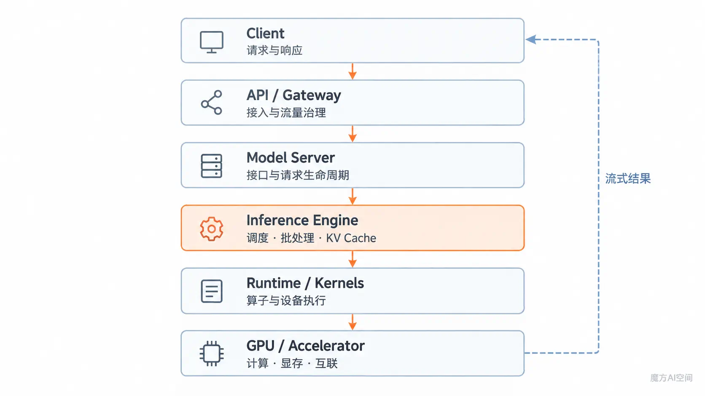

# 01. 推理系统基础

> 推理系统的任务，是把模型能力转化为可以稳定访问、持续调度和高效执行的服务。

## 本章定位

本章先建立系统分层，不深入具体框架。读完后，你应该能区分 Server、Engine、Runtime 和硬件层，并描述一次请求的基本路径。

## 核心地图

推理系统可以按职责划分为六个逻辑层级，请求下行与结果返回的整体关系如图 1 所示。

<p align="center">
  
</p>

<p align="center"><em>图 1：大模型推理系统的逻辑分层</em></p>

这些名称在不同项目中可能略有重叠，判断组件时应看它负责什么，而不是只看名称。

## 1. 离线推理与在线推理

| 模式 | 主要目标 | 典型约束 |
| --- | --- | --- |
| 离线推理 | 在给定数据上尽快完成全部任务 | 总吞吐、资源利用率、完成时间 |
| 在线推理 | 持续响应实时到达的请求 | TTFT、TPOT、尾延迟、错误率和可用性 |

离线任务通常可以积累更大的批次；在线服务必须在等待更多请求和及时响应之间取舍。

## 2. 系统分层

| 层级 | 主要职责 | 常见关注点 |
| --- | --- | --- |
| Client | 发送请求、接收流式结果 | 超时、重试、网络延迟 |
| API / Gateway | 认证、路由、限流和协议转换 | 排队、租户隔离、流量治理 |
| Model Server | 暴露模型接口并管理请求生命周期 | 流式输出、错误处理、服务协议 |
| Inference Engine | 管理批处理、调度、KV Cache 和模型执行 | 并发、显存、吞吐、尾延迟 |
| Runtime / Kernels | 执行算子、图优化和设备调用 | 精度、兼容性、算子效率 |
| Hardware | 提供计算、显存和互联 | 算力、带宽、容量、拓扑 |

框架可能把多个层级合并在同一进程，也可能拆成多个组件；逻辑职责仍然存在。

## 3. 一次请求怎样流动

```text
文本请求
  → 校验与 Tokenization
  → 排队和准入
  → Prefill：处理输入并建立 KV Cache
  → Decode：逐 Token 生成
  → Detokenization 与流式返回
  → 请求结束并释放缓存
```

这条链路中的状态变化、KV Cache 建立和逐 Token 输出过程如图 2 所示。

<p align="center">
  
</p>

<p align="center"><em>图 2：一次大模型推理请求的生命周期</em></p>

请求可能在每一层等待。端到端延迟因此不只等于 GPU 计算时间，还可能包含网络、排队、预处理和响应传输。

## 4. 单卡、多卡与多副本

| 方式 | 解决的问题 | 主要代价 |
| --- | --- | --- |
| 单卡 | 结构简单，适合模型可装入单卡的场景 | 容量和吞吐受单卡限制 |
| 模型并行 | 单卡放不下，或单请求需要更多计算资源 | 通信开销和调度复杂度上升 |
| 数据并行/多副本 | 提高整体并发和可用性 | 需要路由、负载均衡和副本治理 |
| 多机部署 | 扩展模型规模或服务容量 | 网络、拓扑和故障影响更明显 |

“使用更多 GPU”不会自动得到线性加速。增加设备后，通信、同步和负载不均衡可能成为新瓶颈。

## 5. 四个基本取舍

| 目标 | 常见做法 | 可能牺牲 |
| --- | --- | --- |
| 降低首 Token 延迟 | 缩短排队、控制 Prefill 干扰 | 批次变小，总吞吐下降 |
| 提高吞吐 | 增大批次、提高并发 | 单请求等待和尾延迟上升 |
| 降低显存 | 量化、分页缓存、卸载 | 精度、带宽或实现复杂度 |
| 提高可用性 | 多副本、重试、降级 | 资源和运维成本 |

优化前要先明确服务目标：交互式聊天、批量生成和长上下文分析需要的取舍并不相同。

## 常见误区

- **模型能加载就等于能部署。** 加载成功没有验证并发、尾延迟、错误率和容量。
- **GPU 利用率越高越好。** 高利用率可能伴随严重排队，必须结合用户侧指标判断。
- **框架跑分就是生产能力。** 真实结果还取决于请求长度、到达模式、硬件、配置和服务治理。
- **服务慢一定是模型计算慢。** 网络、排队、Tokenization、缓存不足和通信都可能贡献延迟。

## 本章速记

```text
模型能力
  + 请求管理
  + 调度与缓存
  + 高效执行
  + 服务治理
  = 可运行的推理服务
```

## 自检问题

1. Model Server 和 Inference Engine 分别主要解决什么问题？
2. 在线推理为什么不能只追求最大批次？
3. 为什么端到端延迟不能只看 GPU Kernel 时间？
4. 模型并行和多副本解决的问题有什么不同？

## 参考资料

- [NVIDIA NIM LLM Benchmarking Overview](https://docs.nvidia.com/nim/benchmarking/llm/latest/overview.html)
- [vLLM Documentation](https://docs.vllm.ai/)
- [NVIDIA Triton Inference Server Documentation](https://docs.nvidia.com/deeplearning/triton-inference-server/user-guide/docs/)

---

**上一章：**[返回板块首页](../README.md)

**下一章：**[性能指标与 Benchmark](../02_性能指标与Benchmark/README.md)
