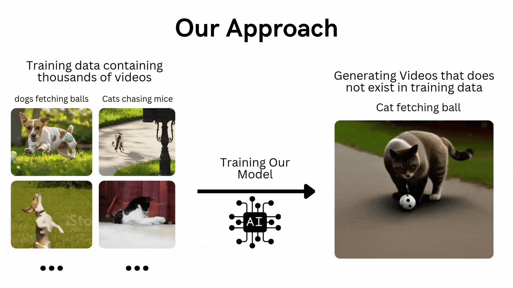

# From-Zero-to-T2V

#### 从零开始实现一个小型文生视频模型
- v1.0.1

### 这是一个基于 GAN 的小型文生视频训练演示！

>我测试了这个架构的各个方面，发现训练数据是关键。通过在数据集中包含更多的运动和形状，您可以增加可变性并提高模型的性能。
由于数据是通过代码生成的，因此生成更多样化的数据不会花费太多时间；相反，你可以专注于完善逻辑。

>此外，本notebook中讨论的GAN架构相对简单。
您可以通过集成高级技术或使用大语言模型嵌入（LLM）而不是基本的神经网络嵌入来使其更加复杂。此外，调整嵌入大小等参数会显著影响模型的有效性。

## 方法架构

