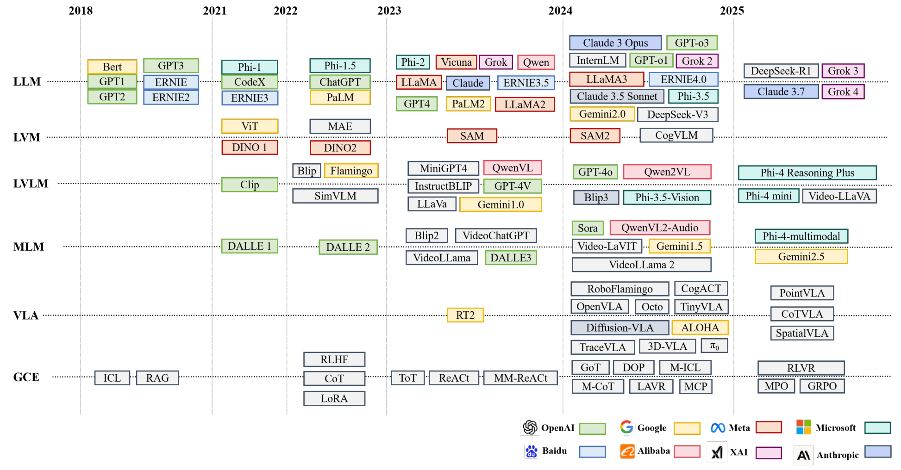
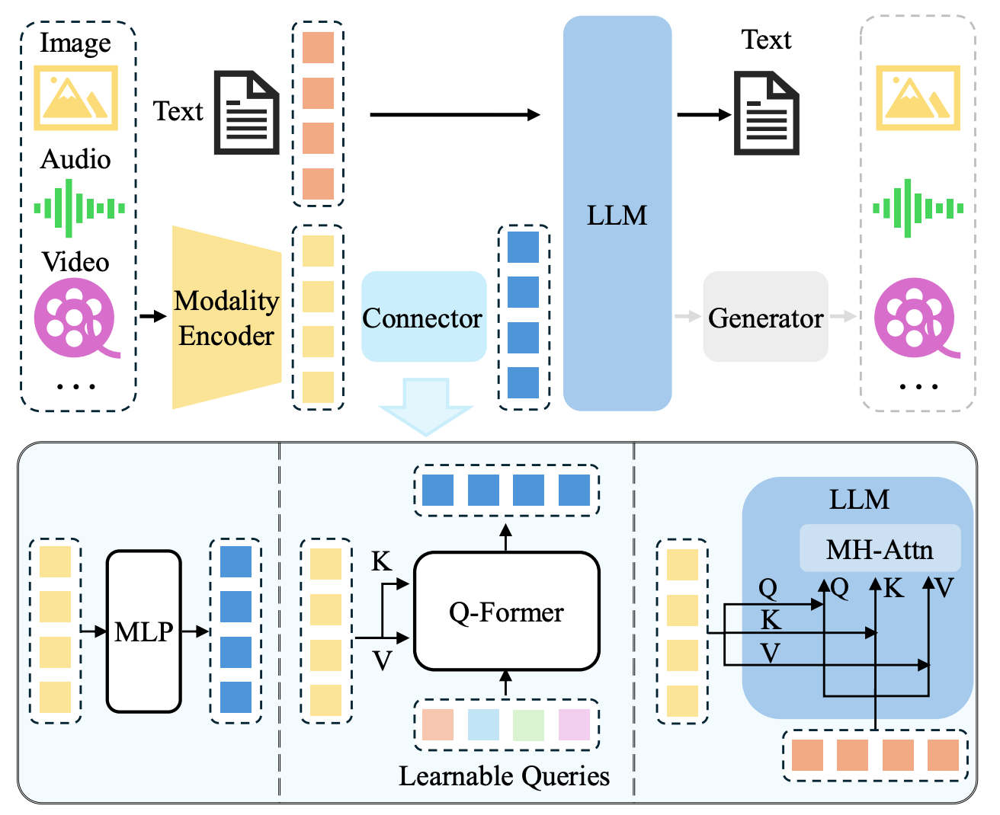

# From-Zero-to-AGI
### 从零走向AGI之路！！！

##### 业余时间发电，您的star是持续更新的最大动力！！!

    

---

### 预备知识
|         Topic          |                           Link                            |
|:----------------------:|:---------------------------------------------------------:|
|          OOP           | [Video Link](https://www.youtube.com/watch?v=q2SGW2VgwAM) |
| Neural Networks Theory | [Video Link](https://www.youtube.com/watch?v=Jy4wM2X21u0) |
|    GAN Architecture    | [Video Link](https://www.youtube.com/watch?v=TpMIssRdhco) |
|     Python basics      | [Video Link](https://www.youtube.com/watch?v=eWRfhZUzrAc) |
|      向量数据库技术鉴赏（上）      | [Video Link](https://www.bilibili.com/video/BV11a4y1c7SW) |
|      向量数据库技术鉴赏（下）      | [Video Link](https://www.bilibili.com/video/BV1BM4y177Dk) |

## 📖目录

- ⭐ [AGI入门基础](#-AGI入门基础)
- 🎇 [LLM基础入门](#-LLM基础入门)
- 🔱 [多模态基础入门](#-多模态基础入门)
- 🎨 [AI绘画基础入门](#-AI绘画基础入门)
- 🎬 [AI视频基础入门](#-AI视频基础入门)
- 🌠 [数字人基础入门](#-数字人基础入门)
- 🎮 [Agent/RAG/MCP](#-Agent/RAG/MCP)
- 🤖 [具身智能](#-具身智能)
- 🚀 [大模型部署系列](#-大模型部署系列)
- 🔨 [项目实战](#-项目实战)
- 💬 [技术交流](技术交流)

## 从零走向 AGI 

### ⭐ AGI入门基础
  - [AI入门课程](https://oizxc9sdhbc.feishu.cn/wiki/PsH9w5oQdiaPMEkLBKlcYt9Cn9d?from=from_copylink)
  - [生成式AI入门课程](https://oizxc9sdhbc.feishu.cn/wiki/KQfwwpHZxi4TQOktDOIcRcjLnBg?from=from_copylink)
  - [微软开源AI Agent入门课程](https://oizxc9sdhbc.feishu.cn/wiki/ZXOFwKzjMioGWOkrdcgcGRFynbf?from=from_copylink)
  - [微软MCP入门课程](https://oizxc9sdhbc.feishu.cn/wiki/RYNGwUPNqihC1nktRpscRYz9n1C?from=from_copylink)

### 🎇 LLM基础入门

  - [（一）什么是大语言模型？](https://blog.csdn.net/m_aigc2022/article/details/139678783?spm=1001.2014.3001.5502)
  - [（二）大模型如何工作](https://blog.csdn.net/m_aigc2022/article/details/139785981?spm=1001.2014.3001.5501)
  - [（三）Transformer 架构](https://blog.csdn.net/m_aigc2022/article/details/140025423?spm=1001.2014.3001.5501)
  - [（四）从头开始编写LLM代码](https://blog.csdn.net/m_aigc2022/article/details/140086462?spm=1001.2014.3001.5501)
  - [（五）手动求解Transformer](https://blog.csdn.net/m_aigc2022/article/details/140260384?spm=1001.2014.3001.5502)
  - [（六）Tokens 和 Embeddings](https://blog.csdn.net/m_aigc2022/article/details/140588456?spm=1001.2014.3001.5502)
  - [（七）详解MoE模型](http://mp.weixin.qq.com/s/qR6ExUarwvL6jbHK5qy_Rg?token=1354273325&lang=zh_CN)

### 🔱 多模态基础入门

  - [综述 | 一文读懂多模态大模型（MLLM）](https://mp.weixin.qq.com/s/zsmuJMbUxnqkFnFD3ym-RA)
  - [一文读懂多模态大模型：LLaVA系列 | 从图像到视频内容理解的进化之路](https://mp.weixin.qq.com/s/Hzg5xqCcpimdtQSB6Mf9WA)
  - [一文搞懂DeepSeek的技术演进之路：大语言模型、视觉语言理解、多模态统一模型](https://mp.weixin.qq.com/s/xYD4eprGvr2aS7lXzGHIuQ)
  - [深度长文｜一文读懂多模态大模型：强化学习技术全面解读 SFT、RLHF、RLAIF、DPO](https://mp.weixin.qq.com/s/T5qsBAXCDhoFOsDbwOF3ow?token=1471301116&lang=zh_CN)
  
### 🎨 AI绘画基础入门
  - [AI绘画发展演变系列一：主流模型](https://oizxc9sdhbc.feishu.cn/wiki/GHzAwXXRgiJyh4kxdGDcKri2ntb?from=from_copylink)

### 🎬 AI视频基础入门
  - [AI文生视频提示词创作指南](https://zhuanlan.zhihu.com/p/711848787)
  - [一文梳理「视频生成」技术核心基础知识和模型应用](https://mp.weixin.qq.com/s/KQJF2FxyTiIB62doiBBAzQ)
  - [综述 | 一文掌握Video Diffusion Model视频扩散模型](http://mp.weixin.qq.com/s/k10PHsFTE90ijvGYvbd8ig?token=1471301116&lang=zh_CN)
  
### 🌠 数字人
  - [AI数字人概念](https://oizxc9sdhbc.feishu.cn/wiki/TWV7wxl4TiG1vQk6E5TcmtmDnTf?from=from_copylink)

### 🎮 Agent/RAG/MCP
  - [2025年开篇｜AI Agent与多模态大模型：智能革命的新纪元](https://mp.weixin.qq.com/s/93TT88Fize3IBSbidnEJiw?token=1471301116&lang=zh_CN)
  - [2w字长文｜一文深度解析 A2A 与 MCP](https://mp.weixin.qq.com/s/JB6F9LZtGh_e0J1V0ZEtYw)
  - [最全梳理：一文搞懂RAG技术的5种范式！](https://oizxc9sdhbc.feishu.cn/wiki/IG49wFShei0tWxkB5R6cWyC9n97?from=from_copylink)
  - [一文搞懂RAG技术范式演变及Agentic RAG：未来AI应用的基石](http://mp.weixin.qq.com/s/Gu819CE-yD80cupwqG0vmw?token=1471301116&lang=zh_CN)
  - [新手必看｜10张图带您极简认识MCP「可视化指南」](https://oizxc9sdhbc.feishu.cn/wiki/QNrjwuSrGii7WekEMrRcJjHKnfb?from=from_copylink)
  - [首篇MCP全面技术综述：架构、核心组件和工作流程](http://mp.weixin.qq.com/s/73-2fadxpSW2Sda4PFY0TA?token=1471301116&lang=zh_CN)
  - [10个爆款MCP用例，AI集成的未来已经到来？](http://mp.weixin.qq.com/s/bL_97a8uIZROtQ6N9WHRfg?token=1471301116&lang=zh_CN)
  - [一文汇总 30 + MCP Server 及完整源代码](http://mp.weixin.qq.com/s/tsWa140LEZmv8iA6qro_gA?token=1471301116&lang=zh_CN)
  - [谷歌开源数据库MCP工具箱](https://oizxc9sdhbc.feishu.cn/wiki/C46fwffW5ifhpmkcprZc0veqn0d?from=from_copylink)
  - [一文梳理主流热门智能体框架：Dify、Coze、n8n、AutoGen、LangChain、CrewAI](http://mp.weixin.qq.com/s/5zLnArJcI0TDxL-iiuikPg?token=667567955&lang=zh_CN)
  - [一文搞懂大模型时代的Agent：方法论、应用与挑战](http://mp.weixin.qq.com/s/PS1dtUyuRPhby4iBIgMyvw?token=1354273325&lang=zh_CN)

### 🤖 具身智能
  - [什么是具身智能](https://www.nvidia.com/en-us/glossary/embodied-ai/)
  - [2025具身机器人行业未来展望报告](https://oizxc9sdhbc.feishu.cn/wiki/SgXWw7Ejuis06WkX6DTchGhKnz7?from=from_copylink)

### 🚀 大模型部署系列
  - [大模型系列：什么是Ray？](http://mp.weixin.qq.com/s/9rAEPrhIDP8brK6phOqa7A?token=667567955&lang=zh_CN)
  - [大模型系列：NVIDIA Dynamo框架详解——PD分离式部署技术解析](http://mp.weixin.qq.com/s/CVNgin4AFtlziWfkDEr4wQ?token=667567955&lang=zh_CN)
  - [大模型系列：一文深度解析 Prefill-Decode 分离式部署架构](http://mp.weixin.qq.com/s/cSs4h8r4au9zMkrh60snAw?token=667567955&lang=zh_CN)
  - [一文梳理主流大模型推理部署框架：vLLM、SGLang、TensorRT-LLM、ollama、XInference](http://mp.weixin.qq.com/s/Fsaz7PAUSiKizl_lw-KSeg?token=667567955&lang=zh_CN)
  - [一文深度全面解析大模型分布式并行策略：DP/TP/PP/CP/EP/SP](http://mp.weixin.qq.com/s/IO9uXMbVTlPvjALRglKWCQ?token=1354273325&lang=zh_CN)

### 🔨 项目实战

- [From-Zero-to-Transformer](From-Zero-to-Transformer/README.md)
- [From-Zero-to-small-T2V](From-Zero-to-small-T2V/README.md)

### 💬 技术交流
>加入 **「AIGCmagic社区」** 群聊，一起交流讨论，涉及 **AI视频、AI绘画、Sora技术拆解、数字人、多模态、大模型、传统深度学习、自动驾驶**
> 等多个不同方向，可私信或添加微信号：**【m_aigc2022】**，备注不同方向邀请入群！！
> 
> 更多精彩内容，尽在 **「魔方AI空间」**，关注了解全栈式 AIGC内容！！
> 
> 

    

