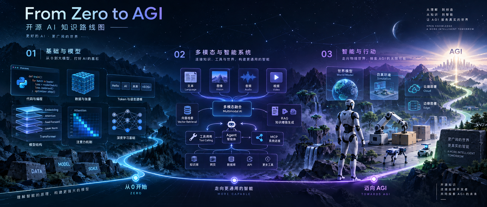
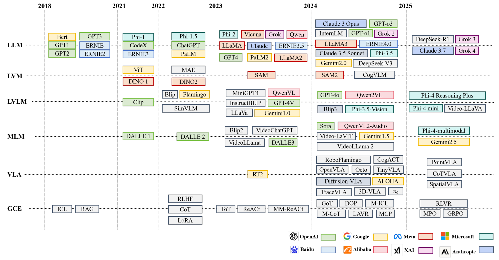

<div align="center">

# From Zero to AGI

### 从基础认知到智能系统，构建完整的 AI 学习路线

一个面向 AI 学习者、开发者与研究者的中文开源知识库，系统覆盖 **LLM、多模态、AI 生成、Agent、具身智能、模型部署与项目实战**。

[](https://github.com/AI-mzq/From-Zero-to-AGI/stargazers)
[](https://github.com/AI-mzq/From-Zero-to-AGI/commits/main)
[](LICENSE)
[](https://mp.weixin.qq.com/s/IGLL6_YI9BUeR2KD_Gfx_Q)

[开始学习](02_LLM基础入门/README.md) · [多模态路线](03_多模态基础入门/README.md) · [项目实战](10_项目实战) · [项目主页](https://ai-mzq.github.io/From-Zero-to-AGI/)

如果这个项目对你有帮助，欢迎点亮 **Star**。你的支持是持续更新的重要动力。

</div>

<div align="center">
  
</div>

---

## 项目介绍

AI 技术发展很快，但学习资料往往分散在论文、博客、课程、开源项目和产品新闻中。**From Zero to AGI** 希望把这些碎片重新组织成一套长期可学习、可检索、可实践的知识体系。

本仓库不只追踪“最近发布了什么”，更关注：

- 一个概念在完整技术体系中的位置是什么？
- 不同模型和方法之间如何演进、继承与分化？
- 从基础原理到工程系统，应该按照什么顺序学习？
- 哪些论文、文章和项目值得长期保留与反复阅读？

仓库内容由 **猫先生 of「魔方AI空间」** 持续维护。公众号负责追踪前沿与发布深度文章，GitHub 仓库负责结构化沉淀、学习编排和项目复现。

```text
公众号前沿解读 → GitHub 系统沉淀 → 项目代码实践 → 建立完整 AI 认知
```

## 如何使用这个仓库

先通过核心内容地图定位学习方向，再进入对应章节系统学习；每个板块同时提供公众号深度阅读和相关项目实践，帮助你从概念理解走向工程落地。

> [!TIP]
> 本仓库以大模型及其延伸方向为主。具备 Python 和神经网络基础后，建议从 [LLM 基础入门](02_LLM基础入门/README.md) 开始；已经掌握 Transformer，可以直接进入 [多模态基础入门](03_多模态基础入门/README.md)、Agent 或具身智能方向。

## 推荐学习路线

### 主学习路线

```text
AI 与深度学习基础
        ↓
Transformer 与 LLM
        ↓
多模态理解与生成
        ↓
Agent / RAG / MCP
        ↓
具身智能与世界模型
        ↓
推理部署与项目实战
```

### 按学习目标选择

| 学习目标 | 推荐路径 |
| --- | --- |
| 大模型入门 | Python 与神经网络基础 → Transformer → LLM 基础 |
| 理解大模型原理 | Token 与 Embedding → Attention → Transformer → 预训练 → 对齐 → 推理与评测 |
| 开发 AI 应用 | LLM → Prompt → RAG → Agent → MCP / Skills → 部署 |
| 学习多模态与视频 | 视觉编码器 → 跨模态对齐 → VLM → 多模态生成 → 视频理解与生成 |
| 研究具身智能 | VLM → VLN / VLA → 世界模型 → 机器人数据 → 仿真、控制与评测 |
| 面向工程落地 | 模型基础 → 推理优化 → 分布式并行 → Serving → 项目实战 |

## 完整核心内容地图

> 部分方向正在快速构建中，知识地图和公众号精选文章已先行开放。

| 板块 | 核心知识 | 状态 | 板块入口 |
| --- | --- | :---: | --- |
| 01. AI 入门基础 | Python、机器学习、深度学习、NLP、CV、目标检测 | 持续更新 | [进入板块](01_AGI入门基础) |
| 02. LLM 基础入门 | Token、Embedding、Transformer、Attention、MoE、预训练、微调、RLHF、推理、评测 | 已上线 | [进入板块](02_LLM基础入门/README.md) |
| 03. 多模态基础入门 | 视觉编码器、连接器、VLM、统一多模态、视频、音频、多模态训练与评测 | 已上线 | [进入板块](03_多模态基础入门/README.md) |
| 04. AI 绘画 | Diffusion、DiT、LoRA、ControlNet、图像编辑、一致性生成 | 构建中 | [进入板块](04_AI绘画基础入门/README.md) |
| 05. AI 视频 | 视频扩散、时空建模、可控生成、长视频、视频理解、音视频联合生成 | 持续更新 | [进入板块](05_AI视频基础入门/README.md) |
| 06. 数字人 | 肖像动画、语音驱动、口型同步、动作控制、情感表达 | 构建中 | [进入板块](06_数字人基础入门/README.md) |
| 07. Agent / RAG / MCP | 检索、工具调用、MCP、A2A、Skills、Memory、Harness、Agentic RL | 构建中 | [进入板块](07_Agent-RAG-MCP/README.md) |
| 08. 具身智能 | VLM、VLN、VLA、世界模型、机器人数据、仿真、控制与评测 | 构建中 | [进入板块](08_具身智能/README.md) |
| 09. 大模型部署 | 量化、推理框架、并行策略、KV Cache、PD 分离、Serving | 构建中 | [进入板块](09_大模型部署系列/README.md) |
| 10. 项目实战 | Transformer、文生视频、多模态系统、Agent 与具身部署 | 持续更新 | [进入板块](10_项目实战) |

### 01. AI 入门基础

这一部分建立理解现代 AI 系统所需的共同语言，从编程、神经网络和经典计算机视觉逐步走向生成式 AI。

**核心知识节点**

```text
Python → 机器学习 → 神经网络 → NLP / CV → Transformer 前置知识
```

**板块内容（持续构建中）**

- [自然语言处理](01_AGI入门基础/自然语言处理/README.md)
- [计算机视觉与 YOLO 系列](01_AGI入门基础/计算机视觉/YOLO系列/README.md)
- [YOLOv1 至 YOLO26 专题](01_AGI入门基础/计算机视觉/YOLO系列)

<details>
<summary><strong>延伸阅读｜魔方AI空间</strong></summary>

- [计算机视觉四大基本任务](https://mp.weixin.qq.com/s/pWwzI6M-fzXhad7t55Oo0Q)
- [目标检测风云二十年](https://mp.weixin.qq.com/s/UbjiY1amFsQVYNtja9eDaA)
- [一文全面梳理 YOLO 系列：从 YOLOv1 到 YOLOv13，再到 YOLO26](https://mp.weixin.qq.com/s/AhhgzGiFl3GC7UKUb6ERPg)
- [ViT 论文精读：打破 CV 和 NLP 模型壁垒](https://mp.weixin.qq.com/s/7KQEATeNw5MO4G2R0F8vhw)

</details>

### 02. LLM 基础入门

从文本如何变成 Token 开始，逐步理解现代大语言模型的架构、训练、对齐、推理和评测。

**核心知识节点**

```text
LLM 概念 → Token / Embedding → Transformer → Attention → 位置编码
→ 主流架构 → MoE → 预训练 → 指令微调 → RLHF → 推理 → Prompt → 评测
```

**板块内容**

- [LLM 完整学习路线与 14 章目录](02_LLM基础入门/README.md)
- [从零实现 Transformer](10_项目实战/From-Zero-to-Transformer/README.md)
- [RLHF：PPO、DPO、GRPO、DAPO 与 GSPO](02_LLM基础入门/10_RLHF/README.md)

<details>
<summary><strong>延伸阅读｜魔方AI空间</strong></summary>

- [一文详解 AI 大模型 14 个核心基础概念](https://mp.weixin.qq.com/s/CeMudxi4KhGCTM4sQxGZwQ)
- [一文梳理主流 LLM 架构技术演进](https://mp.weixin.qq.com/s/Cq-MHP2lXPVAVvqqbTWkkA)
- [一文详解 MoE 模型](https://mp.weixin.qq.com/s/qR6ExUarwvL6jbHK5qy_Rg)
- [一文详解位置编码技术演进](https://mp.weixin.qq.com/s/t5kTS6iOaH3u6TzfpRv3kQ)
- [一文梳理 RLHF 进化史：从 PPO、DPO、GRPO 到 GSPO](https://mp.weixin.qq.com/s/7QrKR2WqjnGAXdV7lwSPUA)
- [一文搞懂大模型加速之 Attention：从 FlashAttention 到 PagedAttention](https://mp.weixin.qq.com/s/Y_eAhOd6fROd2jo9r1jdtQ)

</details>

### 03. 多模态基础入门

理解文本、图像、视频和音频如何被编码、对齐、生成，并进一步连接到推理和行动系统。

**核心知识节点**

```text
多模态概念 → 视觉编码器 → LLM 底座 → 跨模态连接器 → VLM
→ 多模态生成 → 视频 / 音频 → 数据与训练 → 评测 → 多模态 Agent
```

**板块内容**

- [多模态完整学习路线与 14 个专题](03_多模态基础入门/README.md)
- [多模态主题、论文与模型索引](03_多模态基础入门/INDEX.md)
- [多模态术语表](03_多模态基础入门/GLOSSARY.md)

<details>
<summary><strong>延伸阅读｜魔方AI空间</strong></summary>

- [一文读懂多模态大模型（MLLM）](https://mp.weixin.qq.com/s/zsmuJMbUxnqkFnFD3ym-RA)
- [一文读懂 LLaVA 系列：从图像到视频内容理解](https://mp.weixin.qq.com/s/Hzg5xqCcpimdtQSB6Mf9WA)
- [2 万字综述：统一多模态基础模型（UFMs）](https://mp.weixin.qq.com/s/2xugRZbi1AzOU0_2ixyGjQ)
- [一文详解 MM-RLHF：多模态大语言模型对齐](https://mp.weixin.qq.com/s/uoQKb5kpzAPsZ9HEDTQYHg)
- [大型基础模型中的视听智能（AVI）综述](https://mp.weixin.qq.com/s/SXsjgOBIHPCzhcfqpgKCDQ)

</details>

### 04. AI 绘画与视觉生成

从扩散模型基础出发，理解文生图、图像编辑、可控生成、个性化微调和统一视觉生成。

**核心知识节点**

```text
Diffusion → Latent Diffusion → DiT → 文生图 → LoRA / ControlNet
→ 图像编辑 → 主体与风格一致性 → 统一生成模型
```

**板块入口（构建中）**：[AI 绘画基础入门](04_AI绘画基础入门/README.md)

<details>
<summary><strong>延伸阅读｜魔方AI空间</strong></summary>

- [深入浅出 Stable Diffusion 技术绘画原理](https://mp.weixin.qq.com/s/YsQvuhoGCJK5hNzSWVebIw)
- [ComfyUI 是什么？](https://mp.weixin.qq.com/s/_FMM82BO1754ZbyR57XJdQ)
- [项目实战：在消费级硬件上微调 FLUX.1-dev（LoRA）](https://mp.weixin.qq.com/s/OR5lBgBhquJ51WWit0ybUw)
- [OmniGen2：迈向高级多模态生成的统一框架](https://mp.weixin.qq.com/s/5tapmDQA8y1u-5QwDO37mw)

</details>

### 05. AI 视频生成与理解

系统学习视频的时空表示、扩散与 Transformer 架构、可控生成、长视频叙事、视频理解及音视频联合建模。

**核心知识节点**

```text
视频表示 → Video Diffusion / DiT → 时空建模 → 条件与运动控制
→ 长视频与多镜头 → 视频理解 → 音视频联合生成 → 评测与实践
```

**板块内容**

- [AI 视频基础入门](05_AI视频基础入门/README.md)
- [从零实现小型文生视频模型](10_项目实战/From-Zero-to-small-T2V/README.md)

<details>
<summary><strong>延伸阅读｜魔方AI空间</strong></summary>

- [一文梳理 AI 视频生成核心基础知识和模型应用](https://mp.weixin.qq.com/s/KQJF2FxyTiIB62doiBBAzQ)
- [2 万字综述：Video Diffusion Model 视频扩散模型](https://mp.weixin.qq.com/s/k10PHsFTE90ijvGYvbd8ig)
- [一文梳理 27 个 AI 视频核心基础高频知识考点](https://mp.weixin.qq.com/s/jHjGGgp3WyzuNv4blVcPjQ)
- [万字综述：一文详解视频理解](https://mp.weixin.qq.com/s/DMVHbOxeuuZQbpYK662SIQ)
- [从 Sora 到 Seedance：长视频生成与多镜头叙事生成](https://mp.weixin.qq.com/s/aXGSB67J0e6oCBK4z8i_GA)
- [项目实战：Qwen-Video-8B 与 LLaMA-Factory 实现垂类视频理解](https://mp.weixin.qq.com/s/WWJ5-1ZRFNAP57XxLEty0w)

</details>

### 06. 数字人与音频交互

关注人物外观、声音、表情与动作之间的跨模态驱动，理解数字人从“会说话”到“自然表达”的完整链路。

**核心知识节点**

```text
语音识别 / 合成 → 肖像动画 → 口型同步 → 表情与情感驱动
→ 人体视频生成 → 实时交互 → 数字人系统
```

**板块入口（构建中）**：[数字人基础入门](06_数字人基础入门/README.md)

<details>
<summary><strong>延伸阅读｜魔方AI空间</strong></summary>

- [基于 Whisper 和 faster-whisper 构建语音识别系统](https://mp.weixin.qq.com/s/Dw7I5LR8BNdrmjAH6KPTSw)
- [LivePortrait：可精准控制眼睛和嘴唇动作的肖像动画框架](https://mp.weixin.qq.com/s/15H-yJTJgdrfsauoTmgq1w)
- [EchoMimic：音频驱动肖像动画框架](https://mp.weixin.qq.com/s/csSLom2Bg7yhrSW3_hoHqA)
- [DICE-Talk：情感表达式动态肖像生成技术](https://mp.weixin.qq.com/s/9T-uccfGt7vtntLF2wFsvA)
- [人体视频生成技术综述：挑战、方法和见解](https://mp.weixin.qq.com/s/3k9pnN-mCdYTew8FgzraVg)

</details>

### 07. Agent / RAG / MCP

让大模型从“回答问题”走向“检索信息、调用工具、积累经验并持续完成任务”。

**核心知识节点**

```text
RAG → Agent → 工具调用 → MCP / A2A → Skills → Memory
→ Context Engineering → Harness → Loop Engineering → Agentic RL → Multi-Agent
```

**板块入口（构建中）**：[Agent / RAG / MCP](07_Agent-RAG-MCP/README.md)

<details open>
<summary><strong>延伸阅读｜魔方AI空间</strong></summary>

- [一文搞懂大模型时代的 Agent：方法论、应用与挑战](https://mp.weixin.qq.com/s/PS1dtUyuRPhby4iBIgMyvw)
- [一文搞懂 RAG 技术范式演变及 Agentic RAG](https://mp.weixin.qq.com/s/Gu819CE-yD80cupwqG0vmw)
- [2 万字长文：一文深度解析 A2A 与 MCP](https://mp.weixin.qq.com/s/JB6F9LZtGh_e0J1V0ZEtYw)
- [首篇 Agent Skills 系统性综述](https://mp.weixin.qq.com/s/a5U8G7DYpRvbPIyI86BBfw)
- [Agent Harness Engineering 综述：Agent 的上限不只在模型](https://mp.weixin.qq.com/s/waQenXWCVKyOtRi5LnefFw)
- [一文搞懂 Loop Engineering：从单次回答到可控执行循环](https://mp.weixin.qq.com/s/ltkuWEPKlXE5Cf_1e-DX1A)
- [一文全面梳理 Agentic RL：面向 LLM 的自主强化学习](https://mp.weixin.qq.com/s/kJ_9ei35HD7hNXD0NFs9ig)

</details>

### 08. 具身智能与机器人

研究智能体如何在物理世界中感知、推理、规划和行动，并通过数据与环境交互持续学习。

**核心知识节点**

```text
VLM → VLN / VA / VLA → 机器人策略 → 世界模型 → 机器人数据
→ 遥操作与示范学习 → 仿真与 Sim-to-Real → 控制 → 评测与部署
```

**板块入口（构建中）**：[具身智能](08_具身智能/README.md)

<details open>
<summary><strong>延伸阅读｜魔方AI空间</strong></summary>

- [万字综述：从基础概念到大模型赋能，入门具身智能](https://mp.weixin.qq.com/s/nZw1K5W0d8APJu-Yr9f7vQ)
- [一文讲透 2026 年具身智能技术栈：VLM、VLA、VLN、世界模型](https://mp.weixin.qq.com/s/74Ph9n5shGDgMQlAIkGYdg)
- [万字长文：视觉－语言－动作模型的概念、进展、应用和挑战](https://mp.weixin.qq.com/s/Y9bBUfhTer68V4Ree-RYsA)
- [综述：VLA 智能体为什么离不开世界模型？](https://mp.weixin.qq.com/s/_oRKtfNdS0R5PbHRgPTkOQ)
- [一文通俗理解机器人数据 8 个核心概念](https://mp.weixin.qq.com/s/auxNeJttY8TI_A3XRi7-ow)
- [从 RT-2 到 π0.7：通用机器人策略的技术演进](https://mp.weixin.qq.com/s/dOC_P3a_ZQOIuuereQBACQ)
- [一文拆解 NVIDIA GR00T：数据、仿真与部署工具链](https://mp.weixin.qq.com/s/4wPT67PBHu0J-pTdrDK1jw)

</details>

### 09. 大模型部署与系统工程

关注模型如何从研究和 Demo 走向稳定、低成本、可扩展的生产系统。

**核心知识节点**

```text
模型压缩与量化 → KV Cache / Attention 优化 → 推理框架
→ DP / TP / PP / CP / EP / SP → PD 分离 → 分布式 Serving → 监控与评测
```

**板块入口（构建中）**：[大模型部署系列](09_大模型部署系列/README.md)

<details>
<summary><strong>延伸阅读｜魔方AI空间</strong></summary>

- [一文梳理主流大模型推理部署框架](https://mp.weixin.qq.com/s/Fsaz7PAUSiKizl_lw-KSeg)
- [一文解析大模型分布式并行策略：DP、TP、PP、CP、EP、SP](https://mp.weixin.qq.com/s/IO9uXMbVTlPvjALRglKWCQ)
- [一文深度解析 Prefill-Decode 分离式部署架构](https://mp.weixin.qq.com/s/cSs4h8r4au9zMkrh60snAw)
- [NVIDIA Dynamo 框架与 PD 分离式部署](https://mp.weixin.qq.com/s/CVNgin4AFtlziWfkDEr4wQ)
- [大模型系列：什么是 Ray？](https://mp.weixin.qq.com/s/9rAEPrhIDP8brK6phOqa7A)
- [Buffer 与 Cache：开启性能优化的大门](https://mp.weixin.qq.com/s/n31YcxE1BEfg0_unmySYfQ)

</details>

### 10. 项目实战

实战的目标不是“把接口调用成功”，而是完成一个目标明确、可以运行、能够评测和复现的技术闭环。

| 项目 | 学习目标 | 技术栈 | 入口 |
| --- | --- | --- | --- |
| From-Zero-to-Transformer | 从零理解并训练约 51M 参数的语言模型 | Python、PyTorch、Transformer | [查看项目](10_项目实战/From-Zero-to-Transformer/README.md) |
| From-Zero-to-small-T2V | 理解文本条件视频生成、数据构造与训练闭环 | Python、PyTorch、GAN | [查看项目](10_项目实战/From-Zero-to-small-T2V/README.md) |
| From-Zero-to-OpenClaw | 探索 Agent 系统的配置、容器化与部署 | Docker、OpenClaw | [查看项目](10_项目实战/From-Zero-to-OpenClaw) |

<details>
<summary><strong>实践延伸阅读｜魔方AI空间</strong></summary>

- [从头开始编写 LLM 代码](https://mp.weixin.qq.com/s/Chj_j_SdGZ-m-zWfZGstOA)
- [从头构建一个小型文本到视频生成模型](https://mp.weixin.qq.com/s/hVwL6dyXrTMF7l1k54oPSw)
- [Qwen-Video-8B 与 LLaMA-Factory 实现垂类视频理解](https://mp.weixin.qq.com/s/WWJ5-1ZRFNAP57XxLEty0w)
- [基于 Whisper 和 faster-whisper 构建语音识别系统](https://mp.weixin.qq.com/s/Dw7I5LR8BNdrmjAH6KPTSw)

</details>

## 经典大模型时间线

<div align="center">
  
</div>

## 持续更新

仓库将围绕大模型主线持续扩充，近期重点建设 Agent / RAG / MCP、具身智能、世界模型与大模型部署等专题。

## 关注魔方AI空间

「魔方AI空间」长期分享 **LLM、多模态、AI 视频、Agent、具身智能、开源项目与工程实践**。仓库负责沉淀系统知识，公众号同步更新前沿解读与深度文章。

| 渠道 | 入口 |
| --- | --- |
| 微信公众号 | 微信搜索 **魔方AI空间** · [查看公众号代表文章](https://mp.weixin.qq.com/s/IGLL6_YI9BUeR2KD_Gfx_Q) |
| CSDN | [猫先生的技术博客](https://blog.csdn.net/m_aigc2022?type=blog) |
| 知乎 | [猫先生](https://zhihu.com/people/m_aigc2022) |
| 飞书知识库 | [AIGCmagic 知识库](https://oizxc9sdhbc.feishu.cn/wiki/FGS5wST0Hiy6xJklyPTcTVOqnAd?from=from_copylink) |
| 知识星球 | [AIGCmagic 社区](https://wx.zsxq.com/group/48884124114188) |
| 算法工程师面试 | [Interview for Algorithm Engineer](https://github.com/AI-mzq/Interview-for-Algorithm-Engineer) |

## 反馈与建议

如果你发现内容错误、失效链接或值得补充的技术方向，欢迎通过 [Issue](https://github.com/AI-mzq/From-Zero-to-AGI/issues) 告诉我们。

## License

本项目采用 [GNU General Public License v3.0](LICENSE)。引用、转载或二次创作仓库内容时，请保留原作者和项目来源。

---

<div align="center">

**长期主义不是追完所有热点，而是逐步建立能够解释变化的知识体系。**

关注「魔方AI空间」，持续获取前沿技术解读、系统综述与项目实践。

</div>
